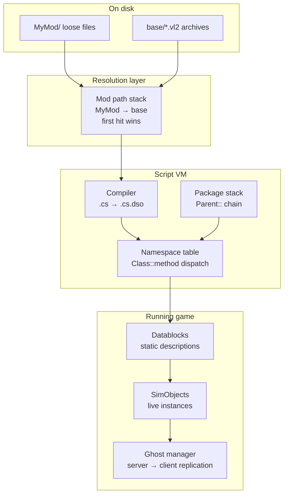

# 02 · Engine Model

This is the part most tutorials skip. The 2002-era community documentation is overwhelmingly
recipe-shaped — "paste this in and you get a flamethrower" — which works right up until the recipe does
not fit what you want to build. These pages explain the machinery underneath so you can write your own
recipes.

| Page | Read it for |
|---|---|
| [Mod paths and overrides](mod-paths-and-overrides.md) | How a bare path like `shapes/foo.dts` becomes a file on disk, and how you take that name over |
| [Boot sequence](boot-sequence.md) | The exact execution order from `console_start.cs` to a running mission |
| [TorqueScript](torquescript.md) | The language — variables, strings, arrays, control flow, and its sharper edges |
| [SimObjects and namespaces](simobject-and-namespaces.md) | The object model, method dispatch via `::`, `SimGroup` and `SimSet` |
| [Datablocks](datablocks.md) | Static object descriptions, inheritance, and network ghosting |
| [Packages](packages.md) | Function overriding — the mechanism every well-behaved mod is built on |
| [Client/server split](client-server-split.md) | Which script runs where, and the three ways the two sides talk |
| [Scheduling and events](scheduling-and-events.md) | `schedule`, callbacks, object lifetime, `MissionCleanup` |

## The mental model in one diagram

Read left to right: a *name* is resolved to a *file* by the mod path stack, compiled into the *namespace
table*, where *packages* rearrange which implementation of a function is live; the resulting code declares
*datablocks*, which are instantiated as *SimObjects*, which the *ghost manager* replicates to clients.

Every modding technique in this handbook is an intervention at one of those five stages.

## Under the community patches

None of the five stages changes. The patches are **built on** this machinery rather than altering it —
`console_client_patches` is a package, `t2csri.vl2` is an ordinary archive on the mount stack, and neither
patch modifies `Tribes2.exe`.

That said, this is the section where knowing the patches matters most, because they occupy the same
mechanisms your mod does. Each page carries an **"Under the community patches"** section; the ones with
real consequences are:

| Page | Why it matters |
|---|---|
| [Boot sequence](boot-sequence.md#under-the-community-patches) | Where the patch inserts itself relative to your autoexec script |
| [Packages](packages.md#under-the-community-patches) | You are no longer alone in the package stack |
| [Client/server split](client-server-split.md#under-the-community-patches) | `GameConnection::onConnect` is deferred by an authentication phase — **the one that catches people out** |
| [Mod paths and overrides](mod-paths-and-overrides.md#under-the-community-patches) | Paths the patch claims, and one file the mod system cannot reach |
