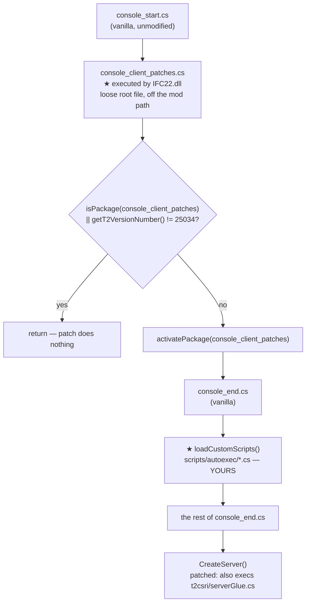

# Boot sequence

"Why isn't my datablock defined yet?" and "why did my package override do nothing?" are both timing
questions. This page traces the exact execution order, from process start to a running mission, entirely
from the shipped scripts **[script]**.

## The four phases

```mermaid
flowchart TD
    subgraph P1["Phase 1 — Engine startup"]
        EXE([Tribes2.exe starts]) --> REG[Engine registers<br/>console functions and classes]
        REG --> CS["exec console_start.cs<br/>loose at GameData root"]
    end

    subgraph P2["Phase 2 — console_start.cs"]
        CS --> ARGS[Parse command line<br/>-mod calls setModPaths]
        ARGS --> AE1["exec autoexec.cs #1"]
        AE1 --> DEF["exec scripts/clientDefaults.cs<br/>exec scripts/serverDefaults.cs<br/>exec prefs/clientPrefs.cs<br/>exec prefs/serverPrefs.cs"]
        DEF --> AE2["exec autojournal.cs<br/>exec autoexec.cs #2"]
        AE2 --> LOGIN[Canvas, audio, login GUI]
        LOGIN --> CE["exec console_end.cs"]
    end

    subgraph P3["Phase 3 — console_end.cs"]
        CE --> CTRL["exec scripts/controlDefaults.cs<br/>exec scripts/message.cs"]
        CTRL --> AUTOX["★ loadCustomScripts&#40;&#41;<br/>exec every scripts/autoexec/*.cs"]
        AUTOX --> AE3["exec autoexec.cs #3"]
        AE3 --> CLIENTS["exec client-side scripts<br/>client.cs, server.cs, hud.cs, GUIs…"]
        CLIENTS --> MENU([Main menu])
    end

    subgraph P4["Phase 4 — Per-server, per-mission"]
        MENU --> CREATE["CreateServer&#40;map, type&#41;<br/>★ execs ALL datablock files"]
        CREATE --> LM["loadMission&#40;&#41;"]
        LM --> S1["loadMissionStage1&#40;&#41;<br/>tear down previous mission"]
        S1 --> S2["loadMissionStage2&#40;&#41;<br/>create Game object<br/>Game.activatePackages&#40;&#41;<br/>exec the .mis file"]
        S2 --> DONE["Game.missionLoadDone&#40;&#41;"]
    end
```



The two starred steps are your mod's entry points.

## Phase 2 — `console_start.cs`

Order matters here because preferences layer on top of defaults:

```php
// 1. Argument loop — this is where -mod takes effect
//    setModPaths($nextArg);  $PureServer = false;

// 2. Command-line overrides get a first bite
exec("autoexec.cs", true);

// 3. Defaults, then user preferences on top
exec("scripts/clientDefaults.cs", true);
exec("scripts/serverDefaults.cs", true);
exec($clientprefs, true, true);      // prefs/clientPrefs.cs
exec($serverprefs, true, true);      // prefs/serverPrefs.cs

// 4. Second pass — for video / window settings that must win
exec("autojournal.cs", true, true);
exec("autoexec.cs", true);
```

`autoexec.cs` is executed **twice** — deliberately. The first pass lets you override things the defaults
will consume; the second lets you override the defaults themselves. If your setting is being stomped, this
is why.

After that: random seed, Windows console, Immersion force feedback, shell background selection, WON login
(unless `$SkipLogin`), canvas and audio creation, GUI profile construction — then, at the end of the login
flow, `CleanUpAndGo()` calls `exec("console_end.cs")`.

> `console_start.cs` is a **loose file at the `GameData/` root** — it is not inside any archive and not on
> the mod path stack. A mod cannot override it through `-mod`. Editing it directly is possible but affects
> every mod on the install. Do not.

## Phase 3 — `console_end.cs`

`console_end.cs` lives inside `base.vl2`, so it *is* mod-path-resolvable — but overriding it wholesale is
a bad idea for the same reasons as any file shadowing.

The order that matters to you:

| Line | Action | Why you care |
|---|---|---|
| 7 | `exec("scripts/controlDefaults.cs")` | Default key bindings |
| 11 | `exec("prefs/" @ $pref::Input::ActiveConfig @ ".cs")` | User key bindings override them |
| 16 | `exec("scripts/message.cs")` | Deliberately moved here so autoexec scripts can register message callbacks **[script]** |
| **19–25** | **`loadCustomScripts()` — `exec` every `scripts/autoexec/*.cs`** | **★ Your mod's entry point** |
| 28 | `exec("autoexec.cs")` | Third and final autoexec pass |
| 58–92 | `exec` the client-side script and GUI set | `client.cs`, `server.cs`, `hud.cs`, all the shell GUIs |
| 95–145 | Launch-mode dispatch | Dedicated / NavBuild / SpnBuild call `CreateServer()` immediately and return |

```php
//exec any user created .cs files found in scripts/autoexec (order is that returned by the OS)
function loadCustomScripts()
{
   %path = "scripts/autoexec/*.cs";
   for( %file = findFirstFile( %path ); %file !$= ""; %file = findNextFile( %path ) )
       exec( %file );
}
loadCustomScripts();
```

Note the comment: **order is whatever the OS returns**. If you ship several autoexec scripts that depend
on each other, do not rely on filename ordering. Ship one entry script that `exec`s the others in the
order you want.

Note also that `loadCustomScripts` runs at line 25, but `scripts/server.cs` is not executed until line 74.
Anything defined in `server.cs` — including `CreateServer` itself — does not exist while your autoexec
script's body is running. Declare packages; do not call into the server layer.

## Phase 4 — `CreateServer()`

This is where every gameplay datablock comes into existence. From `scripts/server.cs` **[script]**:

```php
function CreateServer(%mission, %missionType)
{
   DestroyServer();

   // Load server data blocks
   exec("scripts/commanderMapIcons.cs");
   exec("scripts/markers.cs");
   exec("scripts/serverAudio.cs");
   exec("scripts/damageTypes.cs");
   exec("scripts/deathMessages.cs");
   exec("scripts/inventory.cs");
   exec("scripts/camera.cs");
   exec("scripts/particleEmitter.cs");    // Must exist before item.cs and explosion.cs
   exec("scripts/particleDummies.cs");
   exec("scripts/projectiles.cs");        // Must exits before item.cs
   exec("scripts/player.cs");
   exec("scripts/gameBase.cs");
   exec("scripts/staticShape.cs");
   exec("scripts/weapons.cs");
   exec("scripts/turret.cs");
   exec("scripts/weapTurretCode.cs");
   exec("scripts/pack.cs");
   exec("scripts/vehicles/vehicle_spec_fx.cs");  // Must exist before other vehicle files or CRASH BOOM
   exec("scripts/vehicles/serverVehicleHud.cs");
   exec("scripts/vehicles/vehicle_shrike.cs");
   // … the other five vehicles …
   exec("scripts/vehicles/vehicle.cs");    // Must be added after all other vehicle files or EVIL BAD THINGS
   exec("scripts/ai.cs");
   exec("scripts/item.cs");
   exec("scripts/station.cs");
   // … simGroup, trigger, forceField, lightning, weather, deployables,
   //     stationSetInv, navGraph, targetManager, serverCommanderMap,
   //     environmentals, power, serverTasks, admin, prefs/banlist.cs …
```

**Read the comments Sierra left.** They encode hard ordering constraints:

| Constraint | Reason |
|---|---|
| `particleEmitter.cs` before `item.cs` and explosions | Explosion datablocks reference emitters by name at declaration time |
| `projectiles.cs` before `item.cs` | Weapon items reference projectile datablocks |
| `vehicle_spec_fx.cs` before other vehicle files | *"or CRASH BOOM"* |
| `vehicle.cs` after all other vehicle files | *"or EVIL BAD THINGS"* |

The general rule this reflects: **a datablock declaration that names another datablock requires that
datablock to already exist.** Your own content files inherit the constraint — if `MyWeapon` references
`MyProjectile`, `exec` the projectile file first.

### The gametype auto-loader

Immediately after the fixed list:

```php
//automatically load any mission type that follows naming convention typeGame.name.cs
%search = "scripts/*Game.cs";
for(%file = findFirstFile(%search); %file !$= ""; %file = findNextFile(%search))
{
   %type = fileBase(%file); // get the name of the script
   exec("scripts/" @ %type @ ".cs");
}
```

**Any file matching `scripts/*Game.cs` anywhere on the mod path stack is executed automatically.** This is
the officially sanctioned way to add a gametype: drop `MyMod/scripts/RaceGame.cs` and it loads with no
registration step. See [Gametypes](../05-gameplay-systems/gametypes.md).

## Phase 4b — the mission load chain

```mermaid
sequenceDiagram
    participant S as server.cs
    participant G as Game object
    participant M as .mis file

    S->>S: loadMission(name, type, first)
    Note over S: send load info to clients,<br/>clear prints, build load screen
    S->>S: schedule(0, ServerGroup, loadMissionStage1, …)
    S->>S: loadMissionStage1()
    Note over S: tear down previous mission:<br/>Game.endMission()<br/>MissionGroup.delete()<br/>MissionCleanup.delete()<br/>Game.deactivatePackages()<br/>Game.delete()
    S->>S: loadMissionStage2()
    S->>G: new ScriptObject(Game) {<br/>class = <Type>Game;<br/>superClass = DefaultGame; }
    S->>G: Game.activatePackages()
    S->>M: exec("missions/<name>.mis")
    Note over S: $instantGroup = MissionCleanup
    S->>G: Game.missionLoadDone()
```

Three things worth internalising:

**1. The `Game` object is recreated for every mission.** It is a `ScriptObject` whose `class` is
`<MissionType>Game` and whose `superClass` is `DefaultGame` **[script]**:

```php
new ScriptObject(Game) {
   class = $CurrentMissionType @ "Game";
   superClass = DefaultGame;
};
```

Method calls on `Game` therefore resolve first against `CTFGame::`, then `DefaultGame::`. See
[SimObjects and namespaces](simobject-and-namespaces.md).

**2. Gametype packages activate and deactivate with the mission.** `DefaultGame::activatePackages`
**[script]**:

```php
function DefaultGame::activatePackages(%game)
{
   // activate the default package for the game type
   activatePackage(DefaultGame);
   if(isPackage(%game.class) && %game.class !$= DefaultGame)
      activatePackage(%game.class);
}
```

A package whose name matches the gametype class is activated automatically. Name your gametype's package
`RaceGame` and it switches on when a Race mission loads and off when it ends. This is the cleanest
override scope in the engine.

**3. `$instantGroup` controls where new objects land.** After the `.mis` executes, `$instantGroup` is set
to `MissionCleanup`, so objects created afterwards are deleted automatically at mission end. See
[Scheduling and events](scheduling-and-events.md).

## Where to hook, by intent

| You want to… | Hook |
|---|---|
| Run once at startup | Top of your `scripts/autoexec/*.cs` |
| Define packages | `scripts/autoexec/*.cs`, then `activatePackage()` |
| Add or modify datablocks | A file `exec`'d from a server hook, or override a `scripts/*.cs` file the loader already executes |
| Add a gametype | Ship `scripts/<Name>Game.cs` — auto-loaded |
| Run per mission, server side | `DefaultGame::missionLoadDone` |
| Run per mission, gametype scoped | `package <Type>Game { … }` — auto-activated |
| Run per client connection | `DefaultGame::clientMissionDropReady`, `GameConnection::onConnect` |

## Under the community patches

The vanilla chain above runs in full. The patches insert themselves at two points, differently.

### QoL preview



`IFC22.dll` contains the literal string `console_client_patches.cs` alongside embedded TorqueScript
fragments **[binary]**:

```
exec("t2csri/serverGlue.cs");exec("console_end.cs");function dedCheckLoginDone(){$LoginName = "";$LoginPassword = "";}
exec("t2csri/serverList.cs");
```

So the DLL both executes the patch script and injects script of its own — including a stub replacing
vanilla's `dedCheckLoginDone`, the WON polling function, so dedicated servers get past a login step whose
servers no longer exist. **[inferred]** — the strings are decisive that IFC22 carries and evaluates
script; the exact call site inside the DLL has not been traced.

**Your autoexec entry point still runs at line 25 of `console_end.cs`, unchanged.** The patch has already
activated by then, so your package sits outermost.

The patch also extends `CreateServer` **[patch-script]**:

```php
function CreateServer(%mission, %missionType)
{
   Parent::CreateServer(%mission, %missionType);
   if (!isActivePackage(t2csri_server))
      exec("t2csri/serverGlue.cs");
}
```

which loads the server-side auth stack. Note `Parent::` first — the whole vanilla datablock `exec` list
runs before any patch code.

### RC2a

RC2a has no root script. Its entry points are three files **inside** `base/T2csri.vl2` at
`scripts/autoexec/` **[patch-script]** — so they are picked up by the same `loadCustomScripts()` glob that
loads your mod, in **OS-determined order**.

If your entry script must run after the patch, defer with a zero-delay schedule, as RC2a's own
`t2csri_serv.cs` does **[patch-script]**:

```php
schedule(0, 0, exec, "t2csri/serverglue.cs");
```

### The support pack

Independently of either patch, the community [support pack](../09-support-pack/README.md) adds a further
occupant of the autoexec directory — `scripts/autoexec/autoload_launcher.cs` **[support-script]**:

```php
if( !$AutoloadExecuted ) exec("autoload.cs");
```

which bootstraps a whole second loader: `base/autoload.cs` scans for `.cs` files carrying `// #autoload`
directive headers, resolves their `#include` dependencies and version constraints, consults
`prefs/autoload.ini` for order and exclusions, and `exec`s them. See
[The autoload system](../09-support-pack/autoload-system.md).

So on a fully-loaded machine, `loadCustomScripts()` may execute RC2a's three files, the support pack's
launcher, and your entry script — **in OS-determined order**. Defer anything order-sensitive.

### What does not change

Every ordering constraint in phase 4 — `particleEmitter.cs` before `item.cs`, `vehicle_spec_fx.cs` first,
`vehicle.cs` last — is vanilla and unaffected. The `scripts/*Game.cs` gametype glob is unaffected. The
mission load chain is unaffected.

## Related

- [Packages](packages.md) — the override mechanism referenced throughout
- [Mod paths and overrides](mod-paths-and-overrides.md) — how each `exec` path resolves
- [Gametypes](../05-gameplay-systems/gametypes.md) — the `*Game.cs` convention in full
- [Launch options](../01-getting-started/launch-options.md) — what phase 2's argument loop accepts
- [07 · Community Patches](../07-community-patches/README.md) — where the patches insert themselves
