# Client/server split

Tribes 2 is a client/server game *even in single player* — the offline game runs a local server and
connects a local client to it. Scripts run on one side or the other, and getting this wrong is the second
most common source of "my mod does nothing".

## Which side runs what

```mermaid
flowchart LR
    subgraph SERVER["Server side"]
        SRV["scripts/server.cs<br/>CreateServer&#40;&#41; and everything it execs"]
        DB["All gameplay datablocks<br/>player.cs, weapons.cs, projectiles.cs,<br/>vehicles/, packs/, turrets/, deployables.cs"]
        GAME["Game object<br/>DefaultGame:: and &lt;Type&gt;Game::"]
        AI["ai.cs and the AI task system"]
        MIS["The .mis mission file"]
    end

    subgraph CLIENT["Client side"]
        CLI["scripts/client.cs"]
        HUD["hud.cs, inventoryHud.cs,<br/>objectiveHud.cs, chatMenuHud.cs"]
        GUI["gui/*.gui and their .cs partners<br/>LobbyGui, OptionsDlg, ChatGui, …"]
        MSG["message.cs — client message callbacks"]
        SND["clientAudio.cs"]
    end

    SERVER -->|"ghosting"| CLIENT
    SERVER -->|"commandToClient / messageClient"| CLIENT
    CLIENT -->|"commandToServer"| SERVER
```



The quick test: **if it decides something, it is server-side; if it draws something, it is client-side.**

| Server | Client |
|---|---|
| Damage, scoring, inventory, spawning | HUD, reticles, scoreboards, menus |
| Datablock declarations | Rendering and audio playback |
| AI decisions | Input handling and key binds |
| Mission state and objectives | Chat display and message formatting |
| `commandToClient`, `messageClient` senders | `commandToServer` senders |

## Function-name conventions

The engine enforces two prefixes, and they are how the remote-call layer is secured.

| Prefix | Defined on | Invoked by | Example |
|---|---|---|---|
| `serverCmd<Name>` | Server | Client, via `commandToServer('<Name>', …)` | `serverCmdMessageSent(%client, %text)` |
| `clientCmd<Name>` | Client | Server, via `commandToClient(%client, '<Name>', …)` | `clientCmdBottomPrint(%message, %time, %lines)` |

**The first parameter of every `serverCmd` function is the calling client**, supplied by the engine —
the client cannot forge it:

```php
function serverCmdMessageSent(%client, %text)         // scripts/game.cs family
function serverCmdSetPlayerVote(%client, %vote)
function serverCmdObserveClient(%client, %target)
function serverCmdSetVehicleWeapon(%client, %num)
```

`clientCmd` functions have no such parameter — there is only one server:

```php
function clientCmdCenterPrint( %message, %time, %lines )   // time is specified in seconds
function clientCmdBottomPrint( %message, %time, %lines )
function clientCmdClearCenterPrint()
function clientCmdVehicleMount()
```

### Calling across

```php
// Client → server
commandToServer( 'MessageSent', %text );
commandToServer( 'getScores' );
commandToServer( 'ToggleCamera' );

// Server → one client
commandToClient( %client, 'CenterPrint', %message, %time, %lines );
commandToClient( %client, 'setHudMode', 'Standard' );
```

Note the **tagged string** (single quotes) for the command name. This is required — the name travels as an
interned tag, not as text. See [TorqueScript](torquescript.md#tagged-strings).

> **Security note for server mods.** Any client can call any `serverCmd` function with any arguments. The
> shipped handlers validate; yours must too. Check `%client`'s state before acting — a `serverCmd` that
> spawns a vehicle without checking whether the caller is alive, on a team, and near a station is an
> exploit waiting to be found.

## The three communication mechanisms

### 1. Ghosting — automatic object replication

The server decides which objects each client can see and replicates them. This is the engine's core
networking and it happens without script involvement. Script's role is limited to:

```php
%cl.resetGhosting();      // force a full re-ghost, used at mission change
%client.setMissionCRC($missionCRC);
```

Ghosted objects appear on the client as real objects with real IDs — but **dynamic fields do not
replicate**. A dynamic field set server-side is invisible to the client. If the client needs to know
something, you must send it explicitly.

### 2. `commandToServer` / `commandToClient` — remote procedure calls

Direct, explicit, argument-passing calls, as above. Use these for anything with a specific recipient and a
specific meaning.

### 3. `messageClient` — the message system

A higher-level layer built on top, carrying a *message type* alongside the text so clients can react
programmatically as well as display it **[script]**:

```php
function messageClient(%client, %msgType, %msgString, %a1, %a2, … , %a13)
function messageTeam(%team, %msgType, %msgString, %a1, %a2, … , %a13)
function messageAll(%msgType, %msgString, %a1, %a2, … , %a13)
```

On the client, `clientCmdServerMessage` dispatches to every callback registered for the type — and to
every callback registered for the empty type, which sees everything **[script]**:

```php
function addMessageCallback(%msgType, %func)
{
   for(%i = 0; (%afunc = $MSGCB[%msgType, %i]) !$= ""; %i++)
   {
      // only add each callback once
      if(%afunc $= %func)
         return;
   }
   $MSGCB[%msgType, %i] = %func;
}

function clientCmdServerMessage(%msgType, %msgString, %a1, … , %a10)
{
   %tag = getWord(%msgType, 0);
   for(%i = 0; (%func = $MSGCB["", %i]) !$= ""; %i++)
      call(%func, %msgType, %msgString, %a1, … , %a10);

   if(%tag !$= "")
      for(%i = 0; (%func = $MSGCB[%tag, %i]) !$= ""; %i++)
         call(%func, %msgType, %msgString, %a1, … , %a10);
}
```

This is a genuine extension point: a client-side mod can register a callback for a message type and react
to server events without the server knowing anything about it.

```php
addMessageCallback('MsgClientJoin', myModOnClientJoin);
```

`scripts/message.cs` is executed at line 16 of `console_end.cs`, deliberately **before** the autoexec
loop, with the comment *"message.cs is loaded so autoexec can add new message callbacks"* **[script]**.
Sierra moved it there for exactly this purpose.

### Sound in messages

`defaultMessageCallback` supports an embedded WAV marker — `~w` followed by a filename **[script]**:

```php
%wavStart = strstr( %message, "~w" );
if ( %wavStart != -1 )
{
   %wav = getSubStr( %message, %wavStart + 2, 1000 );
   %wavLengthMS = alxGetWaveLen( %wav );
   if ( %wavLengthMS <= $MaxMessageWavLength )     // 5200 ms
   {
      %handle = alxCreateSource( AudioChat, %wav );
      alxPlay( %handle );
   }
   …
}
```

This is how voice-chat binds play a sound and print text from a single server message. The 5.2-second cap
is a spam guard.

## `ClientGroup` and the client object

Server-side, every connection — human or AI — is a `GameConnection` in `ClientGroup`:

```php
%count = ClientGroup.getCount();
for ( %cl = 0; %cl < %count; %cl++ )
{
   %client = ClientGroup.getObject( %cl );
   if ( !%client.isAIControlled() )
      sendLoadInfoToClient( %client );
}
```

The connection object is where per-player state belongs, and it is reachable from the player object:

```php
%obj.client.setWeaponsHudActive(%this.item);
%obj.client.setAmmoHudCount(%obj.getInventory(%this.ammo));
```

`%player.client` → the connection. `%client.player` → the controlled player object. Either can be null:
a client in observer mode has no player; a corpse has a stale `client` reference. The shipped code guards
both **[script]**:

```php
if ( %obj.getClassname() $= "Player" && %obj.getState() !$= "Dead" )
   %obj.client.setWeaponsHudAmmo(%this.getName(), %amount);
```

## Where to put a file

| Your code… | Put it in | Loaded by |
|---|---|---|
| Declares gameplay datablocks | A file `exec`'d during `CreateServer()` | Server |
| Overrides `DefaultGame::` or `<Type>Game::` | Package in your autoexec script | Server |
| Handles a `serverCmd` | Same | Server |
| Draws or formats anything | A file `exec`'d from your autoexec script | Client |
| Registers a message callback | Autoexec script, after `message.cs` has loaded | Client |
| Is a `.gui` | `gui/` in your mod, loaded with `loadGui()` or `exec` | Client |

Both sides execute your `scripts/autoexec/*.cs` — in a listen server the same process is both. Guard
side-specific work rather than assuming:

```php
if (isObject(ServerGroup))  { … server-only … }
if (isObject(Canvas))       { … client-only — a dedicated server has no canvas … }
```

## Under the community patches

This is where the patches change the most, and the change is easy to miss because it only appears with a
**real remote client**.

### `GameConnection::onConnect` is deferred by a pre-authentication phase

Both patches package it, via `t2csri_server` **[patch-script]**:

```php
function GameConnection::onConnect(%client, %name, %raceGender, %skin, %voice, %voicePitch)
{
   if (%client.getAddress() !$= "local" && %client.t2csri_serverChallenge $= "")
   {
      // check to see if the client is IP banned
      if (BanList::isBanned(0, %client.getAddress()))
      {
         %client.setDisconnectReason("You are not allowed to play on this server.");
         %client.schedule(0, delete);
         return;
      }

      // save these for later
      %client.tname = %name;   %client.trgen = %raceGender;   %client.tskin = %skin;
      %client.tvoic = %voice;  %client.tvopi = %voicePitch;

      // start the 15 second count down
      %client.tterm = schedule(15000, 0, t2csri_expireClient, %client);

      commandToClient(%client, 't2csri_pokeClient', "T2CSRI 1.5 - 08/09/2012");
      return;                             // ← vanilla onConnect NOT called yet
   }

   if (isEventPending(%client.tterm))
      cancel(%client.tterm);

   Parent::onConnect(%client, %name, %raceGender, %skin, %voice, %voicePitch);
   %client.doneAuthenticating = 1;
   %client.t2csri_cert = "";
}
```

Four consequences:

| | |
|---|---|
| **`onConnect` fires twice per remote client** | Once to start authentication, once to complete it. Guard on `%client.doneAuthenticating`. |
| **`ClientGroup` can contain half-connected clients** | For up to 15 seconds. Loops that assume every entry has a player must guard. |
| **`onDrop` is suppressed mid-authentication** | `if (!isObject(%client) \|\| !%client.doneAuthenticating) return;` **[patch-script]** |
| **`local` connections skip the phase entirely** | Offline and listen-server hosts authenticate immediately — **so this never shows up in single-machine testing.** |

The safe hook shape for a mod:

```php
package MyMod
{
   function GameConnection::onConnect(%client, %name, %raceGender, %skin, %voice, %voicePitch)
   {
      Parent::onConnect(%client, %name, %raceGender, %skin, %voice, %voicePitch);
      if (%client.doneAuthenticating)
         myModOnClientReady(%client);
   }
};
```

Or avoid the question entirely and hook `DefaultGame::clientMissionDropReady`, which is
patch-independent.

### New `serverCmd` functions

The auth handshake adds its own remote calls **[patch-script]**:

```php
function serverCmdt2csri_sendCertChunk(%client, %chunk)
function serverCmdt2csri_sendChallenge(%client, %clientChallenge)
function serverCmdt2csri_challengeResponse(%client, %serverChallenge)
```

with client-side partners `clientCmdt2csri_pokeClient`, `clientCmdt2csri_getChallengeChunk`,
`clientCmdt2csri_decryptChallenge`. Do not define anything with a `t2csri_` prefix.

### `getAuthInfo` reads from the certificate

```php
function GameConnection::getAuthInfo(%client)
{
   if (%client.t2csri_authInfo $= "" && %client.getAddress() $= "local")
      %client.t2csri_authInfo = WONGetAuthInfo();

   return %client.t2csri_authInfo;
}
```

The tab-and-newline record format is preserved, but the patch's own comment notes *"in this version, there
is no clan support, so those fields are empty"* **[patch-script]**. **A mod parsing clan fields out of
`getAuthInfo` gets empty strings.**

### What does not change

Ghosting, `commandToServer` / `commandToClient`, `messageClient` / `messageTeam` / `messageAll`, the
message-callback system, `ClientGroup`, and the `%player.client` / `%client.player` relationship are all
vanilla.

## Related

- [Datablocks](datablocks.md) — datablock transmission during mission start
- [Text and messaging](../04-interface/text-and-messaging.md) — the message system from the display side
- [Boot sequence](boot-sequence.md) — which files execute on which side, when
- [Gametypes](../05-gameplay-systems/gametypes.md) — server-side gameplay logic
- [Modding against a patched install](../07-community-patches/modding-against-a-patched-install.md#the-pre-connection-auth-phase) — the auth phase in full
