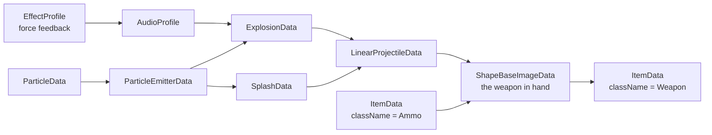
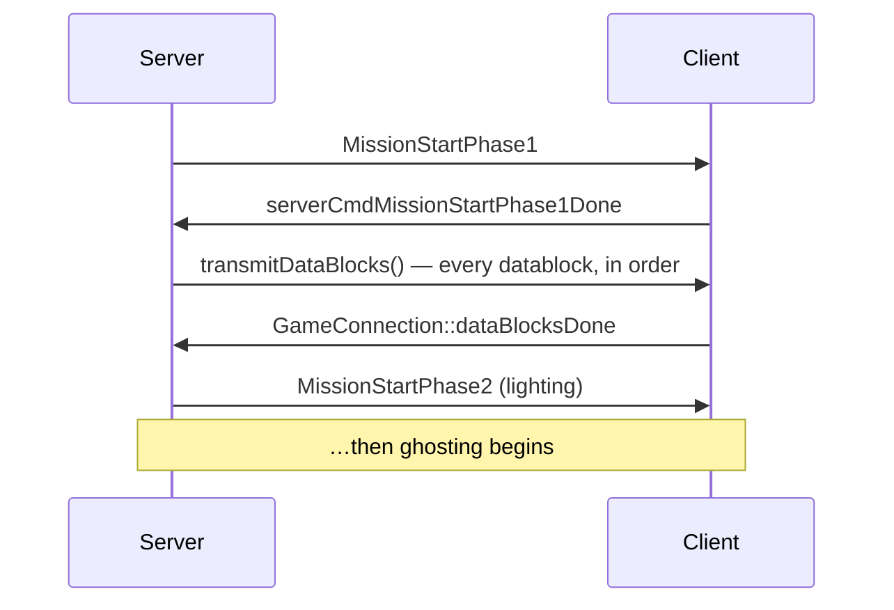

# Datablocks

A **datablock** is a named, immutable-by-convention description shared by many objects. `DiscProjectile`
describes every spinfusor disc ever fired; the individual discs are lightweight `Projectile` instances
pointing at it.

Datablocks are where the overwhelming majority of Tribes 2 modding happens. Change
`DiscProjectile.damageRadius` and every spinfusor in the game changes.

## Declaring one

```php
datablock ItemData(Disc)
{
   className = Weapon;
   catagory = "Spawn Items";
   shapeFile = "weapon_disc.dts";
   image = DiscImage;
   mass = 1;
   elasticity = 0.2;
   friction = 0.6;
   pickupRadius = 2;
   pickUpName = "a spinfusor";
   emap = true;
};
```

| Part | Meaning |
|---|---|
| `ItemData` | The datablock **type** — determines which C++ class consumes it and which fields exist |
| `(Disc)` | The **name**. Globally unique. This is what other code references. |
| `className = Weapon` | The **dispatch namespace** for script callbacks — see [SimObjects and namespaces](simobject-and-namespaces.md) |
| Remaining fields | Type-specific data |

Fields the type does not declare become dynamic fields — settable and readable, but ignored by the engine.
This is how mods attach their own metadata to stock datablocks.

## Inheritance

```php
datablock PlayerData(LightFemaleHumanArmor) : LightMaleHumanArmor
{
   shapeFile = "light_female.dts";
   …
};
```

The `: Parent` form copies every field from the parent, then applies the block's own fields on top. The
parent must already exist at declaration time.

47 of the shipped datablocks use inheritance **[script]**. Two patterns dominate:

**Profile blocks** — a base datablock holding shared tuning, inherited by concrete ones:

```php
datablock PlayerData(LightMaleHumanArmor)   : LightPlayerDamageProfile  { … };
datablock PlayerData(MediumMaleHumanArmor)  : MediumPlayerDamageProfile { … };
datablock StaticShapeData(DeployedBeacon)   : StaticShapeDamageProfile  { … };
```

**Variants** — a near-copy with a few differences:

```php
datablock PlayerData(LightMaleBiodermArmor) : LightMaleHumanArmor { … };
datablock ItemData(HuntersFlag2)            : HuntersFlag1        { … };
```

For a mod, inheritance is the polite way to add content: derive from the stock datablock, override the
handful of fields you care about, and you automatically track any change to the parent.

```php
datablock LinearProjectileData(BigDiscProjectile) : DiscProjectile
{
   indirectDamage   = 0.75;
   damageRadius     = 15.0;
   kickBackStrength = 3000;
};
```

## Declaration order matters

A field that names another datablock is resolved **at declaration time**. If the referenced block does not
exist yet, you get an empty reference and, usually, a runtime failure much later.

This is why `CreateServer()` carries ordering comments **[script]**:

```php
exec("scripts/particleEmitter.cs");    // Must exist before item.cs and explosion.cs
exec("scripts/particleDummies.cs");
exec("scripts/projectiles.cs");        // Must exits before item.cs
…
exec("scripts/vehicles/vehicle_spec_fx.cs");    // Must exist before other vehicle files or CRASH BOOM
…
exec("scripts/vehicles/vehicle.cs");            // Must be added after all other vehicle files or EVIL BAD THINGS
```

And why a weapon file is written bottom-up — effects, then sounds, then explosion, then projectile, then
ammo, then the image, then the item. Read `scripts/weapons/disc.cs` top to bottom and you are reading a
dependency order.



## Datablocks are transmitted to clients

This is the fact that catches out every newcomer.

Datablocks are **not** loaded independently by each side. The server sends its datablocks to each client
over the network during mission start **[script]**:

```php
function serverCmdMissionStartPhase1Done(%client, %seq)
{
   …
   // when the datablocks are transmitted, we'll send the ghost always objects
   %client.transmitDataBlocks($missionSequence);
}

function GameConnection::dataBlocksDone( %client, %missionSequence )
{
   echo("GOT DATA BLOCKS DONE FOR: " @ %client);
   …
   %client.setReceivedDataBlocks(true);
   sendTargetsToClient(%client);
   commandToClient(%client, 'MissionStartPhase2', $missionSequence);
}
```



What follows from this:

| Consequence | Why it matters |
|---|---|
| **A client joining your modded server receives your datablocks automatically.** | Server-side content changes need no client download. This is why so many Tribes 2 mods are server-side only. |
| **Client-side files referenced *by* a datablock are not transmitted.** | If your datablock says `shapeFile = "my_gun.dts"` and the client does not have `my_gun.dts`, the client fails to render it. New *art* requires a client-side download; new *tuning* does not. |
| **Declaring a datablock only on the client is nearly always wrong.** | The server's set is authoritative and overwrites. |
| **Datablock count and order affect the join handshake.** | Very large numbers of datablocks lengthen mission start. |

`preload = true` on a datablock asks the client to load the referenced resources up front rather than on
first use — used on the audio profiles that must not stutter **[script]**:

```php
datablock AudioProfile(DiscFireSound)
{
   filename    = "fx/weapons/spinfusor_fire.wav";
   description = AudioDefault3d;
   preload = true;
   effect = DiscFireEffect;
};
```

## Modifying a stock datablock

Two approaches, with different consequences.

### Assign to its fields at runtime

```php
package MyMod
{
   function DefaultGame::missionLoadDone(%game)
   {
      Parent::missionLoadDone(%game);
      DiscProjectile.damageRadius = 12.0;
   }
};
```

Simple and composable. But note the timing: the datablock has already been declared, and depending on the
field, may already have been transmitted or consumed by the C++ side. **Fields read once at load time will
not respond to a late assignment.** Tuning numbers usually work; structural fields (shape files, state
machine entries) usually do not.

### Redeclare it

Ship a file that re-declares the datablock with the same name. The later declaration wins.

```php
datablock LinearProjectileData(DiscProjectile)
{
   … full declaration with your changes …
};
```

Reliable, because it runs through the normal declaration path — but you now own a full copy, and you must
arrange for your file to execute after the original. In practice this means shadowing
`scripts/weapons/disc.cs` in your mod folder, which is file shadowing with all its drawbacks. See
[Mod paths and overrides](mod-paths-and-overrides.md).

**Recommendation:** derive a new datablock rather than modifying a stock one, wherever the design allows
it. Add `BigDisc` alongside `Disc` instead of changing `Disc`.

## The datablock types

Census of the shipped scripts **[script]**, most-used first:

| Type | Count | Purpose |
|---|---|---|
| `AudioProfile` | 298 | A sound: file, description, force-feedback effect |
| `EffectProfile` | 140 | Immersion force-feedback effect |
| `ParticleData` | 114 | A single particle's appearance and physics |
| `ParticleEmitterData` | 114 | How particles are emitted |
| `ExplosionData` | 66 | Explosion shape, sound, emitters, camera shake |
| `ItemData` | 58 | Anything pickable: weapons, ammo, packs, flags |
| `ShapeBaseImageData` | 35 | A mountable "image" — weapon in hand, pack on back |
| `StaticShapeData` | 35 | Non-moving world objects: stations, sensors, deployables |
| `DebrisData` | 18 | Fragments thrown off by destruction |
| `TurretImageData` | 17 | Turret barrels |
| `CommanderIconData` | 16 | Command-map icons |
| `SensorData` | 15 | Detection ranges and types |
| `AudioDescription` | 13 | Sound *category*: 3D-ness, looping, volume, channel |
| `DecalData` | 12 | Surface marks |
| `SimDataBlock` | 11 | Generic script-only datablock |
| `RunningLightData` | 11 | Vehicle running lights |
| `TurretData` | 10 | Turret bases |
| `ShockwaveData` | 10 | Expanding shockwave effects |
| `SplashData` | 9 | Water impact |
| `PlayerData` | 9 | Armors — the player's physics and appearance |
| `TSShapeConstructor` | 8 | Binds `.dsq` animation sequences to a `.dts` shape |
| `TriggerData` | 7 | Volume triggers |
| `ForceFieldBareData` | 6 | Force fields |
| `TracerProjectileData` | 5 | Hitscan-style tracers (chaingun) |
| `LinearFlareProjectileData` | 5 | Flare-rendered linear projectiles (plasma) |
| `MissionMarkerData` | 4 | Mission-editor markers |
| `JetEffectData` | 4 | Jetpack effects |
| `GrenadeProjectileData` | 4 | Arcing, timed projectiles |
| `PrecipitationData` | 3 | Rain and snow |
| `ParticleEmissionDummyData` | 3 | Standalone emitter placement |
| `FlyingVehicleData` | 3 | Shrike, Havoc, Bomber |
| `AudioEnvironment` | 3 | Reverb environments |
| `TargetProjectileData` | 2 | Targeting laser |
| `SeekerProjectileData` | 2 | Missiles |
| `HoverVehicleData` | 2 | Wildcat, MPB |
| `ELFProjectileData` | 2 | The ELF gun's beam |
| `CameraData` | 2 | Camera behaviour |
| `WheeledVehicleData` | 1 | Tank |
| `StationFXVehicleData`, `StationFXPersonalData` | 1 each | Inventory station effects |

Field references for each are in [Datablock classes](../reference/datablock-classes.md), and the
recipes in [03 · Content Recipes](../03-content-recipes/README.md) show them in use.

## Under the community patches

**The datablock system is entirely unchanged** — declaration, inheritance, `className` dispatch,
transmission to clients, `preload`. Every content recipe in this handbook works identically.

Two things around the edges are worth knowing.

### Asset downloads change the "client must already have the file" rule

The QoL patch adds `enableAssetDownloads(bool)`, driven by `$pref::Net::downloadAssets` **[patch-script]**,
which lets a server ship missing files to joining clients.

This softens — but does not remove — the constraint in the table above. A datablock naming
`shapeFile = "my_gun.dts"` may now get that file delivered on connect rather than requiring every player
to install a client package first.

**Do not rely on it.** It is a user-toggleable preference, so some clients will have it off, and the exact
delivery scope has not been verified here. Ship a client package anyway and treat downloads as a
convenience. See [Packaging](../06-shipping/packaging.md#under-the-community-patches).

### The transmission handshake gains progress reporting

The patch packages the two callbacks that fire during the sequence documented above **[patch-script]**:

```
ghostAlwaysObjectReceived()
ClientReceivedDataBlock(idx, total)
```

Both now update `LoadingProgress` / `LoadingProgressTxt` and force `Canvas.repaint()` so the loading
screen stays responsive through a long datablock transmission. The handshake itself — `transmitDataBlocks`,
`dataBlocksDone`, phase ordering — is untouched.

If your mod declares a very large number of datablocks, this is where the user sees the cost.

### `EffectProfile` is inert on the QoL patch

`EffectProfile` datablocks still parse and are still referenced by `AudioProfile.effect`, but TribesNEXT's
`IFC22.dll` stubs the Immersion force-feedback exports **[binary]**, so nothing plays. Declaring them
remains harmless. See [Audio](../03-content-recipes/audio.md#under-the-community-patches).

## Related

- [SimObjects and namespaces](simobject-and-namespaces.md) — how `className` drives callbacks
- [Boot sequence](boot-sequence.md) — when datablock files execute
- [Client/server split](client-server-split.md) — the transmission described above, in context
- [Weapons](../03-content-recipes/weapons.md) — a complete datablock chain, annotated
- [07 · Community Patches](../07-community-patches/README.md) — asset downloads and the patch archives
