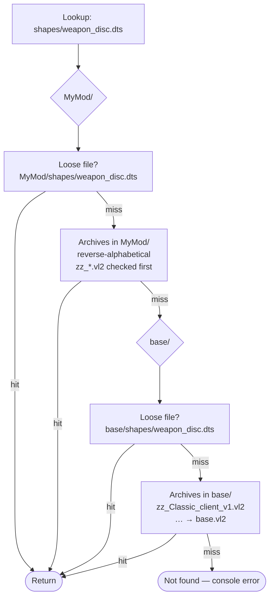

# Mod paths and overrides

Almost every asset reference in Tribes 2 is a **bare relative path** — `shapes/weapon_disc.dts`,
`gui/hud_disc`, `scripts/weapons/disc.cs`. None of them say which mod they come from. The engine resolves
the name at lookup time by walking the **mod path stack** and taking the first hit.

Understanding this one mechanism is what separates "I copied a tutorial" from "I can make the game do what
I want".

## The stack

The stack is a `;`-separated list of directories under `GameData/`. Three console functions manage it
**[binary]**:

| Function | Signature | Purpose |
|---|---|---|
| `setModPaths` | `setModPaths(paths)` | Replace the whole stack from a `;`-separated string |
| `getModPaths` | `getModPaths()` | Read the current stack back as a `;`-separated string |
| `rebuildModPaths` | `rebuildModPaths()` | Rescan and rebuild from the existing list |

`console_start.cs` calls `setModPaths` in exactly one place **[script]** — the `-mod` argument branch:

```php
else if ( $arg $= "-mod" && $hasNextArg )
{
   setModPaths( $nextArg );
   $i += 2;
   $PureServer = false;
}
```

With no `-mod`, `setModPaths` is never called and the engine's built-in default applies.

### `base` is always the tail

`Tribes2.exe` carries the string literals `base` and `;base` adjacent to the `setModPaths` registration
site **[binary]**. The engine appends `;base` to whatever you supply **[inferred]** — the string pair is
decisive evidence that concatenation happens; that it happens on the *tail* is read off the resulting
behaviour, since a mod folder containing only overrides demonstrably falls through to `base/`. So:

| You launch with | Effective stack |
|---|---|
| *(nothing)* | `base` |
| `-mod Classic` | `Classic;base` |
| `-mod MyMod` | `MyMod;base` |

This is why a mod only needs to ship the files it changes. Everything you do not override falls through
to `base/`.

> Some community documentation describes the default as `base;Classic` **[community]**. That is
> backwards for the purpose of overriding: `Classic` is only on the stack when you ask for it with
> `-mod Classic`, and when it is, it is searched *first*. The shipped `Classic_*.bat` launchers all pass
> `-mod Classic` explicitly **[script]**, which would be pointless if Classic were on the stack by default.

## Resolution order

For a lookup of `shapes/weapon_disc.dts` with stack `MyMod;base`:



Two rules, both load-bearing:

1. **Within a mod directory, loose files beat archives.** This is what makes modding practical — drop a
   loose `.cs` next to the `.vl2` that contains the original and yours wins.
2. **Among archives, later-alphabetical wins.** Hence the `zz_` prefix on `zz_Classic_client_v1.vl2`:
   it is a load-order trick to make an archive outrank `base.vl2`. **[inferred — strongly implied by the
   `zz_` naming convention; the sort direction has not been confirmed against the binary]**

## Three ways to override a file

| Technique | How | Trade-off |
|---|---|---|
| **Loose file in your mod** | `MyMod/scripts/player.cs` | Simple, obvious, wins over everything in `base/`. But you now own a full copy of Sierra's file. |
| **`zz_`-prefixed archive** | `base/zz_mymod.vl2` containing `scripts/player.cs` | Ships as one file; survives `base/` reinstalls poorly. Used by Sierra for the Classic client scripts. |
| **Package override** | A `package` block in your own new file | Changes only the functions you name. **Preferred.** See [Packages](packages.md). |

Only the third composes with other mods. The first two are all-or-nothing on a whole file.

## Worked examples

**A — texture override.** `base.vl2` contains `textures/sky.png`. You ship a loose
`MyMod/textures/sky.png`. Stack is `MyMod;base`. The lookup hits your loose file on the first probe;
`base.vl2` is never consulted.

**B — script override with a PURE side effect.** You drop a loose `base/scripts/server.cs` beside
`base.vl2`. It wins the lookup — but the file is no longer inside a hash-validated archive, so
`setPureServer(true)` fails and the server logs `Executing non-PURE script base/scripts/server.cs`
**[binary]**. See [Hosting and testing](../06-shipping/hosting-and-testing.md).

**C — archive shadowing.** `base.vl2` contains `gui/login_dlg.gui`. You ship `base/zz_mymod.vl2`
containing the same path. No loose file exists, so the archive scan runs, and `zz_mymod.vl2` sorts after
`base.vl2` and is checked first.

**D — mod folder wins over base entirely.** `base.vl2` has `scripts/weapons/disc.cs`; you ship
`MyMod/scripts/weapons/disc.cs`. Any `exec("scripts/weapons/disc.cs")` anywhere in the codebase — including
the call in Sierra's own `scripts/weapons.cs` — now loads *your* file. This is powerful and dangerous in
equal measure: you have silently replaced a file that the rest of the game expects to define particular
datablocks.

## Category prefixes

Lookups carry a category directory as part of the relative path. The format strings in the binary
**[binary]** show the shapes the engine builds:

| Format | Category |
|---|---|
| `base/%s` | generic loose-file fallback |
| `shapes/%s`, `shapes/%s.dts` | models |
| `base/textures/%s` | textures |
| `base/terrains/%s` | terrain |
| `interiors/%s` | `.dif` interiors |
| `audio/%s` | sounds |
| `gui/%s` | interface bitmaps |
| `commander/icons/%s` | command-map icons |
| `voice/%s/%s.wav` | voice clips (two-level: pack / clip) |
| `lighting/%s_%x.ml` | generated per-mission lightmaps |
| `prefs/ClientPrefs.cs` | preferences (a write target) |

So when a datablock says `shapeFile = "weapon_disc.dts"`, the engine is looking for
`<modpath>/shapes/weapon_disc.dts`. Your override goes at `MyMod/shapes/weapon_disc.dts`.

## The reserved name

The engine refuses one mod path outright **[binary]**:

> `The string "variant" is reserved and may not be used as a mod path for Tribes 2.`

Do not name a mod `variant`.

## PURE servers

`setPureServer(bool)` / `isPureServer()` toggle asset-integrity enforcement **[binary]**. A PURE server
requires every executed script to live inside a known-hash `.vl2`. The error strings in the binary spell
out the checks:

```
Error: Unable to host a PURE server - file %s found not in a pure volume.
Error: Unable to host a PURE server - file %s has no data.
Error: Unable to host a PURE server - filePath for %s does not match.
Error: Unable to host a PURE server - unable to open file %s.
Error: Unable to host a PURE server - unable to open file console_start.cs.
Unable to host a PURE server - hash value does not match.
Executing non-PURE script %s.
PURE server has been verified.
```

Practical consequence: **a modded server is a non-PURE server**, and `-mod` sets `$PureServer = false`
for you **[script]**. Clients see the non-PURE status. This is expected and normal for mod servers.

## Checking the stack at runtime

```php
echo(getModPaths());
```

Classic's `serverCMDgetMod` does exactly this to report which mod a server is running **[script]**.
Useful as a first diagnostic when your files are not being found.

## Under the community patches

**The mount-stack mechanism is completely untouched by both patches.** `setModPaths`, `getModPaths`,
`rebuildModPaths`, loose-beats-archive, first-hit-wins, the `variant` reservation, PURE — all vanilla.

Two things join the picture.

### The patch archive joins the `base/` mount

`t2csri.vl2` (QoL, 1.3 MB) or `T2csri.vl2` (RC2a, 496 KB) is dropped into `base/` and participates in the
normal archive scan. Alphabetically it sorts between `shapes.vl2` and `textures.vl2`, so under the
reverse-alpha rule it outranks `base.vl2` and `scripts.vl2` but is outranked by `textures.vl2`,
`voice.vl2`, and `zz_Classic_client_v1.vl2`.

In practice the ordering never matters, because the patch declares no paths that collide with vanilla
content — its scripts live under `t2csri/`, with `loginScreens.cs` at the archive root (i.e.
`base/loginScreens.cs`).

**What this means for you:** those paths are now taken. Do not put a `t2csri/` directory in your mod and
do not ship a `base/loginScreens.cs` — either will shadow the patch through the normal mount stack and
break authentication.

### `console_client_patches.cs` is off the stack entirely

The QoL patch's master script is a **loose file at the `GameData/` root**, the same position as
`console_start.cs`. It is not inside any archive and not under any mod path entry.

`IFC22.dll` carries the literal filename string and embedded TorqueScript it evaluates directly
**[binary]**, so the DLL injects it into the boot chain rather than relying on the mount system.

Consequences:

- **A mod cannot shadow or intercept it.** There is no path at which you could place a replacement.
- **It loads regardless of `-mod`.** Your mod and the patch always coexist; you cannot launch "without"
  the patch short of uninstalling it.
- **The same was already true of `console_start.cs`** in vanilla — this is a category of file the mod
  system was never able to reach.

RC2a takes the opposite approach and ships its entry scripts *inside* the archive at
`scripts/autoexec/`, which does put them on the stack — and in collision range of your mod's entry point.
See [RC2a](../07-community-patches/rc2a.md#the-collision-that-matters).

### Other archives that may be in `base/`

The community [support pack](../08-support-pack/README.md) installs as `base/support.vl2`
**[support-script]** and claims:

| Path | Contents |
|---|---|
| `autoload.cs` | i.e. `base/autoload.cs` — the loader |
| `support/*.cs` | 36 library modules |
| `scripts/autoexec/autoload_launcher.cs` | the boot hook |
| `prefs/autoload.ini`, `prefs/autoload.log` | written at runtime |

Do not ship files at any of those paths. `support.vl2` sorts after `skins.vl2` and before `t2csri.vl2`
alphabetically, so it outranks most of `base/` in the reverse-alpha archive scan — but as with the patch
archive, it declares no paths that collide with vanilla content, so the ordering is academic.

## Related

- [Boot sequence](boot-sequence.md) — when `setModPaths` runs relative to everything else
- [Packages](packages.md) — the override mechanism that does not require shadowing files
- [Packaging](../06-shipping/packaging.md) — building your own `.vl2`
- [Install anatomy](../01-getting-started/install-anatomy.md) — what is in each archive
- [07 · Community Patches](../07-community-patches/README.md) — the patch archives in detail
