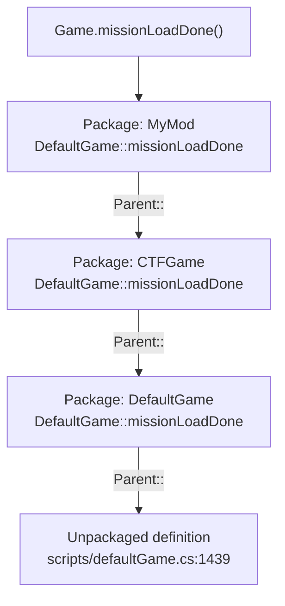

# Packages

A **package** is a named group of function definitions that can be switched on and off at runtime. While
active, its functions replace the ones already defined under the same names; `Parent::` reaches the
replaced version.

This is the engine's answer to "how do two mods both modify the same function", and it is the single most
important technique in this handbook.

## Syntax

```php
package MyMod
{
   function DefaultGame::missionLoadDone(%game)
   {
      Parent::missionLoadDone(%game);
      echo("MyMod: mission loaded");
   }

   function Weapon::onUse(%data, %obj)
   {
      if (%data.getName() $= "Disc" && %obj.discBanned)
         return;
      Parent::onUse(%data, %obj);
   }
};

activatePackage(MyMod);
```

| Element | Note |
|---|---|
| `package Name { … };` | Declares the group. **Nothing happens until activation.** Note the trailing semicolon. |
| `Parent::method(args)` | Calls the previously-active implementation. The namespace is *implied* — inside `DefaultGame::missionLoadDone` you write `Parent::missionLoadDone`, not `Parent::DefaultGame::missionLoadDone`. |
| `activatePackage(Name)` | Switch on |
| `deactivatePackage(Name)` | Switch off |
| `isPackage(Name)` | Test whether a package by that name was declared |

Both plain functions and namespaced functions can be packaged. `Weapon::onUse` above overrides the
handler in `scripts/weapons.cs`; a bare `function CreateServer()` inside a package would override the one
in `scripts/server.cs`.

## Why not just edit the file?

| | File shadowing | Package override |
|---|---|---|
| Scope | Whole file | Named functions only |
| Two mods touching the same function | Impossible — one file wins | Both apply, chained through `Parent::` |
| Tracking base-game changes | You own a stale copy forever | You only own your delta |
| Reviewability | Diff against a 3000-line file | The override *is* the diff |
| Runtime toggling | None | `deactivatePackage()` |

Sierra shipped mods using both. Classic is largely file shadowing — it ships its own `server.cs`,
`player.cs`, `weapons.cs`. The gametypes are all packages. The gametype approach is the better model.

**The exception worth knowing.** For a *total conversion* that owns the server, shadowing is the right
call — you are replacing behaviour wholesale, not deltaing it, and composability buys nothing when nothing
else is loaded. The [Construction mod](../40-construction-mod/what-it-changed.md#the-shadowing-strategy)
shadows 27 vanilla files and declares exactly one package across 128 files **[mod-script]**. It also pays
the price: its derivatives are a fork tree rather than a stack of add-ons, because two shadowing mods
cannot be combined.

## The stacking model

Packages form a stack. Activating pushes; `Parent::` walks down one level.



Activation order therefore determines override order: the **last** package activated is the outermost, and
runs first.

**Always call `Parent::`** unless you specifically intend to suppress the original behaviour. Omitting it
silently disables every other mod's override of that function and any stock behaviour that lived there.
Call it *first* when you want to observe or post-process the result; call it *last* when you need to set
things up before the original runs; skip it only deliberately.

## Activation timing

Packages can be declared and activated **before** the functions they override exist. Overrides bind by
name at call time, not at activation time.

The proof is shipped: `Classic/scripts/autoexec/minivstationx.cs` **[script]**

```php
package MiniVStationX
{
   function StationVehiclePad::createStationVehicle(%data, %obj)
   {
      Parent::createStationVehicle(%data, %obj);
      schedule(250, 0, "moveVStationX");
   }
};

activatePackage(MiniVStationX);
```

`scripts/autoexec/*.cs` runs at line 25 of `console_end.cs`; `StationVehiclePad::createStationVehicle`
lives in `scripts/station.cs`, which is not executed until `CreateServer()` — far later **[script]**. The
package works regardless.

So: **declare and activate your packages in your autoexec entry script.** That is the standard shape.

## The gametype convention

`DefaultGame::activatePackages` activates a package whose name matches the gametype class **[script]**:

```php
function DefaultGame::activatePackages(%game)
{
   // activate the default package for the game type
   activatePackage(DefaultGame);
   if(isPackage(%game.class) && %game.class !$= DefaultGame)
      activatePackage(%game.class);
}

function DefaultGame::deactivatePackages(%game)
{
   deactivatePackage(DefaultGame);
   if(isPackage(%game.class) && %game.class !$= DefaultGame)
      deactivatePackage(%game.class);
}
```

Every shipped gametype uses it **[script]** — `package CTFGame {`, `package CnHGame {`,
`package HuntersGame {`, `package SiegeGame {`, `package RabbitGame {`, `package DnDGame`,
`package TeamHuntersGame {`, `package Training1 {` … `package Training5 {`.

The payoff is automatic scoping: the package activates when a mission of that type loads and deactivates
when it ends. If your mod is gametype-specific, name your package after the gametype class and you get
lifecycle management free.

## The `PackageFix` bug and what it teaches

`console_start.cs` opens with a patch to the engine's own package handling **[script]**:

```php
// z0dd - ZOD - Founder (founder@mechina.com), 10/23/02. Fixes bug where by
// parent functions are lost when packages are deactivated.
package PackageFix
{
   function isActivePackage(%package) { … }

   function ActivatePackage(%this)
   {
      Parent::ActivatePackage(%this);
      …
      // This package name is allready active, so lets not activate it again.
      if(isActivePackage(%this))
      {
         error("ActivatePackage called for a currently active package!");
         return;
      }
      $Package[$TotalNumberOfPackages] = %this;
      $TotalNumberOfPackages++;
   }

   function DeactivatePackage(%this)
   {
      // …deactivate everything above %this in the stack,
      //   deactivate %this,
      //   then reactivate the ones above…
   }

   function listPackages() { … }
};
activatePackage(PackageFix);
```

This ships in the v1.05 install and is active on every Tribes 2 client and server. Three things follow:

1. **Deactivating a package out of stack order corrupts the `Parent::` chain** in the raw engine. The fix
   works by tearing down and rebuilding the stack above the target. Do not assume deactivation is free.
2. **Double activation is an error.** `activatePackage` on an already-active package logs
   `ActivatePackage called for a currently active package!` and returns. If you see that in your console,
   something is activating twice — usually an autoexec script being executed more than once.
3. **`listPackages()` is available to you.** Call it in the console to see the live stack. It is the first
   thing to check when an override is not taking effect.

```php
listPackages();
```

## Patterns

### Wrap and extend

The default. Observe or augment without changing the original's behaviour.

```php
function DefaultGame::onClientKilled(%game, %clVictim, %clKiller, %damageType, %implement, %damageLocation)
{
   Parent::onClientKilled(%game, %clVictim, %clKiller, %damageType, %implement, %damageLocation);
   %clKiller.myModKills++;
}
```

### Guard and delegate

Intercept a subset, pass the rest through.

```php
function Weapon::onUse(%data, %obj)
{
   if (%obj.client.myModRestricted && %data.myModHeavy)
   {
      messageClient(%obj.client, '', "That weapon is restricted here.");
      return;
   }
   Parent::onUse(%data, %obj);
}
```

### Replace entirely

Deliberate suppression. Use sparingly, and comment why.

```php
function DefaultGame::friendlyFireMessage(%game, %damaged, %damager)
{
   // MyMod: friendly fire is off, so this message is noise. Intentionally no Parent:: call.
}
```

### Post-process the return value

```php
function DefaultGame::getTeamName(%game, %team)
{
   return "[MyMod] " @ Parent::getTeamName(%game, %team);
}
```

## Rules of thumb

| Do | Don't |
|---|---|
| Declare packages in `scripts/autoexec/*.cs` | Declare them inside functions |
| Call `Parent::` first, unless you have a reason | Silently drop `Parent::` |
| Name the package after your mod, or after the gametype class | Reuse a stock package name |
| Use one package per concern, so users can disable parts | Put your whole mod in one giant package |
| Check `listPackages()` when debugging | Assume activation succeeded |
| End the block with `};` | Forget the semicolon — the parse error points elsewhere |

## Under the community patches

The package mechanism is unchanged — the patches are *built on* it, which is the best possible
demonstration that it works at scale. What changes is that the stack is no longer nearly empty.

### Who else is in the stack

| Package | Source | Scope | Activated |
|---|---|---|---|
| `PackageFix` | `console_start.cs` | Vanilla — the deactivation-ordering fix documented above | Always, first |
| `console_client_patches` | Loose root file (QoL) | ~35 client-side overrides: UI, video, audio, input, chat | At boot, before your autoexec |
| `t2csri_server` | `t2csri/serverSide.cs` | Server-side auth | `if ($PlayingOnline && !isActivePackage(t2csri_server))` **[patch-script]** |
| `t2csri_ircfix` | RC2a only, `scripts/autoexec/t2csri_IRCfix.cs` | IRC fixes | At autoexec time |
| `LoadLater` | [Support pack](../08-support-pack/README.md), `base/autoload.cs` | Deferred autoload work | At autoexec time, if installed |
| `<Type>Game` | Vanilla gametype files | Per-mission | By `DefaultGame::activatePackages` |
| **Yours** | Your autoexec script | Whatever you override | At autoexec time |

> **A note on the alternative.** Packages chain — they do not compose. Five client scripts overriding the
> same function form a `Parent::` chain where one omission breaks everyone below it, with no registry and
> no way to remove a listener. The community's answer is `callback.cs` in the support pack: a multi-listener
> registry where each script attaches independently. If you are writing a **client-side** utility that
> needs to observe an event several other scripts also observe, that is the better tool. For server-side
> gameplay authority, packages remain correct. See
> [Callbacks and events](../08-support-pack/callbacks-and-events.md).

Because `console_client_patches` activates before your autoexec script runs, **your package is outermost**
and your overrides run first. Your `Parent::` reaches the patch's version; its `Parent::` reaches vanilla.
The chain works — provided every link calls `Parent::`.

The complete list of what the QoL patch overrides is in
[TribesNEXT QoL patch](../07-community-patches/tribesnext-qol.md#everything-console_client_patches-overrides).
The ones you are most likely to collide with are `CreateServer`, `GameConnection::onConnect`, and
`clientCmdChatMessage`.

### The `isActivePackage` guard idiom

Both patches guard activation **[patch-script]**:

```php
if ($PlayingOnline && !isActivePackage(t2csri_server))
   activatePackage(t2csri_server);
```

and the QoL patch guards its whole file:

```php
if (isPackage(console_client_patches) || getT2VersionNumber() != 25034) return;
```

Copy both patterns. `isActivePackage` comes from `PackageFix` in `console_start.cs` **[script]**, so it is
available on every install — and double activation is precisely what `PackageFix` logs
`ActivatePackage called for a currently active package!` for.

### Naming

Do not name a package `console_client_patches`, `t2csri_server`, `t2csri_ircfix`, `PackageFix`, or
`DefaultGame`. Prefix yours with your mod name.

### Debugging with a full stack

```php
listPackages();
```

On a patched install this now prints several entries. If your override is not taking effect, check that
your package appears **after** `console_client_patches` in the list — that is the ordering you want.

## Related

- [Boot sequence](boot-sequence.md) — where to activate, and what exists when
- [SimObjects and namespaces](simobject-and-namespaces.md) — what `Class::method` names resolve against
- [Gametypes](../05-gameplay-systems/gametypes.md) — the auto-activated gametype package convention
- [Your first mod](../01-getting-started/your-first-mod.md) — a package override end to end
- [Modding against a patched install](../07-community-patches/modding-against-a-patched-install.md) — the collision surface
