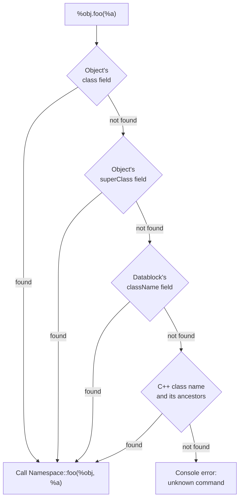

# SimObjects and namespaces

Every live thing in Tribes 2 — a player, a projectile, a GUI control, a group, the `Game` object itself —
is a **SimObject**. This page covers what that means for script: identity, fields, method dispatch, and
the container types you will use constantly.

## Identity: ID and name

Every SimObject has a numeric **ID**, assigned at creation. It may also have a **name**.

```php
new SimGroup (MissionCleanup);          // named
%thrownItem = new Item() { … };         // unnamed — %thrownItem holds the ID
```

Both forms work as a handle:

```php
MissionCleanup.add(%thrownItem);        // by name
%thrownItem.setTransform(%pos);         // by ID
```

Conversions:

| Call | Direction |
|---|---|
| `nameToID(Name)` | Name → numeric ID. Returns `-1` if no such object. |
| `%obj.getID()` | Object → numeric ID |
| `%obj.getName()` | Object → name (empty if unnamed) |
| `isObject(%handle)` | Does this ID or name refer to a live object? |

`isObject` before use is the standard defensive idiom, because objects are deleted out from under
references constantly:

```php
if ( isObject( Canvas ) )
   Canvas.repaint();
```

Classic's `minivstationx.cs` uses `nameToID` to reach mission objects by their `.mis`-declared names
**[script]**:

```php
nametoid(team1vehiclestation).station.setTransform("-180.737 264.173 73.9045 0 0 -0.999913 0.0206931");
```

Note that a *deleted* object's ID may be reused later. Never cache an ID across a mission boundary.

## Fields

Two kinds, which behave identically from script:

| Kind | Origin | Example |
|---|---|---|
| **Static** | Declared by the C++ class | `%player.position`, `%item.dataBlock` |
| **Dynamic** | Created by assigning to it | `%thrownItem.sourceObject`, `%obj.thrownChargeId` |

```php
%thrownItem.sourceObject = %obj;
%thrownItem.team = %obj.team;
%obj.lastThrowTime[%data] = getSimTime();
```

Dynamic fields are how essentially all mod state is stored. They cost nothing to declare, are per-object,
and support array syntax. They are also completely unchecked — a typo creates a new field silently.

Dynamic fields **do not replicate**. A dynamic field set on the server is invisible to the client, and
vice versa. See [Client/server split](client-server-split.md).

## Method dispatch

This is the mechanism that makes TorqueScript extensible without touching C++.

When you call `%obj.foo(%a, %b)`, the engine looks for a script function named `<Namespace>::foo` and calls
it with the object as the first argument. It tries several namespaces in order:



**[inferred]** — the exact ordering is reconstructed from how the shipped scripts rely on it, not from the
binary. What the shipped code demonstrates decisively is that all four sources participate.

### `class` and `superClass` on ScriptObject

The `Game` object is the canonical example **[script]**:

```php
new ScriptObject(Game) {
   class = $CurrentMissionType @ "Game";     // e.g. "CTFGame"
   superClass = DefaultGame;
};
```

A call to `Game.missionLoadDone()` therefore tries `CTFGame::missionLoadDone` first, and falls back to
`DefaultGame::missionLoadDone`. This gives you single inheritance for pure-script objects: define the
common behaviour once in `DefaultGame::`, override selectively in `CTFGame::`.

Other shipped examples:

```php
new ScriptObject(MusicPlayer) { class = MP3Audio;  … };   // clientAudio.cs
new ScriptObject(CDPlayer)    { class = CDAudio;   … };   // redbook.cs
new ScriptObject()            { className = "PlayerRep"; … };   // message.cs
```

> Note `className` in the last example rather than `class`. Both appear in the shipped scripts; `class` is
> the form used for `Game` and the audio players, `className` for lightweight record objects. Prefer
> `class` for new code and match the surrounding file when editing existing code.

### `className` on datablocks

Datablocks route method calls the same way. `ItemData` declares a `className` field, and that name becomes
the dispatch namespace for items using that datablock:

```php
datablock ItemData(Disc)
{
   className = Weapon;               // ← dispatch namespace
   catagory = "Spawn Items";
   shapeFile = "weapon_disc.dts";
   image = DiscImage;
};
```

Which is why `scripts/weapons.cs` defines **[script]**:

```php
function Weapon::onUse(%data, %obj) { … }
function Weapon::onInventory(%this, %obj, %amount) { … }
function Weapon::onPickup(%this, %obj, %shape, %amount) { … }
```

Every weapon in the game shares that code because every weapon's `ItemData` says `className = Weapon`.
Set `className = Pack` and you get `Pack::onUse`, `Pack::onInventory` from `scripts/pack.cs` instead.

**This is the primary extension point for content.** Give your new datablock an existing `className` to
inherit an entire behaviour set for free, or invent a new one and write the handlers yourself.

> Watch the spelling of `catagory`. It is misspelled in the engine's field table and every shipped
> datablock spells it that way **[script]**. `category` silently becomes a dynamic field and the item
> will not appear in the right inventory group.

## Groups and sets

| Type | Semantics |
|---|---|
| `SimSet` | An unordered collection. An object may belong to many sets. |
| `SimGroup` | An *owning* collection. An object belongs to exactly one group; deleting the group deletes its contents. |

Common operations:

```php
%count = ClientGroup.getCount();
for (%i = 0; %i < %count; %i++)
{
   %client = ClientGroup.getObject(%i);
   …
}

MissionCleanup.add(%thrownItem);
MissionGroup.delete();
```

### The groups you must know

| Group | Contains | Lifetime |
|---|---|---|
| **`ClientGroup`** | Every connected `GameConnection`, human and AI | Server lifetime. Referenced 340 times in the shipped scripts — the standard way to iterate players. |
| **`MissionGroup`** | Everything declared in the `.mis` file — terrain, interiors, spawn spheres, flags | Deleted and rebuilt on every mission change |
| **`MissionCleanup`** | Objects created at runtime that should die with the mission | Deleted on mission change |
| **`ServerGroup`** | Server-lifetime objects, including the schedule owner for mission loading | Rebuilt per mission cycle |

`loadMissionStage1` deletes `MissionGroup`, `MissionCleanup`, `Game`, and `$ServerGroup` in that order
**[script]** — a clean slate for the next mission.

### `$instantGroup`

Newly created objects are automatically added to whatever group `$instantGroup` names. `loadMissionStage2`
sets it to `ServerGroup` before executing the `.mis`, then to `MissionCleanup` afterwards **[script]**:

```php
$instantGroup = ServerGroup;
…
exec(%file);                    // the .mis file — objects land in MissionGroup
$instantGroup = MissionCleanup; // everything created from here on cleans up automatically
```

**Practical rule:** any object your mod creates during a mission is automatically cleaned up, provided you
do not disturb `$instantGroup`. If you create objects before a mission (e.g. during `CreateServer`), add
them explicitly or leak them.

Explicit is safer regardless:

```php
%thrownItem = new Item() { dataBlock = %data.thrownItem; sourceObject = %obj; };
MissionCleanup.add(%thrownItem);
```

That is exactly what `HandInventory::onUse` does **[script]**.

## Object lifetime

| Call | Effect |
|---|---|
| `%obj.delete()` | Immediate deletion |
| `%obj.schedule(%ms, delete)` | Deferred deletion |
| `%group.delete()` | Deletes the group *and everything in it* |

Deletion is immediate and unconditional. Any script still holding the ID gets a dangling reference —
which is why `isObject()` guards appear everywhere in the shipped code.

```php
if(%obj.thrownChargeId > 0)
{
   %obj.thrownChargeId.delete();
   %obj.thrownChargeId = 0;
}
```

Note the pattern: delete, then clear the reference.

## Useful introspection

| Call | Returns |
|---|---|
| `%obj.getClassName()` | The C++ class name — `"Player"`, `"Item"`, `"StaticShape"` |
| `%obj.getDataBlock()` | The datablock object |
| `%obj.getDataBlock().className` | The dispatch namespace |
| `%obj.getName()` | Script name, if any |
| `%obj.dump()` | Prints every field and method to the console |
| `%obj.getGroup()` | The containing group |

`dump()` is the single most useful debugging call in the language. See
[Debugging](../06-shipping/debugging.md).

> **`dump()` prints; it does not return.** There is no field-reflection API on `SimObject` in V12 — the
> method table is `setPersistent`, `save`, `setName`, `getName`, `getClassName`, `getId`, `getGroup`,
> `delete`, `schedule`, `dump`, `getType` and nothing more **[binary]**. To *enumerate* an object's fields
> from script, serialise it with `obj.save(fileName, <selectedOnly>)` and read the result back with a
> `FileObject`; the engine's writer walks the real field tables in C++, and static fields land one tab
> shallower than dynamic ones **[script]**. That is the same call the mission editor uses to write `.mis`
> files. The [Construction mod](../40-construction-mod/building-systems.md#saving-and-loading-buildings)
> hand-rolls a filtered equivalent when it needs per-datablock control over what gets written.

Guards on class name are everywhere in the shipped scripts **[script]**:

```php
if(%obj.getClassName() !$= "Player")
   return;

if (%obj.getDataBlock().className $= Armor)
   %obj.mountImage(%data.image, $WeaponSlot);
```

## Under the community patches

The object model is unchanged — IDs, names, dynamic fields, `class` / `superClass` / `className`
dispatch, `SimGroup` and `SimSet` semantics, `$instantGroup`, deletion.

Two additions:

**`HTTPObject` gains HTTPS.** The class is registered in vanilla `Tribes2.exe` **[binary]** but speaks
plain HTTP only. TribesNEXT's `IFC22.dll` provides a libcurl-backed implementation with TLS, which is what
the auth lookup uses. If your mod wants to talk to a web service, this is the object — but it only works
on a patched install, so guard for it.

**`ClientGroup` can hold half-connected clients.** On a patched server a `GameConnection` exists during
the pre-authentication phase without a player attached. Loops over `ClientGroup` that assume every entry
is a live player need a guard — see
[Client/server split](client-server-split.md#under-the-community-patches).

The RC2a-only `rubyExec` / `rubyEval` bridge is worth knowing exists but is not something to build on; it
was removed in the QoL rewrite.

## Related

- [Datablocks](datablocks.md) — the static half of the object model
- [Packages](packages.md) — overriding the namespaced functions described here
- [Scheduling and events](scheduling-and-events.md) — `schedule` and object cleanup
- [Class hierarchy](../90-reference/class-hierarchy.md) — the engine class tree
- [07 · Community Patches](../07-community-patches/README.md) — the patch-added console surface
