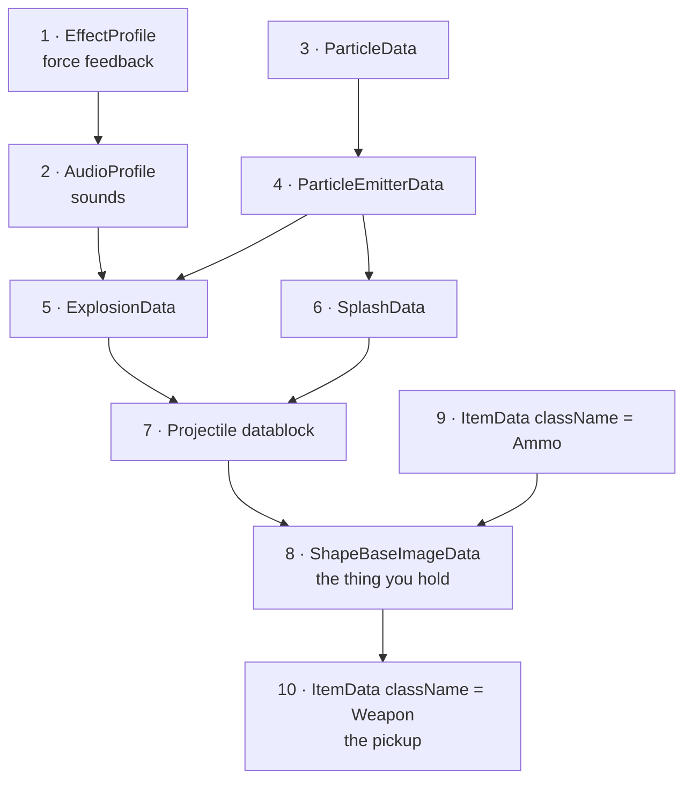

# 03 · Content Recipes

This is the section the 2002-era community tutorials were mostly about: how to add a weapon, an armor, a
vehicle, a deployable. Those recipes are preserved and corrected here, with the shipped V12 code as the
reference rather than someone's memory of it.

**Read [02 · Engine Model](../02-engine-model/README.md) first.** Every recipe here assumes you know what
a datablock is, how `className` dispatch works, and why declaration order matters.

| Page | Build |
|---|---|
| [Weapons](weapons.md) | A complete weapon: item, image, state machine, fire code |
| [Projectiles](projectiles.md) | All ten projectile datablock types and their fields |
| [Ammo and inventory](ammo-and-inventory.md) | Ammo, inventory limits, station loadouts |
| [Packs](packs.md) | Backpacks — passive and activated |
| [Grenades and hand inventory](grenades-and-hand-inventory.md) | Thrown items: grenades, mines, beacons |
| [Armors](armors.md) | `PlayerData` — movement, energy, animation |
| [Vehicles](vehicles.md) | Flying, wheeled, and hover vehicles |
| [Turrets and deployables](turrets-and-deployables.md) | Turret barrels and deployed objects |
| [Particles, explosions, and effects](particles-explosions-effects.md) | The visual effect datablock chain |
| [Damage and type masks](damage-and-typemasks.md) | Damage types, radius damage, collision masks |
| [Audio](audio.md) | Sound profiles, descriptions, and 3D playback |

## The universal shape of a content file

Every content file in Tribes 2 is written **bottom-up**: each datablock is declared only after everything
it references exists. `scripts/weapons/disc.cs` is the canonical example, and every recipe here follows its
structure.



If you get a `Unable to find object: '<Name>' attempting to find object on datablock field` error, you
declared something out of order. Move it up.

## Where to put your files

```
GameData/MyMod/
└── scripts/
    ├── autoexec/
    │   └── mymod.cs             ← entry point; declares packages, execs the rest
    ├── weapons/
    │   └── myWeapon.cs
    ├── packs/
    │   └── myPack.cs
    ├── vehicles/
    │   └── myVehicle.cs
    └── turrets/
        └── myBarrel.cs
```

Mirror the base layout. It costs nothing and makes your mod legible to anyone who knows the base game.

Load them from a server-side hook, not from the top of your autoexec script — see
[Boot sequence](../02-engine-model/boot-sequence.md).

## Under the community patches

**Nothing in this section changes on a patched install**, with one partial exception.

Neither TribesNEXT patch modifies `Tribes2.exe`, and neither touches gameplay content. Datablock
declaration, inheritance, `className` dispatch, field validation ranges, transmission to clients, the
`exec` ordering constraints — all identical. A weapon, armor, vehicle, pack, turret, deployable, or
projectile written against this section runs unmodified on vanilla, RC2a, and the QoL preview.

The exception is [Audio](audio.md), which has its own section: the QoL patch adds OpenAL Soft alongside
Miles and kills force feedback. Neither changes how you *author* audio — your `AudioProfile` and
`AudioDescription` blocks are unaffected.

Two smaller notes that cut across the recipes:

- **`EffectProfile` is inert on the QoL patch.** The blocks still parse; the effects never play. Declaring
  them stays harmless. **[binary]**
- **New art may reach clients via asset downloads.** `enableAssetDownloads` can ship missing files on
  connect, softening the "every client must install it" rule — but it is user-toggleable, so do not rely
  on it. See [Packaging](../06-shipping/packaging.md#under-the-community-patches).

Full detail in [07 · Community Patches](../07-community-patches/README.md).

## A caution about the tutorial corpus

The [community tutorials](../reference/source-tutorial-index.md) are the origin of most of these
recipes and are worth reading. They also contain a fair amount of guesswork stated as fact. The author of
`coding_knowledge.txt` is refreshingly honest about it **[community]**:

> "restorativeFactor / dragFactor / endFactor / randForceFactor / randForceTime — i don't know what these
> do."

Where this handbook can do better, it does. Where a field's meaning genuinely is not recoverable from the
scripts or the binary, it says so rather than guessing.
