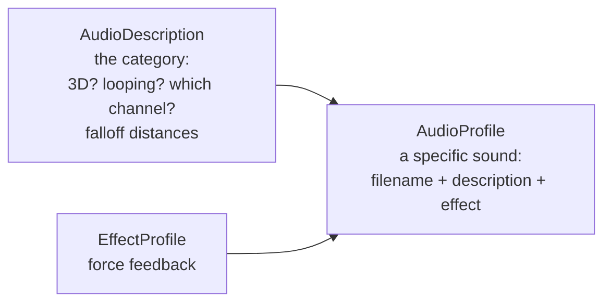

# Audio

Sound in Tribes 2 is two datablocks and a handful of console functions. `AudioProfile` is the most-declared
datablock in the game — 298 of them **[script]** — so this is a system you will touch constantly.

## The two datablocks



### `AudioProfile` — a sound

```php
datablock AudioProfile(DiscFireSound)
{
   filename    = "fx/weapons/spinfusor_fire.wav";
   description = AudioDefault3d;        // ← the AudioDescription
   preload     = true;
   effect      = DiscFireEffect;        // ← optional force-feedback EffectProfile
};
```

| Field | Meaning |
|---|---|
| `filename` | Path relative to the mod path stack — `audio/` is the implied category |
| `description` | An `AudioDescription` datablock |
| `preload` | Load at datablock transmission rather than on first play |
| `effect` | An `EffectProfile` for Immersion force feedback |

`preload = true` on anything that must not stutter the first time it plays — weapon fire, impacts, UI
clicks. The shipped profiles use it selectively; looping ambient sounds mostly do not.

### `AudioDescription` — the category

Thirteen ship **[script]**. Three examples:

```php
datablock AudioDescription(AudioClosest3d)
{
   volume     = 1.0;
   isLooping  = false;
   is3D       = true;
   minDistance = 5.0;
   MaxDistance = 30.0;
   type       = $EffectAudioType;
   environmentLevel = 1.0;
};

datablock AudioDescription(AudioDefault3d)
{
   volume     = 1.0;
   isLooping  = false;
   is3D       = true;
   minDistance = 20.0;
   MaxDistance = 100.0;
   type       = $EffectAudioType;
   environmentLevel = 1.0;
};

datablock AudioDescription(ProjectileLooping3d)
{
   volume     = 1.0;
   isLooping  = true;
   is3D       = true;
   minDistance = 5.0;
   MaxDistance = 20.0;
   type       = $EffectAudioType;
   environmentLevel = 1.0;
};
```

| Field | Meaning |
|---|---|
| `volume` | Base gain |
| `isLooping` | Repeat until stopped |
| `is3D` | Positional. `false` plays at constant volume regardless of distance — use for UI. |
| `minDistance` | Full volume within this radius |
| `MaxDistance` | Inaudible beyond this |
| `type` | The mixer channel — see below |
| `environmentLevel` | Reverb response, `0.0`–`1.0` |

**Note the capital `M` in `MaxDistance`** against lowercase `minDistance`. That is how the shipped
datablocks spell it, consistently. Match it.

### The shipped descriptions

| Name | Looping | min / max | Use for |
|---|---|---|---|
| `AudioClosest3d` | no | 5 / 30 | Reloads, switches — heard only nearby |
| `AudioClose3d` | no | 10 / 60 | Deploy sounds, mid-range effects |
| `AudioDefault3d` | no | 20 / 100 | Weapon fire |
| `AudioExplosion3d` | no | — | Explosions, longest range |
| `ClosestLooping3d` | yes | 5 / 30 | Idle hums |
| `CloseLooping3d` | yes | 10 / 50 | Engine loops |
| `AudioDefaultLooping3d` | yes | 20 / 100 | Long-range loops |
| `ProjectileLooping3d` | yes | 5 / 20 | Projectiles in flight |

Pick the existing description that matches your intent rather than declaring a new one. The distances
were tuned together and mixing in an oddly-scaled sound is immediately noticeable.

## Channels

`$…AudioType` globals name the mixer channels, each bound to a preference **[script]**:

```php
alxSetChannelVolume( $EffectAudioType, $pref::Audio::effectsVolume );
alxSetChannelVolume( $VoiceAudioType,  $pref::Audio::voiceVolume );
alxSetChannelVolume( $ChatAudioType,   $pref::Audio::radioVolume );
alxSetChannelVolume( $MusicAudioType,  $pref::Audio::musicVolume );
alxSetChannelVolume( $GuiAudioType,    $pref::Audio::guiVolume );
alxSetChannelVolume( $RadioAudioType,  $pref::Audio::radioVolume );
```

| Channel | For |
|---|---|
| `$EffectAudioType` | Gameplay sounds — the default |
| `$VoiceAudioType` | Voice pack clips |
| `$ChatAudioType` | Chat and radio |
| `$RadioAudioType` | Radio |
| `$GuiAudioType` | Interface |
| `$MusicAudioType` | Music |

Putting a sound on the right channel means the player's volume sliders work as expected. A gameplay sound
on `$GuiAudioType` cannot be turned down independently.

## Playing sounds

| Call | Side | Purpose |
|---|---|---|
| `serverPlay3D(%profile, %transform)` | Server | Positional one-shot, replicated to clients. No object needed. |
| `%obj.playAudio(%slot, %profile)` | Server | Sound attached to an object, on a numbered slot |
| `%obj.stopAudio(%slot)` | Server | Stop that slot |
| `alxCreateSource(%description, %filename)` | Client | Create a source handle directly |
| `alxPlay(%handle)` | Client | Play it |
| `alxStop(%handle)` | Client | Stop it |
| `alxStopAll()` | Client | Silence everything |
| `alxGetWaveLen(%filename)` | Client | Length in milliseconds |
| `alxPlayMusic(%path)` | Client | Stream music |
| `alxListenerf(AL_GAIN_LINEAR, %v)` | Client | Master gain |
| `alxSetChannelVolume(%type, %v)` | Client | Per-channel gain |

`alx` is the OpenAL-style naming — Tribes 2 wraps Miles Sound System behind an OpenAL-shaped API.

### Object audio slots

Slots are numbered and long-lived, which is how looping sounds are managed. The ELF gun reserves two
**[script]**:

```php
$ELFZapSound  = 2;
$ELFFireSound = 3;
…
%targeter.playAudio($ELFFireSound, ELFGunFireSound);
if(!%target.zapSound)
{
   %target.playAudio($ELFZapSound, ELFHitTargetSound);
   %target.zapSound = true;
}
…
%target.stopAudio($ELFZapSound);
%targeter.stopAudio($ELFFireSound);
```

Note the boolean guard — `playAudio` on a slot that is already playing restarts it, so a per-frame call
without a guard produces a stutter rather than a loop. **Define your slot numbers as globals**, as Sierra
did, so two systems do not collide on a slot.

### Positional one-shots

```php
serverPlay3D(GrenadeThrowSound, %pos);
```

Server-side, no object required, replicated. This is the right call for transient sounds at a location.

## Sound in chat messages

`defaultMessageCallback` plays a WAV embedded in a message via the `~w` marker **[script]**:

```php
$MaxMessageWavLength = 5200;

%wavStart = strstr( %message, "~w" );
if ( %wavStart != -1 )
{
   %wav = getSubStr( %message, %wavStart + 2, 1000 );
   %wavLengthMS = alxGetWaveLen( %wav );
   if ( %wavLengthMS <= $MaxMessageWavLength )
   {
      %handle = alxCreateSource( AudioChat, %wav );
      alxPlay( %handle );
   }
   else
      error( "WAV file \"" @ %wav @ "\" is too long! **" );

   %message = getSubStr( %message, 0, %wavStart );
   if ( %message !$= "" )
      addMessageHudLine( %message );
}
```

So a server message of the form `'\c2Enemy spotted!~wfx/voice/spotted.wav'` prints text *and* plays a
sound. This is how voice binds work, and the 5.2-second cap is the anti-spam guard.

Deployables use it for the error beep **[script]**:

```php
%errorSnd = '~wfx/misc/misc.error.wav';
```

## Force feedback — `EffectProfile`

140 declared **[script]**. They drive Immersion TouchSense hardware, which almost nobody has today.

```php
datablock EffectProfile(DiscFireEffect)
{
   effectname = "weapons/spinfusor_fire";
   minDistance = 2.5;
   maxDistance = 2.5;
};
```

`effectname` refers to an `.ifr` (Immersion Force-feedback Resource) in `base.vl2`'s `effects/`
directory. **You do not need to declare these** — a new `AudioProfile` with no `effect` field works fine.
The shipped weapon files declare a full set purely for completeness.

## Recipe: sounds for a new weapon

Follow the shipped order — effects, then sounds, then everything that references them:

```php
//------------------------------------------------------------------------------
// MyMod — Burst Spinfusor sounds
//------------------------------------------------------------------------------

datablock AudioProfile(BurstDiscFireSound)
{
   filename    = "fx/weapons/spinfusor_fire.wav";     // reuse a stock file
   description = AudioDefault3d;
   preload     = true;
};

datablock AudioProfile(BurstDiscReloadSound)
{
   filename    = "fx/weapons/spinfusor_reload.wav";
   description = AudioClosest3d;
   preload     = true;
};

datablock AudioProfile(BurstDiscLoopSound)
{
   filename    = "fx/weapons/spinfusor_idle.wav";
   description = ClosestLooping3d;
};

datablock AudioProfile(BurstDiscDryFireSound)
{
   filename    = "fx/weapons/spinfusor_dryfire.wav";
   description = AudioClose3d;
   preload     = true;
};
```

then reference them from the image's state machine:

```php
   stateSound[2] = BurstDiscLoopSound;      // Ready
   stateSound[3] = BurstDiscFireSound;      // Fire
   stateSound[4] = BurstDiscReloadSound;    // Reload
   stateSound[6] = BurstDiscDryFireSound;   // DryFire
```

### Shipping your own `.wav` files

Place them at `MyMod/audio/<yourpath>/<name>.wav` and reference them as `"<yourpath>/<name>.wav"` — the
`audio/` category prefix is implied. See
[Mod paths and overrides](../02-engine-model/mod-paths-and-overrides.md#category-prefixes).

Because audio files are *referenced by* a datablock rather than carried in it, a client without your
`.wav` gets silence, not an error. **New audio requires a client-side download**; reusing stock sounds
does not. See [Datablocks](../02-engine-model/datablocks.md#datablocks-are-transmitted-to-clients).

## Reverb environments

`AudioEnvironment` datablocks (3 shipped **[script]**) define reverb spaces, applied by the mission and
scaled per-sound by `environmentLevel` on the `AudioDescription`. Rarely worth authoring for a gameplay
mod; relevant if you are building interiors.

## Under the community patches

This is the most-changed subsystem in section 03 — though almost none of it affects how you *author*
audio.

### OpenAL Soft joins Miles

The QoL patch replaces `Mss32.dll` with a proxy that routes to OpenAL Soft (`soft_oal.dll`), and offers
both backends **[patch-script]**:

```php
$pref::Audio::drivers = "Miles\tOpenAL";
```

The reason is practical: Miles' DirectSound path degraded on Windows Vista and broke harder on Windows 10.
OpenAL Soft is what makes audio work on a modern machine.

**Your `AudioProfile` and `AudioDescription` datablocks need no changes.** The `alx*` API is the same —
the naming was always OpenAL-shaped, and the patch simply makes it OpenAL underneath.

Driver switching is handled by an override **[patch-script]**: `audioSetDriver("none")`, then
`audioSetDriver(newDriver)`, then the shell hum is re-armed via `alxPlay()`. Environmental audio is gated
on `alxIsExtensionPresent(EAX)`, which now reports the OpenAL backend's capability rather than the
hardware's.

New `alx*` functions registered by `IFC22.dll` **[binary]**:

```
alxGetContexti(ALC_PROVIDER_COUNT | ALC_PROVIDER | ALC_SPEAKER_COUNT | ALC_SPEAKER)
alxGetContextstr(ALC_PROVIDER_NAME | ALC_SPEAKER_NAME, idx)
alxIsExtensionPresent(name)
alxEnableEnvironmental(bool)
```

### Music gains FLAC

`MP3Audio::playTrack` is overridden to play FLAC instead of MP3 when the OpenAL provider is active and a
matching FLAC file exists **[patch-script]**. `getRandomTrack` still enumerates `music/*.mp3` for
selection, so a mod shipping music should ship MP3 and may optionally ship FLAC alongside.

### Force feedback is dead

`EffectProfile` datablocks — 140 of them in the shipped scripts — still parse, and `AudioProfile.effect`
still accepts them. But TribesNEXT's `IFC22.dll` stubs the 11 Immersion exports it replaces **[binary]**,
so the `.ifr` effects never play.

**This changes nothing about how you write audio.** Declaring `EffectProfile` blocks remains harmless, and
omitting them was always fine. RC2a keeps the vendor DLL, so force feedback still works there.

### Sound files still need to reach the client

Unchanged, with one caveat: `enableAssetDownloads` may deliver a missing `.wav` on connect. Do not rely on
it — see [Packaging](../06-shipping/packaging.md#under-the-community-patches).

## Related

- [Weapons](weapons.md) — `stateSound[n]` in the image state machine
- [Particles, explosions, and effects](particles-explosions-effects.md) — `soundProfile` on `ExplosionData`
- [Text and messaging](../04-interface/text-and-messaging.md) — the `~w` marker
- [Armors](armors.md) — the footstep and impact sound tables
- [TribesNEXT QoL patch](../07-community-patches/tribesnext-qol.md#audio) — the audio overrides in full
