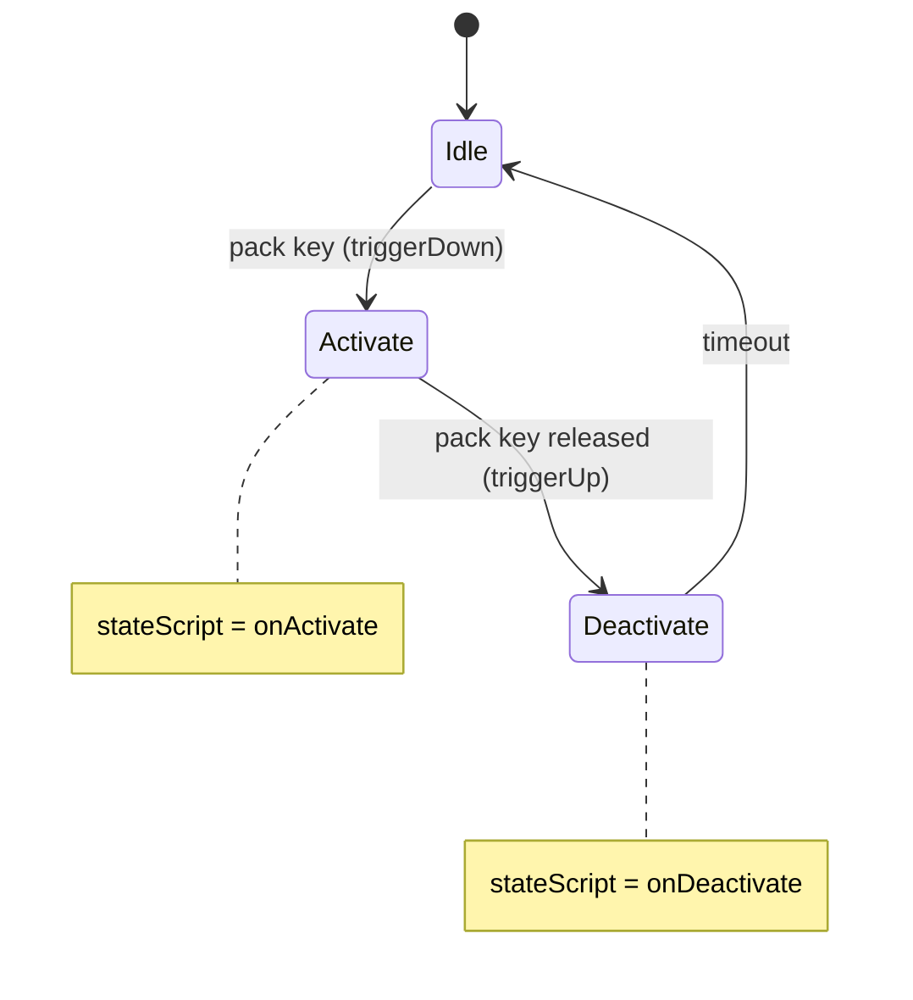

# Packs

A pack is an `ItemData` with `className = Pack` and a `ShapeBaseImageData` that mounts to
`$BackpackSlot`. Packs come in two flavours — **passive** (effect applies while worn) and **activated**
(the player presses the pack key to toggle it).

## The shared behaviour

`scripts/pack.cs` defines the three handlers every pack inherits from `className = Pack` **[script]**.

### Auto-mounting

```php
function Pack::onInventory(%data,%obj,%amount)
{
   //only do this for players
   if(%obj.getClassName() !$= "Player")
      return;

   // Auto-mount the packs on players
   if((%oldPack = %obj.getMountedImage($BackpackSlot)) != 0)
      %obj.setInventory(%oldPack.item, 0);
   if (%amount && %obj.getDatablock().className $= Armor)
   {
      // if you picked up another pack after you placed a satchel charge but
      // before you detonated it, delete the charge
      if(%obj.thrownChargeId > 0)
      {
         %obj.thrownChargeId.delete();
         %obj.thrownChargeId = 0;
      }
      %obj.mountImage(%data.image,$BackpackSlot);
      %obj.client.setBackpackHudItem(%data.getName(), 1);
   }
   if(%amount == 0 )
   {
      if ( %data.getName() $= "SatchelCharge" )
         %obj.client.setBackpackHudItem( "SatchelUnarmed", 1 );
      else
         %obj.client.setBackpackHudItem(%data.getName(), 0);
   }
   ItemData::onInventory(%data,%obj,%amount);
}
```

Three behaviours fall out of this and you get them free:

- **Only one pack at a time.** Acquiring a pack removes the previous one.
- **Packs mount automatically** on acquisition — no `use()` needed.
- **The backpack HUD icon** updates itself.

### The pack key

```php
function Pack::onUse(%data,%obj)
{
   if (%obj.getMountedImage($BackpackSlot) != %data.image.getId())
      %obj.mountImage(%data.image,$BackpackSlot);
   else
   {
      // Toggle the image trigger.
      %obj.setImageTrigger($BackpackSlot,
         !%obj.getImageTrigger($BackpackSlot));
   }
}
```

Pressing the pack key toggles the image's trigger. For a passive pack nothing happens because its state
machine has no trigger transitions. For an activated pack the trigger drives the state machine.

### Pickup guard

```php
function Pack::onCollision(%data, %obj, %col)
{
   // Don't pick up a new pack if you have a satchel charge deployed:
   if ( %col.thrownChargeId > 0 )
      return;

   ItemData::onCollision(%data, %obj, %col);
}
```

## Passive pack — the energy pack

The whole file **[script]**:

```php
// ------------------------------------------------------------------
// ENERGY PACK
// can be used by any armor type
// does not have to be activated
// increases the user's energy recharge rate

datablock ShapeBaseImageData(EnergyPackImage)
{
   shapeFile = "pack_upgrade_energy.dts";
   item = EnergyPack;
   mountPoint = 1;                 // ← the back node
   offset = "0 0 0";
   rechargeRateBoost = 0.15;       // ← a dynamic field, read by the handlers below

   stateName[0] = "default";
   stateSequence[0] = "activation";
};

datablock ItemData(EnergyPack)
{
   className = Pack;
   catagory = "Packs";
   shapeFile = "pack_upgrade_energy.dts";
   mass = 1;
   elasticity = 0.2;
   friction = 0.6;
   pickupRadius = 2;
   rotate = true;                  // ← spins when lying on the ground
   image = "EnergyPackImage";
   pickUpName = "an energy pack";

   computeCRC = true;
};

function EnergyPackImage::onMount(%data, %obj, %node)
{
   %obj.setRechargeRate(%obj.getRechargeRate() + %data.rechargeRateBoost);
   %obj.hasEnergyPack = true; // set for sniper check
}

function EnergyPackImage::onUnmount(%data, %obj, %node)
{
   %obj.setRechargeRate(%obj.getRechargeRate() - %data.rechargeRateBoost);
   %obj.hasEnergyPack = "";
}

function EnergyPack::onPickup(%this, %obj, %shape, %amount)
{
   // created to prevent console errors
}
```

This is the template for every passive pack, and it is remarkably small. Note:

- **A single-state machine** (`stateName[0] = "default"`) with no transitions — the pack is never
  "activated".
- **`onMount` / `onUnmount` do the work**, symmetrically. Add the bonus on mount, subtract it on unmount.
  Getting this asymmetric is the classic pack bug: pick up and drop an energy pack ten times and end up
  with a permanent recharge boost.
- **The tuning value lives on the image as a dynamic field** (`rechargeRateBoost`), not hardcoded in the
  handler. Copy this — it makes the pack tunable without touching code.
- **`EnergyPack::onPickup` exists solely to suppress a console error.** The engine calls `onPickup` and
  there is no `Pack::onPickup`, so without this stub you get error spam.

## Activated pack — the repair pack

```php
datablock ShapeBaseImageData(RepairPackImage)
{
   shapeFile = "pack_upgrade_repair.dts";
   item = RepairPack;
   mountPoint = 1;
   offset = "0 0 0";
   emap = true;

   gun = RepairGunImage;           // ← dynamic field: what to mount on activation

   stateName[0] = "Idle";
   stateTransitionOnTriggerDown[0] = "Activate";

   stateName[1] = "Activate";
   stateScript[1] = "onActivate";
   stateSequence[1] = "fire";
   stateSound[1] = RepairPackActivateSound;
   stateTransitionOnTriggerUp[1] = "Deactivate";

   stateName[2] = "Deactivate";
   stateScript[2] = "onDeactivate";
   stateTransitionOnTimeout[2] = "Idle";
};
```



The handlers **[script]**:

```php
function RepairPackImage::onActivate(%data, %obj, %slot)
{
   // don't activate the pack if player is piloting a vehicle
   if(%obj.isPilot())
   {
      %obj.setImageTrigger(%slot, false);
      return;
   }

   if(!isObject(%obj.getMountedImage($WeaponSlot))
      || %obj.getMountedImage($WeaponSlot).getName() !$= "RepairGunImage")
   {
      messageClient(%obj.client, 'MsgRepairPackOn', '\c2Repair pack activated.');

      // make sure player's arm thread is "look"
      %obj.setArmThread(look);

      // mount the repair gun
      %obj.mountImage(RepairGunImage, $WeaponSlot);
      // clientCmdsetRepairReticle found in hud.cs
      commandToClient(%obj.client, 'setRepairReticle');
   }
}

function RepairPackImage::onDeactivate(%data, %obj, %slot)
{
   //called when the player hits the "pack" key again (toggle)
   %obj.setImageTrigger(%slot, false);
   // if repair gun was mounted, unmount it
   if(%obj.getMountedImage($WeaponSlot).getName() $= "RepairGunImage")
      %obj.unmountImage($WeaponSlot);
}

function RepairPackImage::onUnmount(%data, %obj, %node)
{
   // dismount the repair gun if the player had it mounted
   // need the extra "if" statement to avoid a console error message
   if(%obj.getMountedImage($WeaponSlot))
      if(%obj.getMountedImage($WeaponSlot).getName() $= "RepairGunImage")
         %obj.unmountImage($WeaponSlot);
   // if the player was repairing something when the pack was thrown, stop repairing it
   if(%obj.repairing != 0)
      stopRepairing(%obj);
}
```

The pattern to copy: **`onActivate` refuses when it should not run, `onDeactivate` cleans up, and
`onUnmount` cleans up again** in case the player throws the pack while it is active. All three matter —
skip `onUnmount` and a thrown repair pack leaves the player holding a repair gun forever.

## Item glow

The repair pack's `ItemData` shows the ground-glow fields **[script]**:

```php
   lightOnlyStatic = true;
   lightType = "PulsingLight";
   lightColor = "1 0 0 1";
   lightTime = 1200;
   lightRadius = 4;
```

| Field | Meaning |
|---|---|
| `lightOnlyStatic` | Only glow when the item is at rest on the ground |
| `lightType` | `"PulsingLight"`, `"ConstantLight"`, `"NoLight"` |
| `lightColor` | RGBA |
| `lightTime` | Pulse period, ms |
| `lightRadius` | Illumination radius, metres |

## The shipped packs

`scripts/pack.cs` executes twelve pack files **[script]**:

| Upgrade packs | Turret barrel packs |
|---|---|
| `ammopack.cs` — raises `max[]` limits | `aabarrelpack.cs` |
| `cloakingpack.cs` — activated invisibility | `missilebarrelpack.cs` |
| `energypack.cs` — passive recharge boost | `mortarbarrelpack.cs` |
| `repairpack.cs` — activated repair gun | `plasmabarrelpack.cs` |
| `shieldpack.cs` — activated damage absorption | `ELFbarrelpack.cs` |
| `satchelCharge.cs` — deployable explosive | |
| `sensorjammerpack.cs` — passive sensor jamming | |

Barrel packs are covered in [Turrets and deployables](turrets-and-deployables.md).

## Recipe: a passive speed pack

`MyMod/scripts/packs/speedPack.cs`:

```php
//------------------------------------------------------------------------------
// MyMod — Speed Pack: passive run-speed boost at the cost of energy recharge
//------------------------------------------------------------------------------

datablock ShapeBaseImageData(SpeedPackImage)
{
   shapeFile  = "pack_upgrade_energy.dts";    // reuse a stock model
   item       = SpeedPack;
   mountPoint = 1;
   offset     = "0 0 0";
   emap       = true;

   runBoost      = 1.25;      // multiplier
   rechargeCost  = 0.08;      // energy recharge given up

   stateName[0]     = "default";
   stateSequence[0] = "activation";
};

datablock ItemData(SpeedPack)
{
   className    = Pack;
   catagory     = "Packs";
   shapeFile    = "pack_upgrade_energy.dts";
   mass         = 1;
   elasticity   = 0.2;
   friction     = 0.6;
   pickupRadius = 2;
   rotate       = true;
   image        = "SpeedPackImage";
   pickUpName   = "a speed pack";

   computeCRC = true;
};

function SpeedPackImage::onMount(%data, %obj, %node)
{
   // Remember what we changed, so onUnmount is exact.
   %obj.speedPackOldRun = %obj.getDataBlock().runForce;
   %obj.setRechargeRate(%obj.getRechargeRate() - %data.rechargeCost);
   %obj.hasSpeedPack = true;
}

function SpeedPackImage::onUnmount(%data, %obj, %node)
{
   %obj.setRechargeRate(%obj.getRechargeRate() + %data.rechargeCost);
   %obj.hasSpeedPack = "";
   %obj.speedPackOldRun = "";
}

function SpeedPack::onPickup(%this, %obj, %shape, %amount)
{
   // suppress console error, as EnergyPack does
}
```

Then register it — this is the part that is easy to forget. In your package:

```php
package MyMod
{
   function LightMaleHumanArmor::stationSetInv(%data, %player)
   {
      Parent::stationSetInv(%data, %player);
      %player.setInventory(SpeedPack, 1);
   }
};
```

and add `max[SpeedPack] = 1;` to each armor that may carry it — see
[Ammo and inventory](ammo-and-inventory.md#the-complete-checklist-for-a-new-item).

> **Movement speed caveat.** `runForce` and `maxForwardSpeed` live on the `PlayerData` datablock, which is
> shared by every player wearing that armor — writing to it from a pack affects everyone. A real speed
> pack needs a per-player mechanism; the shipped packs work by adjusting per-object properties
> (`setRechargeRate`, `setCloaked`, `setInvincibleMode`) precisely for that reason. Design your pack around
> a per-object setter, not a datablock field. See [Armors](armors.md).

## Related

- [Ammo and inventory](ammo-and-inventory.md) — registering the pack so it can be obtained
- [Armors](armors.md) — `max[]` limits and per-object movement properties
- [Weapons](weapons.md) — the image state machine in detail
- [Turrets and deployables](turrets-and-deployables.md) — barrel packs and satchel charges

> **On a patched install:** nothing on this page changes. Neither TribesNEXT patch touches gameplay
> content — see [03 · Content Recipes](README.md#under-the-community-patches).
