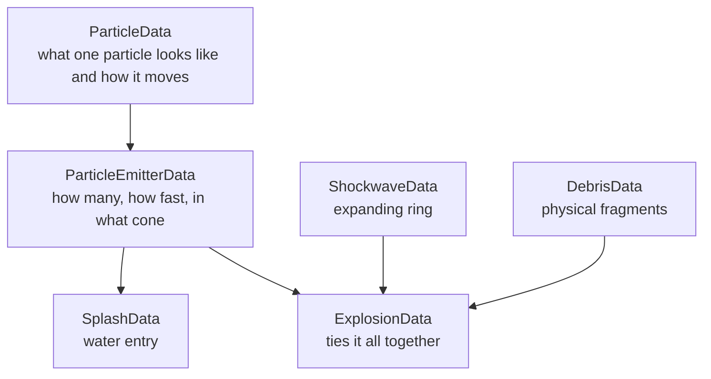

# Particles, explosions, and effects

The visual effect system is five datablock types stacked in a fixed order. Once you know the stack, every
effect in the game reads the same way.



`ParticleData` and `ParticleEmitterData` are the two most-declared datablocks in the game — 114 each
**[script]**.

## `ParticleData` — one particle

`scripts/particleEmitter.cs` ships an annotated default **[script]**:

```php
datablock ParticleData(DefaultParticle)
{
   dragCoefficient      = 0.0;   // Not affected by drag
   gravityCoefficient   = 0.0;   // ...or gravity
   windCoefficient      = 1.0;

   inheritedVelFactor   = 0.0;   // Do not inherit emitters velocity
   constantAcceleration = 0.0;   // No constant accel along initial velocity

   lifetimeMS           = 1000;  // lasts 1 second
   lifetimeVarianceMS   = 0;     // ...exactly

   textureName          = "particleTest";

   colors[0]     = "1 1 1 1";    // All white, no blending
   colors[1]     = "1 1 1 1";
   colors[2]     = "1 1 1 1";
   colors[3]     = "1 1 1 1";

   sizes[0]      = 1;            // One meter across
   sizes[1]      = 1;
   sizes[2]      = 1;
   sizes[3]      = 1;

   times[0] = 0.0;               // Linear blend from color[0] to color[1]
   times[1] = 1.0;               //  Note that times[0] is always 0
   times[2] = 2.0;               //  even when set in the data block.
   times[3] = 2.0;
};
```

| Field | Meaning |
|---|---|
| `dragCoefficient` | Air resistance |
| `gravityCoefficient` | Gravity multiplier. **Negative values rise** — that is how smoke works. |
| `windCoefficient` | Wind response |
| `inheritedVelFactor` | Fraction of the emitter's velocity to adopt |
| `constantAcceleration` | Acceleration along the initial velocity |
| `lifetimeMS` / `lifetimeVarianceMS` | Duration ± variance |
| `textureName` | Sprite texture |
| `useInvAlpha` | Invert alpha blending — use for smoke, leave off for fire |
| `spinRandomMin` / `spinRandomMax` | Rotation, degrees per second |
| `colors[0..3]` | RGBA keyframes |
| `sizes[0..3]` | Size keyframes, metres |
| `times[0..3]` | Normalised keyframe times, `0.0`–`1.0` |

**`colors`, `sizes`, and `times` are parallel arrays** describing the particle's animation over its life.
`times[0]` is always `0.0` regardless of what you write. From the spinfusor's underwater bubbles
**[script]**:

```php
datablock ParticleData(DiscExplosionBubbleParticle)
{
   dragCoefficient      = 0.0;
   gravityCoefficient   = -0.25;      // ← rises
   inheritedVelFactor   = 0.0;
   constantAcceleration = 0.0;
   lifetimeMS           = 2000;
   lifetimeVarianceMS   = 750;
   useInvAlpha          = false;
   textureName          = "special/bubbles";

   spinRandomMin        = -100.0;
   spinRandomMax        =  100.0;

   colors[0]     = "0.7 0.8 1.0 0.0";     // fade in
   colors[1]     = "0.7 0.8 1.0 0.4";
   colors[2]     = "0.7 0.8 1.0 0.0";     // fade out
   sizes[0]      = 1.0;
   sizes[1]      = 1.0;
   sizes[2]      = 1.0;
   times[0]      = 0.0;
   times[1]      = 0.3;
   times[2]      = 1.0;
};
```

The alpha ramp `0.0 → 0.4 → 0.0` with `times 0.0 / 0.3 / 1.0` is the standard fade-in-fast, fade-out-slow
shape. Copy it.

## `ParticleEmitterData` — how they are emitted

```php
datablock ParticleEmitterData(DefaultEmitter)
{
   ejectionPeriodMS = 100;    // 10 Particles Per second
   periodVarianceMS = 0;      // ...exactly

   ejectionVelocity = 2.0;    // From 1.0 - 3.0 meters per sec
   velocityVariance = 1.0;

   ejectionOffset   = 0.0;    // Emit at the emitter origin

   thetaMin         = 0.0;    // All theta angles
   thetaMax         = 90.0;

   phiReferenceVel  = 0.0;    // All phi angles
   phiVariance      = 360.0;

   overrideAdvances = false;

   particles = "DefaultParticle";
};
```

| Field | Meaning |
|---|---|
| `ejectionPeriodMS` | Milliseconds between particles. **Lower is denser.** |
| `periodVarianceMS` | Randomisation of the period |
| `ejectionVelocity` / `velocityVariance` | Launch speed ± variance |
| `ejectionOffset` | Distance from the emitter origin to spawn |
| `thetaMin` / `thetaMax` | Cone half-angles from the emitter axis, degrees |
| `phiReferenceVel` / `phiVariance` | Rotation around the axis |
| `overrideAdvances` | See below |
| `orientParticles` | Align the sprite to the velocity vector |
| `lifetimeMS` | Emitter's own lifetime |
| `particles` | The `ParticleData` to emit. **Space-separated list for several types.** |

### The cone

`thetaMin` / `thetaMax` define a cone around the emitter's forward axis:

| Setting | Shape |
|---|---|
| `thetaMin = 0; thetaMax = 0` | A straight beam |
| `thetaMin = 0; thetaMax = 90` | A hemisphere |
| `thetaMin = 0; thetaMax = 180` | A full sphere |
| `thetaMin = 85; thetaMax = 85` | A flat ring — used by `DiscMistEmitter` **[script]** |
| `thetaMin = 60; thetaMax = 80` | An angled ring — `DiscSplashEmitter` |

### The two comments worth reading

`particleEmitter.cs` opens with a warning that explains two non-obvious fields **[script]**:

> *"A note about the `phiReferenceVel`, it will only be useful in cases in which the axis of the emitter
> is not changed over the life of the emission — i.e., a linear projectile say, or an explosion that sits
> in one place. A grenade, for instance, wouldn't necessarily give the desired result."*

> *"`overrideAdvances` should probably only be turned on for emitters that are attached to explosions. It
> prevents the emitter from advancing a particle to the boundary of the update it was created in. It's
> useful for explosion emitters, which fake a 1000 ms update, and never update again… On a projectile,
> it's likely to cause non-random looking particle 'clumps' if there's a low frame rate condition on the
> client."*

Short version: **`overrideAdvances = true` on explosion emitters, `false` on trail emitters.** The shipped
emitters follow this consistently.

## `ExplosionData` — the assembly

```php
datablock ExplosionData(DiscExplosion)
{
   explosionShape = "disc_explosion.dts";
   soundProfile   = discExpSound;

   faceViewer     = true;
   explosionScale = "1 1 1";

   shakeCamera      = true;
   camShakeFreq     = "10.0 11.0 10.0";
   camShakeAmp      = "20.0 20.0 20.0";
   camShakeDuration = 0.5;
   camShakeRadius   = 10.0;

   sizes[0] = "1.0 1.0 1.0";
   sizes[1] = "1.0 1.0 1.0";
   times[0] = 0.0;
   times[1] = 1.0;
};
```

| Field | Meaning |
|---|---|
| `explosionShape` | A `.dts` with a built-in animation |
| `soundProfile` | `AudioProfile` to play |
| `faceViewer` | Billboard the shape toward the camera |
| `explosionScale`, `sizes[]`, `times[]` | Scale animation |
| `emitter[0..n]` | Particle emitters to fire |
| `debris`, `debrisNum`, `debrisThetaMin/Max`, `debrisVelocity` | Physical fragments |
| `shockwave` | `ShockwaveData` |
| `subExplosion[0..n]` | Nested `ExplosionData` — how the hand grenade builds a layered blast |
| `shakeCamera`, `camShakeFreq`, `camShakeAmp`, `camShakeDuration`, `camShakeRadius` | Screen shake |
| `lightStartRadius`, `lightEndRadius`, `lightStartColor`, `lightEndColor` | Dynamic light flash |

The underwater variant differs only in adding a bubble emitter **[script]**:

```php
datablock ExplosionData(UnderwaterDiscExplosion)
{
   explosionShape = "disc_explosion.dts";
   soundProfile   = underwaterDiscExpSound;
   faceViewer     = true;
   sizes[0] = "1.3 1.3 1.3";
   sizes[1] = "0.75 0.75 0.75";
   sizes[2] = "0.4 0.4 0.4";
   times[0] = 0.0;   times[1] = 0.5;   times[2] = 1.0;

   emitter[0] = "DiscExplosionBubbleEmitter";

   shakeCamera = true;
   …
};
```

Every projectile with an `underwaterExplosion` field follows this pattern. It is cheap to add and makes
underwater combat look finished.

### Sub-explosions

The hand grenade uses three `ExplosionData` blocks — `HandGrenadeSubExplosion1`,
`HandGrenadeSubExplosion2`, and `HandGrenadeExplosion` which references the other two **[script]**. This
is how you build a big, layered blast without one enormous datablock.

## `ShockwaveData` — expanding rings

```php
datablock ShockwaveData(TurretShockwave)
{
   width           = 6.0;
   numSegments     = 20;
   numVertSegments = 2;
   velocity        = 8;
   acceleration    = 20.0;
   lifetimeMS      = 1500;
   height          = 1.0;
   verticalCurve   = 0.5;

   mapToTerrain = false;      // ← true makes it follow ground contour
   renderBottom = true;

   texture[0] = "special/shockwave4";
   texture[1] = "special/gradient";
   texWrap    = 6.0;

   times[0] = 0.0;   times[1] = 0.5;   times[2] = 1.0;

   colors[0] = "0.8 0.8 0.8 1.00";
   colors[1] = "0.8 0.5 0.2 0.20";
   colors[2] = "1.0 0.5 0.5 0.0";
};
```

`mapToTerrain = true` is what makes ground-burst shockwaves hug the landscape.

## `SplashData` — water entry

```php
datablock SplashData(DiscSplash)
{
   numSegments   = 15;
   ejectionFreq  = 0.0001;
   ejectionAngle = 45;
   ringLifetime  = 0.5;
   lifetimeMS    = 400;
   velocity      = 5.0;
   startRadius   = 0.0;
   acceleration  = -3.0;
   texWrap       = 5.0;

   texture = "special/water2";

   emitter[0] = DiscSplashEmitter;
   emitter[1] = DiscMistEmitter;

   colors[0] = "0.7 0.8 1.0 0.0";
   colors[1] = "0.7 0.8 1.0 1.0";
   colors[2] = "0.7 0.8 1.0 0.0";
   colors[3] = "0.7 0.8 1.0 0.0";
   times[0] = 0.0;  times[1] = 0.4;  times[2] = 0.8;  times[3] = 1.0;
};
```

The expanding ring plus two emitters — droplets and mist — is the standard water-impact recipe.

## `DebrisData` — fragments

```php
datablock DebrisData( TurretDebris )
{
   … shapeFile, lifetime, velocity, spread, elasticity, friction,
     numBounces, bounceVariance, gravModifier, emitters, explodeOnMaxBounce …
};
```

Referenced from an `ExplosionData` via `debris`, or from a vehicle/armor via `debris` +
`debrisShapeName`.

## Using effects from script

| Call | Purpose |
|---|---|
| `new ParticleEmissionDummy() { dataBlock = …; emitter = …; }` | A standalone emitter placed in the world |
| `%obj.playAudio(%slot, %profile)` | Sound on an object |
| `serverPlay3D(%profile, %transform)` | Positional sound, no object needed |
| `%obj.playShieldEffect(%normal)` | The shield flash |

`ParticleEmissionDummyData` (3 declared **[script]**) is the datablock behind standalone emitters — you
need one to place an emitter that is not attached to a projectile or explosion. See the smoke grenade
recipe in [Grenades and hand inventory](grenades-and-hand-inventory.md#recipe-a-smoke-grenade).

## Recipe: a custom explosion

```php
//------------------------------------------------------------------------------
// MyMod — a green plasma-style explosion
//------------------------------------------------------------------------------

datablock ParticleData(MyModSparkParticle)
{
   dragCoefficient      = 0.5;
   gravityCoefficient   = 0.4;
   inheritedVelFactor   = 0.2;
   constantAcceleration = 0.0;
   lifetimeMS           = 800;
   lifetimeVarianceMS   = 250;
   textureName          = "particleTest";
   useInvAlpha          = false;
   spinRandomMin        = -300.0;
   spinRandomMax        =  300.0;

   colors[0] = "0.4 1.0 0.4 1.0";
   colors[1] = "0.2 0.8 0.3 0.6";
   colors[2] = "0.1 0.4 0.1 0.0";
   sizes[0]  = 0.4;
   sizes[1]  = 0.6;
   sizes[2]  = 0.2;
   times[0]  = 0.0;
   times[1]  = 0.4;
   times[2]  = 1.0;
};

datablock ParticleEmitterData(MyModSparkEmitter)
{
   ejectionPeriodMS = 4;
   periodVarianceMS = 0;
   ejectionVelocity = 12.0;
   velocityVariance = 5.0;
   ejectionOffset   = 0.4;
   thetaMin         = 0;
   thetaMax         = 180;      // full sphere
   phiReferenceVel  = 0;
   phiVariance      = 360;
   overrideAdvances = true;     // ← explosion emitter
   lifetimeMS       = 150;
   particles        = "MyModSparkParticle";
};

datablock ShockwaveData(MyModShockwave)
{
   width           = 4.0;
   numSegments     = 20;
   numVertSegments = 2;
   velocity        = 12;
   acceleration    = 15.0;
   lifetimeMS      = 900;
   height          = 0.6;
   verticalCurve   = 0.5;
   mapToTerrain    = true;
   renderBottom    = true;
   texture[0]      = "special/shockwave4";
   texture[1]      = "special/gradient";
   texWrap         = 6.0;
   times[0] = 0.0;  times[1] = 0.5;  times[2] = 1.0;
   colors[0] = "0.6 1.0 0.6 1.00";
   colors[1] = "0.3 0.8 0.3 0.30";
   colors[2] = "0.2 0.5 0.2 0.00";
};

datablock ExplosionData(MyModExplosion)
{
   explosionShape = "disc_explosion.dts";
   soundProfile   = discExpSound;
   faceViewer     = true;
   explosionScale = "1.4 1.4 1.4";

   emitter[0] = MyModSparkEmitter;
   shockwave  = MyModShockwave;

   shakeCamera      = true;
   camShakeFreq     = "10.0 11.0 10.0";
   camShakeAmp      = "18.0 18.0 18.0";
   camShakeDuration = 0.6;
   camShakeRadius   = 12.0;

   sizes[0] = "1.0 1.0 1.0";
   sizes[1] = "1.2 1.2 1.2";
   times[0] = 0.0;
   times[1] = 1.0;
};
```

Then point a projectile at it: `explosion = "MyModExplosion";`.

Remember the ordering rule — particles before emitters before the explosion. See
[Datablocks](../02-engine-model/datablocks.md#declaration-order-matters).

## Related

- [Projectiles](projectiles.md) — the `explosion` / `splash` / `baseEmitter` fields
- [Audio](audio.md) — `soundProfile` and `AudioProfile`
- [Weapons](weapons.md) — the full effect chain in a real weapon file

> **On a patched install:** the particle, emitter, explosion, shockwave, splash, and debris datablocks are
> all unchanged. The one exception is `EffectProfile` (force feedback), which is inert on the QoL patch —
> see [03 · Content Recipes](README.md#under-the-community-patches).
