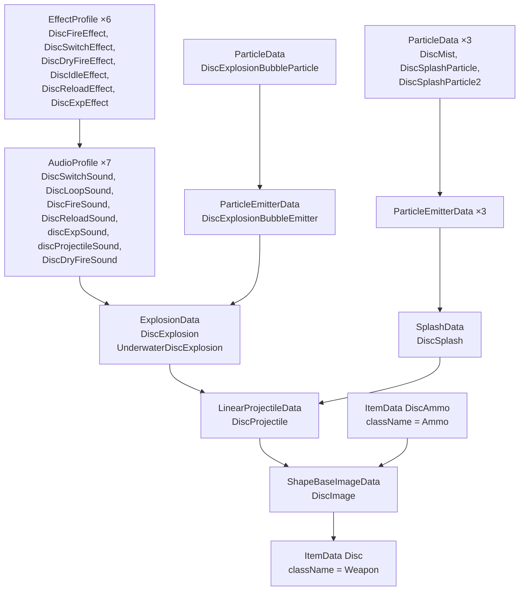
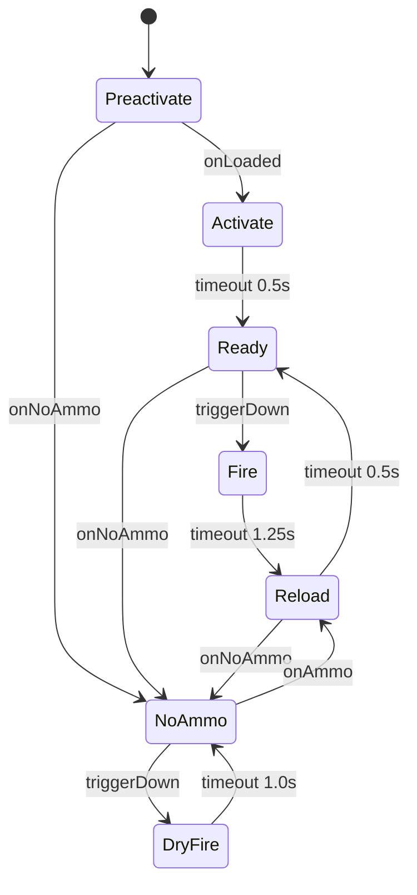

# Weapons

A Tribes 2 weapon is not one datablock. It is a chain of them, and a small state machine. This page walks
`scripts/weapons/disc.cs` — the spinfusor — end to end, because it is the cleanest complete example in the
shipped game, then shows how to build your own.

## The chain



Declared in exactly that order in the file. Reverse any two and you get an unresolved reference.

## The two `ItemData` blocks

### The weapon pickup

```php
datablock ItemData(Disc)
{
   className = Weapon;              // ← dispatch namespace: Weapon::onUse, ::onInventory, ::onPickup
   catagory = "Spawn Items";        // ← note the misspelling; it is the engine's
   shapeFile = "weapon_disc.dts";   // ← the model lying on the ground
   image = DiscImage;               // ← what you mount when you use it
   mass = 1;
   elasticity = 0.2;
   friction = 0.6;
   pickupRadius = 2;
   pickUpName = "a spinfusor";      // ← "You picked up a spinfusor"
   emap = true;                     // ← environment mapping (shiny)
};
```

`className = Weapon` gives you every handler in `scripts/weapons.cs` for free **[script]**:

```php
function Weapon::onUse(%data, %obj)
{
   if(Game.weaponOnUse(%data, %obj))
      if (%obj.getDataBlock().className $= Armor)
         %obj.mountImage(%data.image, $WeaponSlot);
}
```

Note `Game.weaponOnUse(...)` — the gametype gets a veto on every weapon use. That is the hook a gametype
or mod uses to restrict weapons. See [Gametypes](../05-gameplay-systems/gametypes.md).

### The ammo pickup

```php
datablock ItemData(DiscAmmo)
{
   className = Ammo;                // ← Ammo::onInventory in weapons.cs
   catagory = "Ammo";
   shapeFile = "ammo_disc.dts";
   mass = 1;
   elasticity = 0.2;
   friction = 0.6;
   pickupRadius = 2;
   pickUpName = "some spinfusor discs";
};
```

Energy weapons (blaster, ELF gun, sniper rifle, targeting laser, shock lance) have **no ammo datablock** —
their image sets `usesEnergy` instead. See [Ammo and inventory](ammo-and-inventory.md).

## `ShapeBaseImageData` — the weapon in your hands

An **image** is a shape mounted to a slot on a `ShapeBase` object. Weapons mount to `$WeaponSlot`; packs
mount to `$BackpackSlot`.

```php
datablock ShapeBaseImageData(DiscImage)
{
   className = WeaponImage;              // ← WeaponImage::onMount / ::onUnmount in weapons.cs
   shapeFile = "weapon_disc.dts";
   item = Disc;                          // ← back-reference to the ItemData
   ammo = DiscAmmo;                      // ← which ItemData counts as this weapon's ammo
   offset = "0 0 0";
   emap = true;

   projectileSpread = 0;                 // 0 = perfectly accurate

   projectile = DiscProjectile;          // ← what gets spawned on fire
   projectileType = LinearProjectile;    // ← the C++ class to instantiate

   // …state machine…
};
```

| Field | Meaning |
|---|---|
| `className` | Dispatch namespace. `WeaponImage` for weapons, `HandInventoryImage` for thrown items. |
| `item` | The `ItemData` this image corresponds to |
| `ammo` | The `ItemData` consumed on fire. Omit for energy weapons. |
| `projectile` | The projectile **datablock** |
| `projectileType` | The projectile **class name** — `LinearProjectile`, `GrenadeProjectile`, `TracerProjectile`, … Must match the datablock's type. |
| `projectileSpread` | Random cone, in radians ÷ π. `0` is pinpoint. |
| `offset`, `rotation` | Mount transform relative to the node |
| `mountPoint` | Which node to mount to (packs use `1`) |
| `usesEnergy`, `fireEnergy`, `minEnergy` | Energy weapon behaviour |
| `emap` | Environment mapping |

### Projectile spread

The chaingun is the reference **[script]**:

```php
projectileSpread = 8.0 / 1000.0;
```

The engine applies it by building a random Euler rotation and rotating the muzzle vector **[script]**:

```php
if(%data.projectileSpread)
{
   %vector = %obj.getMuzzleVector(%slot);
   %x = (getRandom() - 0.5) * 2 * 3.1415926 * %data.projectileSpread;
   %y = (getRandom() - 0.5) * 2 * 3.1415926 * %data.projectileSpread;
   %z = (getRandom() - 0.5) * 2 * 3.1415926 * %data.projectileSpread;
   %mat = MatrixCreateFromEuler(%x @ " " @ %y @ " " @ %z);
   %vector = MatrixMulVector(%mat, %vector);
   …
}
```

So the value is a fraction of ±π on each axis. `8.0/1000.0` is roughly ±1.4°.

## The state machine

This is the part that trips people up. An image is a finite state machine; `stateName[n]` and its sibling
arrays define state `n`, and the transitions move between them by **name**, not index.

The spinfusor's seven states **[script]**:

```php
   stateName[0]                     = "Preactivate";
   stateTransitionOnLoaded[0]       = "Activate";
   stateTransitionOnNoAmmo[0]       = "NoAmmo";

   stateName[1]                     = "Activate";
   stateTransitionOnTimeout[1]      = "Ready";
   stateTimeoutValue[1]             = 0.5;
   stateSequence[1]                 = "Activated";
   stateSound[1]                    = DiscSwitchSound;

   stateName[2]                     = "Ready";
   stateTransitionOnNoAmmo[2]       = "NoAmmo";
   stateTransitionOnTriggerDown[2]  = "Fire";
   stateSequence[2]                 = "DiscSpin";
   stateSound[2]                    = DiscLoopSound;

   stateName[3]                     = "Fire";
   stateTransitionOnTimeout[3]      = "Reload";
   stateTimeoutValue[3]             = 1.25;
   stateFire[3]                     = true;
   stateRecoil[3]                   = LightRecoil;
   stateAllowImageChange[3]         = false;
   stateSequence[3]                 = "Fire";
   stateScript[3]                   = "onFire";
   stateSound[3]                    = DiscFireSound;

   stateName[4]                     = "Reload";
   stateTransitionOnNoAmmo[4]       = "NoAmmo";
   stateTransitionOnTimeout[4]      = "Ready";
   stateTimeoutValue[4]             = 0.5; // 0.25 load, 0.25 spinup
   stateAllowImageChange[4]         = false;
   stateSequence[4]                 = "Reload";
   stateSound[4]                    = DiscReloadSound;

   stateName[5]                     = "NoAmmo";
   stateTransitionOnAmmo[5]         = "Reload";
   stateSequence[5]                 = "NoAmmo";
   stateTransitionOnTriggerDown[5]  = "DryFire";

   stateName[6]                     = "DryFire";
   stateSound[6]                    = DiscDryFireSound;
   stateTimeoutValue[6]             = 1.0;
   stateTransitionOnTimeout[6]      = "NoAmmo";
```



**The rate of fire is `stateTimeoutValue[Fire] + stateTimeoutValue[Reload]`** — 1.75 seconds for the
spinfusor. This is the number most weapon mods actually want to change.

### State field reference

| Field | Effect |
|---|---|
| `stateName[n]` | The state's name. Transitions reference this string. |
| `stateTimeoutValue[n]` | Seconds before the timeout transition fires |
| `stateTransitionOnTimeout[n]` | Target state when the timer expires |
| `stateTransitionOnTriggerDown[n]` | Target when the fire button goes down |
| `stateTransitionOnTriggerUp[n]` | Target when it is released |
| `stateTransitionOnAmmo[n]` | Target when ammo becomes available |
| `stateTransitionOnNoAmmo[n]` | Target when ammo runs out |
| `stateTransitionOnLoaded[n]` | Target once the shape has loaded |
| `stateFire[n]` | `true` marks this as the firing state |
| `stateScript[n]` | A script callback suffix — `"onFire"` calls `<ImageName>::onFire` |
| `stateSequence[n]` | Animation sequence in the `.dts` to play |
| `stateSequenceRandomFlash[n]` | Randomise the muzzle flash frame |
| `stateSound[n]` | `AudioProfile` to play on entry |
| `stateRecoil[n]` | Recoil animation on the player — `LightRecoil`, `MediumRecoil`, `HeavyRecoil` |
| `stateAllowImageChange[n]` | `false` locks weapon switching while in this state |
| `stateWaitForTimeout[n]` | `false` allows an early transition out |
| `stateSpinThread[n]` | Spin-up animation control: `Stop`, `SpinUp`, `FullSpeed`, `SpinDown` |
| `stateEmitter[n]`, `stateEmitterTime[n]`, `stateEmitterNode[n]` | Particle emission during the state |

The chaingun demonstrates the spin-up pattern — `Ready → Spinup → Fire → Spindown` with `stateSpinThread`
driving the barrel animation **[script]**.

## What happens on fire

`stateScript[3] = "onFire"` causes the engine to call `DiscImage::onFire`. There is no such function, so
dispatch falls through to the generic `ShapeBaseImageData::onFire` in `scripts/projectiles.cs`
**[script]**, which does all the real work:

1. Cancels cloaking (firing decloaks you) and invincibility
2. Checks energy against `minEnergy` if `usesEnergy`
3. Applies `projectileSpread` if non-zero
4. Creates the projectile:

```php
%p = new (%data.projectileType)() {
   dataBlock        = %data.projectile;
   initialDirection = %obj.getMuzzleVector(%slot);
   initialPosition  = %obj.getMuzzlePoint(%slot);
   sourceObject     = %obj;
   sourceSlot       = %slot;
   vehicleObject    = %vehicle;
};
MissionCleanup.add(%p);
```

5. Records it as `%obj.lastProjectile` and `%obj.client.projectile` (an explicitly commented **AI hook**)
6. Deducts energy or ammo:

```php
if(%data.usesEnergy)
   %obj.setEnergyLevel(%energy - %data.fireEnergy);
else
   %obj.decInventory(%data.ammo, 1);
```

**It returns the projectile.** That is what makes per-weapon `onFire` overrides clean — call `Parent::`,
then act on the result:

```php
//add mortars to the "grenade set" so the AI's can avoid them better...
function MortarImage::onFire(%data,%obj,%slot)
{
   %p = Parent::onFire(%data, %obj, %slot);
   AIGrenadeThrown(%p);
}

function MissileLauncherImage::onFire(%data,%obj,%slot)
{
   %p = Parent::onFire(%data, %obj, %slot);
   MissileSet.add(%p);

   %target = %obj.getLockedTarget();
   if(%target)
      %p.setObjectTarget(%target);
   else if(%obj.isLocked())
      %p.setPositionTarget(%obj.getLockedPosition());
   else
      %p.setNoTarget();
}
```

This is the correct place for custom fire behaviour: multi-shot, homing, alternate fire, whatever.

## Recipe: a complete new weapon

A three-round-burst spinfusor. New file, `MyMod/scripts/weapons/burstDisc.cs`:

```php
//------------------------------------------------------------------------------
// MyMod — Burst Spinfusor
//------------------------------------------------------------------------------

// 1. Projectile — inherit from the stock disc, tune down.
datablock LinearProjectileData(BurstDiscProjectile) : DiscProjectile
{
   indirectDamage   = 0.22;      // each round is weaker than a full disc
   damageRadius     = 5.0;
   kickBackStrength = 900;
   dryVelocity      = 110;
};

// 2. Ammo.
datablock ItemData(BurstDiscAmmo)
{
   className    = Ammo;
   catagory     = "Ammo";
   shapeFile    = "ammo_disc.dts";
   mass         = 1;
   elasticity   = 0.2;
   friction     = 0.6;
   pickupRadius = 2;
   pickUpName   = "some burst discs";
};

// 3. The image, with its state machine.
datablock ShapeBaseImageData(BurstDiscImage)
{
   className      = WeaponImage;
   shapeFile      = "weapon_disc.dts";
   item           = BurstDisc;
   ammo           = BurstDiscAmmo;
   offset         = "0 0 0";
   emap           = true;

   projectileSpread = 6.0 / 1000.0;
   projectile       = BurstDiscProjectile;
   projectileType   = LinearProjectile;

   burstCount = 3;              // ← our own dynamic field, read in onFire below

   stateName[0]                    = "Preactivate";
   stateTransitionOnLoaded[0]      = "Activate";
   stateTransitionOnNoAmmo[0]      = "NoAmmo";

   stateName[1]                    = "Activate";
   stateTransitionOnTimeout[1]     = "Ready";
   stateTimeoutValue[1]            = 0.5;
   stateSequence[1]                = "Activated";
   stateSound[1]                   = DiscSwitchSound;

   stateName[2]                    = "Ready";
   stateTransitionOnNoAmmo[2]      = "NoAmmo";
   stateTransitionOnTriggerDown[2] = "Fire";
   stateSequence[2]                = "DiscSpin";
   stateSound[2]                   = DiscLoopSound;

   stateName[3]                    = "Fire";
   stateTransitionOnTimeout[3]     = "Reload";
   stateTimeoutValue[3]            = 0.4;
   stateFire[3]                    = true;
   stateRecoil[3]                  = LightRecoil;
   stateAllowImageChange[3]        = false;
   stateSequence[3]                = "Fire";
   stateScript[3]                  = "onFire";
   stateSound[3]                   = DiscFireSound;

   stateName[4]                    = "Reload";
   stateTransitionOnNoAmmo[4]      = "NoAmmo";
   stateTransitionOnTimeout[4]     = "Ready";
   stateTimeoutValue[4]            = 1.4;
   stateAllowImageChange[4]        = false;
   stateSequence[4]                = "Reload";
   stateSound[4]                   = DiscReloadSound;

   stateName[5]                    = "NoAmmo";
   stateTransitionOnAmmo[5]        = "Reload";
   stateSequence[5]                = "NoAmmo";
   stateTransitionOnTriggerDown[5] = "DryFire";

   stateName[6]                    = "DryFire";
   stateSound[6]                   = DiscDryFireSound;
   stateTimeoutValue[6]            = 1.0;
   stateTransitionOnTimeout[6]     = "NoAmmo";
};

// 4. The pickup item.
datablock ItemData(BurstDisc)
{
   className    = Weapon;
   catagory     = "Spawn Items";
   shapeFile    = "weapon_disc.dts";
   image        = BurstDiscImage;
   mass         = 1;
   elasticity   = 0.2;
   friction     = 0.6;
   pickupRadius = 2;
   pickUpName   = "a burst spinfusor";
   emap         = true;
};

// 5. Fire behaviour — one round now, the rest on a short delay.
function BurstDiscImage::onFire(%data, %obj, %slot)
{
   %p = Parent::onFire(%data, %obj, %slot);

   for (%i = 1; %i < %data.burstCount; %i++)
      %obj.schedule(%i * 90, "burstDiscExtraShot", %data, %slot);

   return %p;
}

function Player::burstDiscExtraShot(%obj, %data, %slot)
{
   // Stop if the player died, switched weapons, or ran dry mid-burst.
   if (!isObject(%obj) || %obj.getState() $= "Dead")
      return;
   if (%obj.getMountedImage(%slot) != %data.getId())
      return;
   if (%obj.getInventory(%data.ammo) <= 0)
      return;

   ShapeBaseImageData::onFire(%data, %obj, %slot);
}

// 6. Ammo pickup increment.
$AmmoIncrement[BurstDiscAmmo] = 5;
```

Then load it. In `MyMod/scripts/autoexec/mymod.cs`:

```php
package MyMod
{
   function CreateServer(%mission, %missionType)
   {
      Parent::CreateServer(%mission, %missionType);
      exec("scripts/weapons/burstDisc.cs");     // after the base weapons exist
   }
};
activatePackage(MyMod);
```

The `Parent::` call first is essential — `BurstDiscProjectile : DiscProjectile` requires `DiscProjectile`
to already exist, and it is declared inside `CreateServer`'s `exec` list.

To make it appear in inventory stations and on the HUD, see
[Ammo and inventory](ammo-and-inventory.md) and [HUD](../04-interface/hud.md).

## Modifying an existing weapon instead

For pure tuning, do not copy the file. Override the fields:

```php
package MyMod
{
   function DefaultGame::missionLoadDone(%game)
   {
      Parent::missionLoadDone(%game);

      DiscProjectile.damageRadius = 12.0;
      DiscProjectile.indirectDamage = 0.60;
   }
};
```

State machine values are read by the C++ side when the image is constructed and generally do **not**
respond to a late assignment. To change a rate of fire you must redeclare the `ShapeBaseImageData` or
shadow the file. See [Datablocks](../02-engine-model/datablocks.md#modifying-a-stock-datablock).

## Related

- [Projectiles](projectiles.md) — every projectile type and its fields
- [Ammo and inventory](ammo-and-inventory.md) — making your weapon obtainable
- [Damage and type masks](damage-and-typemasks.md) — damage types and radius damage
- [Audio](audio.md) — the sound datablocks in the chain
- [Particles, explosions, and effects](particles-explosions-effects.md) — the visual chain

> **On a patched install:** nothing on this page changes. Neither TribesNEXT patch touches gameplay
> content — see [03 · Content Recipes](README.md#under-the-community-patches).
