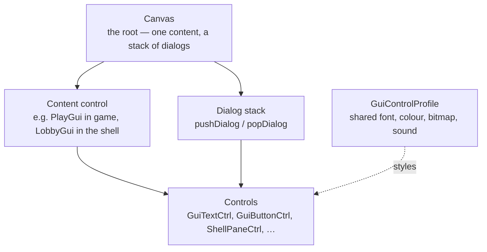

# 04 · Interface

Everything the player sees that is not the 3D world: menus, dialogs, the HUD, chat, and messages.

All of it is **client side**. See [Client/server split](../02-engine-model/client-server-split.md) if you
are not sure which side your code is running on.

| Page | Read it for |
|---|---|
| [GUI system](gui-system.md) | `.gui` files, control profiles, Canvas, dialogs, the GUI editor |
| [HUD](hud.md) | In-game HUD controls, reticles, weapon and inventory HUD registration |
| [Text and messaging](text-and-messaging.md) | Chat, `bottomPrint`, colour codes, tagged strings, message callbacks |

## The shape of it



`Canvas` has exactly one **content** control at a time and a **stack** of dialogs on top of it. The
shipped scripts call `pushDialog` / `popDialog` 183 times between them and `setContent` 29 times
**[script]** — dialogs are the normal way to show something, and content switches are reserved for major
mode changes (shell → loading → game).

## Where the files are

```
base/scripts.vl2
├── gui/           136 .gui files — the layouts
└── scripts/       the .cs partners holding the behaviour
    ├── LobbyGui.cs, GameGui.cs, OptionsDlg.cs, ChatGui.cs, …
    ├── hud.cs, inventoryHud.cs, objectiveHud.cs, chatMenuHud.cs
    └── message.cs, centerPrint.cs
```

A `.gui` file is a layout; its behaviour lives in a same-named `.cs`. Both are loaded from
`console_end.cs` **[script]**.

## Under the community patches

**This is the section the patches change most.** If you are writing a UI mod, read the
"Under the community patches" section on each page here before you start.

The headline items:

| Change | Page |
|---|---|
| Every vanilla font is substituted for a `.sdft` — layouts tuned to vanilla metrics **will shift** | [GUI system](gui-system.md#under-the-community-patches) |
| Render scale, UI scale, and UI aspect are user-controlled — the 640×480 assumption no longer holds | [GUI system](gui-system.md#under-the-community-patches) |
| The Video options panel is torn down and rebuilt | [GUI system](gui-system.md#under-the-community-patches) |
| The HUD repositions by aspect ratio; two opacity defaults change | [HUD](hud.md#under-the-community-patches) |
| Inbound chat is tag-filtered and optionally word-filtered | [Text and messaging](text-and-messaging.md#under-the-community-patches) |

What does **not** change: `.gui` syntax, control classes, `GuiControlProfile` fields, the Canvas dialog
stack, `onWake` / `onSleep`, `GuiMLTextCtrl` markup, the `$WeaponsHudData` registration mechanism, and the
whole `messageClient` / `clientCmd` API.
