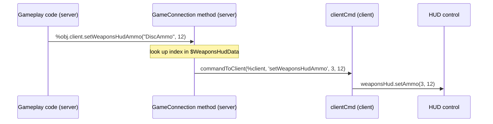

# HUD

The in-game HUD is a set of GUI controls inside `PlayGui`, driven entirely by server → client commands.
Nothing on the HUD updates by itself — the server tells it what to show.

## The pattern

Every HUD update is a **pair of functions**: a `GameConnection::` method on the server that looks up an
index and sends a command, and a `clientCmd` on the client that applies it.



`scripts/hud.cs` contains roughly forty of these pairs **[script]**. The naming is completely consistent:
`GameConnection::setXxx` on the server, `clientCmdSetXxx` on the client.

## `$WeaponsHudData` — registering a weapon

The HUD does not know about weapons. It knows about **slots**, and `$WeaponsHudData` maps slots to
weapons. From `scripts/weapons.cs` **[script]**:

```php
// z0dd - ZOD, 9/13/02. Added global array for serverside weapon reticles and "visible"
$WeaponsHudData[0, bitmapName]   = "gui/hud_blaster";
$WeaponsHudData[0, itemDataName] = "Blaster";
//$WeaponsHudData[0, ammoDataName] = "";           ← energy weapon, no ammo
$WeaponsHudData[0, reticle]      = "gui/ret_blaster";
$WeaponsHudData[0, visible]      = "true";

$WeaponsHudData[3, bitmapName]   = "gui/hud_disc";
$WeaponsHudData[3, itemDataName] = "Disc";
$WeaponsHudData[3, ammoDataName] = "DiscAmmo";
$WeaponsHudData[3, reticle]      = "gui/ret_disc";
$WeaponsHudData[3, visible]      = "true";

$WeaponsHudData[5, bitmapName]   = "gui/hud_sniper";
$WeaponsHudData[5, itemDataName] = "SniperRifle";
$WeaponsHudData[5, reticle]      = "gui/hud_ret_sniper";
$WeaponsHudData[5, visible]      = "false";        ← the sniper has its own scope overlay

$WeaponsHudCount = 18;
```

| Key | Meaning |
|---|---|
| `bitmapName` | The weapon icon on the HUD strip |
| `itemDataName` | The `ItemData` name — this is the lookup key |
| `ammoDataName` | The ammo `ItemData`. **Omit for energy weapons** — the HUD then shows infinite ammo. |
| `reticle` | The crosshair bitmap |
| `visible` | Whether the default reticle frame is drawn |

The lookup is a linear scan **[script]**:

```php
function GameConnection::setWeaponsHudAmmo(%client, %name, %ammoAmount)
{
   for(%i = 0; %i < $WeaponsHudCount; %i++)
      if($WeaponsHudData[%i, ammoDataName] $= %name)
      {
         commandToClient(%client, 'setWeaponsHudAmmo',%i, %ammoAmount);
         break;
      }
}
```

**`$WeaponsHudCount` bounds the loop.** Add a weapon at index 18 and forget to bump the count, and the
scan never reaches it — the weapon works but never appears on the HUD. This is the single most common HUD
bug in new mods.

### Registering a new weapon

```php
package MyMod
{
   function CreateServer(%mission, %missionType)
   {
      Parent::CreateServer(%mission, %missionType);
      exec("scripts/weapons/burstDisc.cs");

      %n = $WeaponsHudCount;
      $WeaponsHudData[%n, bitmapName]   = "gui/hud_disc";
      $WeaponsHudData[%n, itemDataName] = "BurstDisc";
      $WeaponsHudData[%n, ammoDataName] = "BurstDiscAmmo";
      $WeaponsHudData[%n, reticle]      = "gui/ret_disc";
      $WeaponsHudData[%n, visible]      = "true";
      $WeaponsHudCount = %n + 1;
   }
};
```

Appending at `$WeaponsHudCount` rather than a fixed index keeps you compatible with other mods that do
the same.

> There is a hard-coded index warning in the shipped file **[script]**:
>
> ```cs
> // WARNING!!! If you change the weapon index of the targeting laser,
> // you must change the HudWeaponInvBase::addWeapon function to test
> // for the new value!
> ```
>
> Do not renumber existing entries.

## Reticles

`clientCmdSetWeaponsHudActive` chooses the crosshair. z0dd rewrote it to be server-driven, but left the
old hard-coded switch in place for compatibility **[script]**:

```php
// z0dd - ZOD, 9/13/02. Serverside reticles, sever tells client what file to use.
function GameConnection::setWeaponsHudActive(%client, %name, %clearActive)
{
   if(%clearActive)
      commandToClient(%client, 'setWeaponsHudActive', -1);
   else
   {
      for(%i = 0; %i < $WeaponsHudCount; %i++)
         if($WeaponsHudData[%i, itemDataName] $= %name)
         {
            commandToClient(%client, 'setWeaponsHudActive', %i,
                            $WeaponsHudData[%i, reticle], $WeaponsHudData[%i, visible]);
            break;
         }
   }
}

// z0dd - ZOD, 9/30/02. Changed for lazy scripter backward compatibility.
function clientCmdSetWeaponsHudActive(%slot, %ret, %vis)
{
   weaponsHud.setActiveWeapon(%slot);
   switch$($WeaponNames[%slot])
   {
      case "Blaster":
         reticleHud.setBitmap("gui/ret_blaster");
         reticleFrameHud.setVisible(true);
      case "Plasma":
         reticleHud.setBitmap("gui/ret_plasma");
         reticleFrameHud.setVisible(true);
      …
   }
}
```

The `%ret` and `%vis` arguments carry the server's choice; the `switch$` is the legacy path. If your
reticle is not appearing, check that your `$WeaponsHudData[n, reticle]` entry exists — the legacy switch
has no case for your weapon and will fall through.

Custom reticle from script:

```php
commandToClient(%obj.client, 'setRepairReticle');
commandToClient(%obj.client, 'removeReticle');
```

`RepairPackImage::onActivate` uses the first **[script]**; `WeaponImage::onUnmount` uses the second.

## The HUD API surface

All server-side `GameConnection::` methods, each with a `clientCmd` partner **[script]**:

### Weapons

| Method | Purpose |
|---|---|
| `setWeaponsHudItem(%client, %name, %ammoAmount, %addItem)` | Add or remove a weapon from the strip |
| `setWeaponsHudAmmo(%client, %name, %ammoAmount)` | Update an ammo count |
| `setWeaponsHudActive(%client, %name, %clearActive)` | Highlight the active weapon, set the reticle |
| `setWeaponsHudBitmap(%client, %slot, %name, %bitmap)` | Change a slot's icon |
| `setWeaponsHudClearAll(%client)` | Clear the strip |
| `setWeaponsHudBackGroundBmp(%client, %name)` | Background bitmap |
| `setWeaponsHudHighLightBmp(%client, %name)` | Highlight bitmap |
| `setWeaponsHudInfiniteAmmoBmp(%client, %name)` | Infinite-ammo indicator |
| `setAmmoHudCount(%client, %amount)` | The big ammo number. **`-1` means infinite.** |

### Inventory

| Method | Purpose |
|---|---|
| `setInventoryHudItem(%client, %name, %amount, %addItem)` | Add or remove |
| `setInventoryHudAmount(%client, %name, %amount)` | Update a count |
| `setInventoryHudBitmap(%client, %slot, %name, %bitmap)` | Icon |
| `setInventoryHudClearAll(%client)` | Clear |
| `setInventoryHudBackGroundBmp(%client, %name)` | Background |

### Packs and status icons

| Method / command | Purpose |
|---|---|
| `setBackpackHudItem(%client, %name, %addItem)` | The backpack icon |
| `clearBackpackIcon(%client)` | Clear it |
| `updateSensorPackText(%client, %num)` | Sensor jammer readout |
| `clientCmdSetSatchelArmed()` | Satchel charge armed |
| `clientCmdsetCloakIconOn()` / `Off()` | Cloak |
| `clientCmdsetRepairPackIconOn()` / `Off()` | Repair pack |
| `clientCmdsetShieldIconOn()` / `Off()` | Shield pack |
| `clientCmdsetSenJamIconOn()` / `Off()` | Sensor jammer |

### Vehicle HUD

| Method | Purpose |
|---|---|
| `setVWeaponsHudActive(%client, %slot)` | Active vehicle weapon |
| `setVWeaponsHudClearAll(%client)` | Clear |

Vehicle HUD pages live in `scripts/vehicles/clientVehicleHud.cs` and `serverVehicleHud.cs`.

### Sensors

| Method | Purpose |
|---|---|
| `sensorPing(%this, %ping)` | Sensor detection ping |
| `sensorJammed(%this, %jam)` | Jammed indicator |
| `SensorHud::update(%this)` | Refresh |

### Reset

`clientCmdResetHud()` rebuilds the whole HUD — called at mission start and respawn.

## Where the HUD updates come from

You rarely call these directly. The item callbacks do it for you **[script]**:

```php
function Ammo::onInventory(%this,%obj,%amount)
{
   …
   if ( %obj.getClassname() $= "Player" && %obj.getState() !$= "Dead" )
   {
      %obj.client.setWeaponsHudAmmo(%this.getName(), %amount);
      if(%obj.getMountedImage($WeaponSlot).ammo $= %this.getName())
         %obj.client.setAmmoHudCount(%amount);
   }
}

function WeaponImage::onMount(%this,%obj,%slot)
{
   …
   %obj.client.setWeaponsHudActive(%this.item);
   if(%obj.getMountedImage($WeaponSlot).ammo !$= "")
      %obj.client.setAmmoHudCount(%obj.getInventory(%this.ammo));
   else
      %obj.client.setAmmoHudCount(-1);        // ← -1 = infinite
}

function Pack::onInventory(%data,%obj,%amount)
{
   …
   %obj.client.setBackpackHudItem(%data.getName(), 1);
}
```

**So a correctly-declared weapon updates the HUD automatically** — provided its `$WeaponsHudData` entry
exists. That is the whole integration.

Note the corpse guard: `%obj.getState() !$= "Dead"`. Sierra left a comment about why **[script]**:

```php
// Uh, don't update the hud ammo counters if this is a corpse...that's bad.
```

Copy that guard in any HUD code you write.

## Adding your own HUD element

A HUD element is an ordinary GUI control inside `PlayGui`, plus a `clientCmd` to drive it.

```php
// --- Client side: gui/MyModHud.gui, or built at runtime ---
package MyMod
{
   function clientCmdResetHud()
   {
      Parent::clientCmdResetHud();

      if (!isObject(MyModCounter))
      {
         %ctrl = new GuiTextCtrl(MyModCounter)
         {
            profile   = "GuiTextObjGreenLeftProfile";
            position  = "8 60";
            extent    = "200 16";
            minExtent = "8 8";
            visible   = "1";
            text      = "";
         };
         PlayGui.add(%ctrl);
      }
      MyModCounter.setText("");
   }
};
activatePackage(MyMod);

function clientCmdMyModSetCounter(%text)
{
   if (isObject(MyModCounter))
      MyModCounter.setText(%text);
}
```

```php
// --- Server side: push a value ---
function GameConnection::myModSetCounter(%client, %text)
{
   commandToClient(%client, 'MyModSetCounter', %text);
}
```

Hooking `clientCmdResetHud` means your control is recreated whenever the HUD rebuilds — at mission start
and on respawn. Without that, your element vanishes on the first respawn.

## Objective and other HUDs

| File | Contains |
|---|---|
| `scripts/hud.cs` | The main HUD API — everything above |
| `scripts/inventoryHud.cs` | The inventory station screen |
| `scripts/objectiveHud.cs` | Objective and score display |
| `scripts/chatMenuHud.cs` | The voice-chat menu |
| `scripts/vehicles/clientVehicleHud.cs` | Vehicle instrument pages |
| `scripts/centerPrint.cs` | Centre and bottom print — see [Text and messaging](text-and-messaging.md) |
| `scripts/commanderMap.cs`, `commanderMapIcons.cs` | The tactical map |

## Under the community patches

**The `$WeaponsHudData` registration mechanism and the whole `GameConnection::setXxx` / `clientCmdSetXxx`
API are unchanged.** A weapon mod's HUD integration works identically.

What changes is layout and appearance.

### The HUD repositions itself by aspect ratio

`dashboardHud::onResize` is overridden to slide HUD position according to `$pref::Video::uiAspect`, with
hardcoded special cases at 480 and 600 canvas height **[patch-script]**.

Combined with the render-scale and UI-scale sliders described in
[GUI system](gui-system.md#under-the-community-patches), this means **you cannot assume a fixed HUD
geometry**. A custom HUD element positioned by absolute coordinate will sit correctly at one aspect and
wrongly at another.

The mitigation is the one already recommended above: build your element inside a
`clientCmdResetHud` override so it is recreated on every HUD rebuild, and position it relative to a parent
control rather than to the canvas.

### Opacity defaults change

`initClientPatches()` bumps two HUD opacities at startup **[patch-script]**:

| Control | Vanilla | Patched |
|---|---|---|
| `navHud` | 0.5 | 0.75 |
| `reticleHud` | 0.5 | 0.85 |

If your mod reads or restores these values, read them rather than assuming the vanilla defaults.

### `MessageHud::open` extends to the canvas

Overridden to size to the full canvas extent **[patch-script]**, rather than the vanilla fixed size.

### Reticles

Unchanged. `$WeaponsHudData[n, reticle]` still drives `setWeaponsHudActive`, and the legacy hardcoded
`switch$` in `clientCmdSetWeaponsHudActive` still has no case for your weapon — the server-supplied
`%ret` argument is what makes custom reticles work, on patched and vanilla alike.

### Loading progress

Two callbacks the patch overrides touch the load path rather than the HUD proper —
`ghostAlwaysObjectReceived` and `ClientReceivedDataBlock(idx, total)` now drive `LoadingProgress` and force
a repaint **[patch-script]**. Relevant if your mod declares a large number of datablocks: this is where
the user sees the wait.

## Related

- [GUI system](gui-system.md) — controls and profiles
- [Ammo and inventory](../03-content-recipes/ammo-and-inventory.md) — the callbacks that drive HUD updates
- [Client/server split](../02-engine-model/client-server-split.md) — the `commandToClient` mechanism
- [Text and messaging](text-and-messaging.md) — prints and chat
- [Modding against a patched install](../07-community-patches/modding-against-a-patched-install.md#ui-mods) — UI guidance
