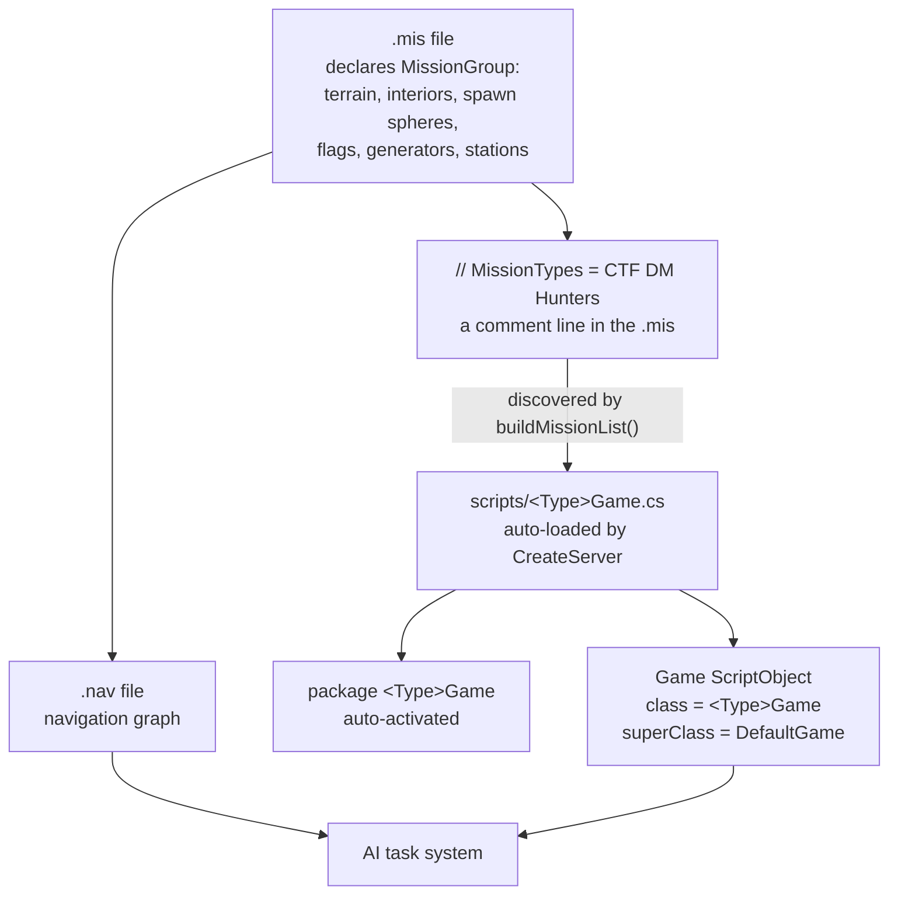

# 05 · Gameplay Systems

The rules layer: what wins a match, what the map contains, and how bots decide what to do.

All of it is **server side**.

| Page | Read it for |
|---|---|
| [Gametypes](gametypes.md) | The `Game` object, the `DefaultGame::` callback surface, and adding a new gametype |
| [Missions](missions.md) | `.mis` files, mission objects, the in-game editor, nav graphs |
| [AI and bots](ai-bots.md) | The task system, nav graphs, and hooking bot behaviour |

## How the three fit together

Two discovery mechanisms, both comment-driven and both worth knowing:

- **`scripts/*Game.cs`** is globbed by `CreateServer()`, so any file matching that pattern anywhere on the
  mod path stack is loaded automatically **[script]**.
- **`// MissionTypes = …`** in a `.mis` file tells `buildMissionList()` which gametypes that map supports
  **[script]**.

Neither requires a registration call. Drop the files in and they appear.

## Under the community patches

**Both discovery mechanisms survive intact**, and so does the entire `DefaultGame::` callback surface, the
`Game` ScriptObject, the mission format, and the AI task system. A gametype written against this section
runs on a patched server unmodified.

Three specifics, each covered on its page:

- **`addGameType()` and friends are stubbed** by `t2csri_server` **[patch-script]**. Your gametype still
  appears — discovery goes through the mission scan, not through those calls.
  See [Gametypes](gametypes.md#under-the-community-patches).
- **`GameConnection::onConnect` fires twice per remote client.** If your gametype hooks connection
  directly rather than through `DefaultGame::clientMissionDropReady`, see
  [Client/server split](../02-engine-model/client-server-split.md#under-the-community-patches).
- **Bots are `local` and skip authentication**, so a `doneAuthenticating` guard excludes them.
  See [AI and bots](ai-bots.md#under-the-community-patches).
