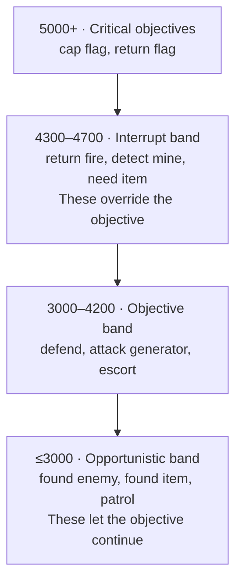

# AI and bots

Tribes 2's bot AI is entirely script-driven and unusually well structured: a **weighted task system**
where each bot continuously re-scores a set of candidate tasks and runs the highest-scoring one. It is
readable, hookable, and a genuine pleasure to extend.

## The files

`scripts/ai.cs` is the entry point and loads the rest **[script]**:

```php
//first, exec the supporting scripts
exec("scripts/aiDebug.cs");
exec("scripts/aiDefaultTasks.cs");
exec("scripts/aiObjectives.cs");
exec("scripts/aiInventory.cs");
exec("scripts/aiChat.cs");
exec("scripts/aiHumanTasks.cs");
exec("scripts/aiObjectiveBuilder.cs");
exec("scripts/aiBotProfiles.cs");
```

plus a per-gametype file — `aiCTF.cs`, `aiCnH.cs`, `aiHunters.cs`, `aiSiege.cs`, `aiRabbit.cs`,
`aiDnD.cs`, `aiBountyGame.cs`, `aiTeamHunters.cs`, `aiDeathMatch.cs`, `aiPracticeCtf.cs` — `exec`'d from
the gametype file itself:

```php
//exec the AI scripts
exec("scripts/aiCTF.cs");
```

**So a new gametype's AI belongs in `scripts/ai<Name>.cs`, `exec`'d from `scripts/<Name>Game.cs`.**

## The task system

A task is a namespace with four methods **[script]**:

| Method | Called | Purpose |
|---|---|---|
| `<Task>::init(%task, %client)` | Once, on creation | Set up task state |
| `<Task>::weight(%task, %client)` | Continuously | **Score this task's current desirability** |
| `<Task>::assume(%task, %client)` | On becoming the active task | Start doing it |
| `<Task>::monitor(%task, %client)` | While active | Do the work; adjust as the situation changes |
| `<Task>::retire(%task, %client)` | On losing the active slot | Clean up |

```php
function AIEngageTask::init(%task, %client)    { … }
function AIEngageTask::assume(%task, %client)  { … }
function AIEngageTask::retire(%task, %client)  { … }
function AIEngageTask::weight(%task, %client)  { … }
function AIEngageTask::monitor(%task, %client) { … }
```

The highest-weighted task wins. `weight()` returning `0` takes the task out of contention.

### Registering tasks

Tasks are added per bot, on respawn **[script]** — from `aiCTF.cs`:

```php
function CTFGame::onAIRespawn(%game, %client)
{
   //add the default task
   if (! %client.defaultTasksAdded)
   {
      %client.defaultTasksAdded = true;
      %client.addTask(AIEngageTask);
      %client.addTask(AIPickupItemTask);
      %client.addTask(AITauntCorpseTask);
      %client.addtask(AIEngageTurretTask);
      %client.addtask(AIDetectMineTask);
   }
}
```

`%client.addTask(<TaskNamespace>)` returns a handle you can store:

```php
%client.bountyTask = %client.addTask(AIBountyEngageTask);
```

## The weight bands

This is the part that makes the system tractable. Weights are not arbitrary — they occupy documented
bands, and the band determines whether a task interrupts the bot's objective or runs alongside it.

From `aiDefaultTasks.cs` **[script]**:

```php
//Weights for tasks that override the objective task: must be between 4300 and 4700
$AIWeightVehicleMountedEscort = 4700;
$AIWeightReturnTurretFire     = 4675;
$AIWeightNeedItemBadly        = 4650;
$AIWeightReturnFire           = 4600;
$AIWeightDetectMine           = 4500;
$AIWeightTauntVictim          = 4400;
$AIWeightNeedItem             = 4350;
$AIWeightDestroyTurret        = 4300;

//Weights that allow the objective task to continue:  must be 3000 or less
$AIWeightFoundEnemy           = 3000;
$AIWeightFoundItem            = 2500;
$AIWeightFoundToughEnemy      = 1000;
$AIWeightPatrolling           = 2000;
```

and the objective weights from `ai.cs` **[script]**:

```php
//Objective weights - level 1
$AIWeightCapFlag[1]           = 5000;  //range 5100 to 5320
$AIWeightKillFlagCarrier[1]   = 4800;  //range 4800 to 5120
$AIWeightReturnFlag[1]        = 5001;  //range 5101 to 5321
$AIWeightDefendFlag[1]        = 3900;  //range 4000 to 4220
$AIWeightGrabFlag[1]          = 3850;  //range 3950 to 4170
$AIWeightAttackGenerator[1]   = 3100;  //range 3200 to 3520
$AIWeightRepairGenerator[1]   = 3200;  //range 3300 to 3620
$AIWeightDefendGenerator[1]   = 3100;  //range 3200 to 3420
$AIWeightMortarTurret[1]      = 3400;  //range 3500 to 3600
$AIWeightLazeObject[1]        = 3200;  //range 3300 to 3400
$AIWeightRepairTurret[1]      = 3100;  //range 3200 to 3420
$AIWeightAttackInventory[1]   = 2900;  //range 2800 to 2920
$AIWeightEscortCapper[1]      = 3250;  //range 3350 to 3470
…
```



**Pick your band deliberately.** A new task weighted at 4600 will interrupt everything a bot is doing;
one at 2500 will only run when nothing better is available. The `//range` comments show that each
objective weight is a base to which situational bonuses are added.

## Bot profiles

`aiBotProfiles.cs` defines named bots with personalities **[script]**:

```php
function aiConnectByIndex(%index, %team)
{
   if (%index < 0 || $BotProfile[%index, name] $= "")
      return;

   if (%team $= "")
      %team = -1;

   //initialize the profile, if required
   if ($BotProfile[%index, skill] $= "")
      $BotProfile[%index, skill] = 0.5;

   return aiConnect($BotProfile[%index, name], %team, $BotProfile[%index, skill],
                    $BotProfile[%index, offense], $BotProfile[%index, voice],
                    $BotProfile[%index, voicePitch]);
}
```

| Profile key | Meaning |
|---|---|
| `name` | Display name |
| `skill` | Competence, `0.0`–`1.0`. Defaults to `0.5`. |
| `offense` | Offensive/defensive tendency |
| `voice` | Voice pack |
| `voicePitch` | Pitch adjustment |

`aiConnectByName(%name, %team)` does a linear scan for a named profile. Add your own profiles by
appending `$BotProfile[n, …]` entries.

## Objectives

Team-level goals live in an `AIObjectiveQ` per team, built at mission start **[script]**:

```php
function CTFGame::AIInit(%game)
{
   // load external objectives files
   loadObjectives();

   for (%i = 1; %i <= %game.numTeams; %i++)
   {
      if (!isObject($ObjectiveQ[%i]))
      {
         $ObjectiveQ[%i] = new AIObjectiveQ();
         MissionCleanup.add($ObjectiveQ[%i]);
      }

      error("team " @ %i @ " objectives load...");
      $ObjectiveQ[%i].clear();
      AIInitObjectives(%i, %game);
   }

   //call the default AIInit() function
   AIInit();
}
```

Bots pull objectives from their team's queue and weight them against their personal tasks. The objective
files are external data loaded by `loadObjectives()`; `aiObjectiveBuilder.cs` constructs them from the
mission.

> Note the `error("team " @ %i @ " objectives load...")` call — that is Sierra using `error()` as a
> logging channel, not signalling a fault. You will see it in the console on every mission load and it is
> harmless.

## Navigation

Bots need a **nav graph**: `terrains/<MissionName>.nav`, referenced by the `NavigationGraph` object in
the `.mis`. A map without one has no bot support — `buildMissionList` tests for the file's existence
**[script]**:

```php
// Test to see if the mission is bot-enabled:
%navFile = "terrains/" @ %name @ ".nav";
$BotEnabled[%idx] = isFile( %navFile );
```

Generate one with:

```bash
Tribes2.exe -navBuild <MissionName> <MissionType>
```

The `NavigationGraph` object's parameters tune the generation **[script]**:

```php
new NavigationGraph(NavGraph) {
   conjoinAngleDev = "70";
   cullDensity = "0.3";
   customArea = "0 0 0 0";
   coverage = "0";
   GraphFile = "Slapdash.nav";
};
```

`scripts/navGraph.cs` and `scripts/graphBuild.cs` implement the build.

## Movement modes

```php
$AIModeStop         = 0;
$AIModeWalk         = 1;
$AIModeGainHeight   = 2;
$AIModeExpress      = 3;
$AIModeMountVehicle = 4;
```

`$AIModeExpress` is the fast mode — jetting and skiing along the graph.

## Line of sight

```php
$AIClientLOSTimeout = 15000;  //how long a client has to remain out of sight of the bot
                              //before the bot "can't see" the client anymore...
$AIClientMinLOSTime = 10000;  //how long a bot will search for a client
```

Raising `$AIClientLOSTimeout` makes bots more persistent; lowering it makes them easier to break away
from.

## Hooks for a mod

| Hook | Purpose |
|---|---|
| `<Type>Game::onAIRespawn(%game, %client)` | Add tasks to a bot |
| `<Type>Game::AIInit(%game)` | Build the objective queues |
| `%client.addTask(<TaskNamespace>)` | Register a task |
| `%client.isAIControlled()` | Test — used throughout to skip bots in client loops |
| `AIGrenadeThrown(%projectile)` | Tell bots to avoid a thrown explosive |
| `AIConnect(...)`, `aiConnectByName(...)`, `aiConnectByIndex(...)` | Spawn a bot |
| `$Host::BotCount`, `$CmdLineBotCount` | Bot count, settable with `-bot n` |
| `initGameBots(%mission, %missionType)` | Called from `CreateServer()` when `$Host::BotsEnabled` |

Content mods must consider bots too. Two shipped examples of content telling the AI about itself
**[script]**:

```php
//add mortars to the "grenade set" so the AI's can avoid them better...
function MortarImage::onFire(%data,%obj,%slot)
{
   %p = Parent::onFire(%data, %obj, %slot);
   AIGrenadeThrown(%p);
}
```

```php
datablock ItemData(MineDeployed)
{
   …
   aiAvoidThis = true;
};
```

And a warning in `HandInventory::onUse` **[script]**:

```php
//AI HOOK - If you change the %throwStren, tell Tinman!!!
//Or edit aiInventory.cs and search for: use(%grenadeType);
```

`aiInventory.cs` contains the bot's model of what weapons do and how to aim them. **A new weapon is
invisible to bots until you tell `aiInventory.cs` about it** — bots will carry it and never use it.

## Recipe: a custom task

```php
//------------------------------------------------------------------------------
// MyMod — bots seek out and repair damaged deployables
//------------------------------------------------------------------------------

$AIWeightMyModRepairDeployable = 3150;    // objective band — does not interrupt combat

function AIMyModRepairTask::init(%task, %client)
{
   %task.target = -1;
}

function AIMyModRepairTask::weight(%task, %client)
{
   %player = %client.player;
   if (!isObject(%player) || %player.getState() $= "Dead")
   {
      %task.setWeight(0);
      return;
   }

   // Needs a repair pack to be useful at all.
   if (!%player.getInventory(RepairPack))
   {
      %task.setWeight(0);
      return;
   }

   %target = myModFindDamagedDeployable(%client.team, %player.getPosition(), 150);
   if (%target <= 0)
   {
      %task.setWeight(0);
      return;
   }

   %task.target = %target;
   %task.setWeight($AIWeightMyModRepairDeployable);
}

function AIMyModRepairTask::assume(%task, %client)
{
   %client.stepMove(%task.target.getPosition(), 2.0);
}

function AIMyModRepairTask::monitor(%task, %client)
{
   if (!isObject(%task.target) || %task.target.getDamageLevel() <= 0)
   {
      %task.setWeight(0);
      return;
   }
   %client.aimAt(%task.target.getPosition());
}

function AIMyModRepairTask::retire(%task, %client)
{
   %task.target = -1;
   %client.clearStep();
}
```

Register it in your package:

```php
package MyMod
{
   function CTFGame::onAIRespawn(%game, %client)
   {
      Parent::onAIRespawn(%game, %client);
      if (!%client.myModTasksAdded)
      {
         %client.myModTasksAdded = true;
         %client.addTask(AIMyModRepairTask);
      }
   }
};
```

Note the `myModTasksAdded` guard mirroring Sierra's `defaultTasksAdded` — `onAIRespawn` fires on every
respawn, and adding the same task repeatedly is a leak.

> The bot movement calls used above (`stepMove`, `aimAt`, `clearStep`) follow the shape used throughout
> `aiDefaultTasks.cs`. **[inferred]** — read `AIPatrolTask` and `AIEngageTask` in that file for the exact
> movement API before writing a real task; the set is larger than these three and the shipped tasks are
> the authoritative reference.

## Debugging bots

`scripts/aiDebug.cs` provides visualisation and logging for the task system. Enable it and you can watch
weights change in real time — the fastest way to understand why a bot is doing something unexpected.

## Under the community patches

**The AI system is untouched by both patches.** The task system, weight bands, objectives, nav graphs, bot
profiles, and every hook above work identically.

Two incidental interactions:

- **Bots skip authentication.** An `AIConnection` connects as `local`, so the pre-connection auth phase
  documented in [Client/server split](../02-engine-model/client-server-split.md#under-the-community-patches)
  does not apply to them. `%client.doneAuthenticating` is never set on a bot — so a guard written for that
  field will **exclude bots**. Test `isAIControlled()` as well if you mean "any client".
- **`allocClientTarget` is overridden** by the QoL patch to force `%skinTag = $teamSkin[%client.team]` for
  SinglePlayer and AI, so training-team skins are honoured **[patch-script]**. Only relevant if your mod
  also touches target allocation.

`$Host::BotCount`, `$Host::BotsEnabled`, `$Host::MinBotDifficulty`, `$Host::MaxBotDifficulty`, and the
`-bot n` switch all behave as documented.

## Related

- [Gametypes](gametypes.md) — where `ai<Type>.cs` is `exec`'d from
- [Missions](missions.md) — `.nav` graphs and `-navBuild`
- [Ammo and inventory](../03-content-recipes/ammo-and-inventory.md) — what `aiInventory.cs` models
- [Debugging](../06-shipping/debugging.md) — console tools
