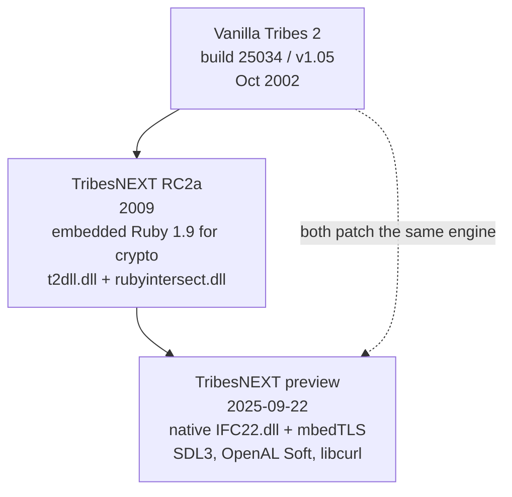

# 07 · Community Patches

Nobody plays vanilla Tribes 2 in 2026. Vivendi shut down the WON master servers in 2008, taking account
login and server browsing with them, and every playable install since has run a community patch.

Sections 01–06 of this handbook describe the **vanilla V12 engine, build 25034**, because that is the
substrate everything else sits on. This section describes what the patches change on top of it, and what
that means when you are writing a mod that will actually be run.

| Page | Read it for |
|---|---|
| [TribesNEXT QoL patch](tribesnext-qol.md) | The current patch — IFC22 hijack, `console_client_patches`, the t2csri script set, what it overrides |
| [RC2a](rc2a.md) | The 2009 Ruby-based predecessor, still found in the wild |
| [Modding against a patched install](modding-against-a-patched-install.md) | Practical guidance: collisions, ordering, testing, distribution |

## The two patches

| | RC2a | QoL preview |
|---|---|---|
| Vintage | 2009 | 2025-09-22 |
| Crypto | Embedded Ruby 1.9.0 (`msvcrt-ruby190.dll`, 1.4 MB) | mbedTLS statically linked into `IFC22.dll` (2.0 MB) |
| Engine bridge | `t2dll.dll` (15 KB MinGW) spawning `rubyintersect.dll` over pipes | `IFC22.dll` registering console functions in `DllMain` |
| Audio | Vanilla Miles | Miles **or** OpenAL Soft (`soft_oal.dll`), user-selectable |
| Window/input | Vanilla DirectInput | SDL3 |
| HTTPS | Ruby | libcurl + CA bundle |
| Script entry | `scripts/autoexec/t2csri_*.cs` inside `T2csri.vl2` | Loose `console_client_patches.cs`, executed by the DLL |
| Patch archive | `base/T2csri.vl2`, 496 KB | `base/t2csri.vl2`, 1.3 MB |

Both replace WON authentication with the same protocol shape — an HTTPS lookup against
`tribesnext.com/auth` returning an RSA-signed redirect. Only the implementation moved.

## What stays exactly the same

This matters more than what changes. Neither patch touches:

- **The mod path stack.** `setModPaths` / `-mod` semantics are untouched; the patch adds one more `.vl2`
  to `base/` and otherwise participates in resolution like any other content.
- **The datablock system.** Declaration, inheritance, transmission to clients — unchanged.
- **The package system.** Same mechanism; the patches are themselves packages.
- **TorqueScript.** No language changes.
- **Every content recipe in [section 03](../03-content-recipes/README.md).** Weapons, armors, vehicles,
  packs, deployables, projectiles, damage types — all identical.
- **The gametype and mission conventions.** `scripts/*Game.cs` auto-discovery and `// MissionTypes = `
  both work unchanged.

**A weapon mod written against vanilla runs on a patched install without modification.** That is the
headline, and it is why this handbook documents vanilla first.

## What changes, and where it is covered

| Area | Change | Handbook page |
|---|---|---|
| Files on disk | `IFC22.dll` and `Mss32.dll` replaced; new DLLs; `base/t2csri.vl2` added | [Install anatomy](../01-getting-started/install-anatomy.md#under-the-community-patches) |
| Boot chain | `console_client_patches.cs` executed by the DLL, outside the mod path | [Boot sequence](../02-engine-model/boot-sequence.md#under-the-community-patches) |
| Package stack | Two or three extra packages active at all times | [Packages](../02-engine-model/packages.md#under-the-community-patches) |
| Connection | A pre-authentication phase defers `GameConnection::onConnect` | [Client/server split](../02-engine-model/client-server-split.md#under-the-community-patches) |
| Client assets | `enableAssetDownloads` can ship missing files to clients | [Datablocks](../02-engine-model/datablocks.md#under-the-community-patches), [Packaging](../06-shipping/packaging.md#under-the-community-patches) |
| Audio | OpenAL Soft alongside Miles; force feedback dead | [Audio](../03-content-recipes/audio.md#under-the-community-patches) |
| Fonts and UI scale | `.sdft` fonts, `$Font::Substitute`, render/UI scaling, resolutions beyond 640×480 | [GUI system](../04-interface/gui-system.md#under-the-community-patches) |
| HUD | Aspect-aware repositioning, opacity changes | [HUD](../04-interface/hud.md#under-the-community-patches) |
| Chat | Tag filtering and a bad-word filter on inbound messages | [Text and messaging](../04-interface/text-and-messaging.md#under-the-community-patches) |
| Gametype lists | Master-server type registration stubbed out | [Gametypes](../05-gameplay-systems/gametypes.md#under-the-community-patches) |
| Console surface | ~30 new functions registered by `IFC22.dll` | [Console functions](../90-reference/console-functions.md#under-the-community-patches) |
| Preferences | New `$pref::` families | [Global variables](../90-reference/global-variables.md#under-the-community-patches) |

Each of those pages carries an **"Under the community patches"** section at the end. The vanilla material
above it stays correct; the patch section says what is layered on top.

## Scope and honesty

This section documents the patches **as they affect mod development**. It is not a complete account of
either patch, and it is not an authentication or security reference — the auth protocol, the crypto, and
the server-registration flow are the patch authors' domain.

Evidence markers work as they do elsewhere, with one addition:

| Marker | Meaning here |
|---|---|
| **[patch-script]** | Read from the patch's own shipped `.cs` — file and line cited |
| **[binary]** | From string or import analysis of `IFC22.dll` / `t2dll.dll` |

The QoL preview build documented here is **20250922**. TribesNEXT is actively maintained; check the
current release before relying on a specific detail.

## Credit

TribesNEXT is the work of **Electricutioner / Thyth**, **Krash**, and the Tribes 2 Community System
Reengineering Initiative, with continued maintenance by the current TribesNEXT team. The patch scripts
carry a 2008 T2CSRI copyright; RC2a's Ruby components are GPL-3-or-later.

Without it there would be no Tribes 2 to mod.
