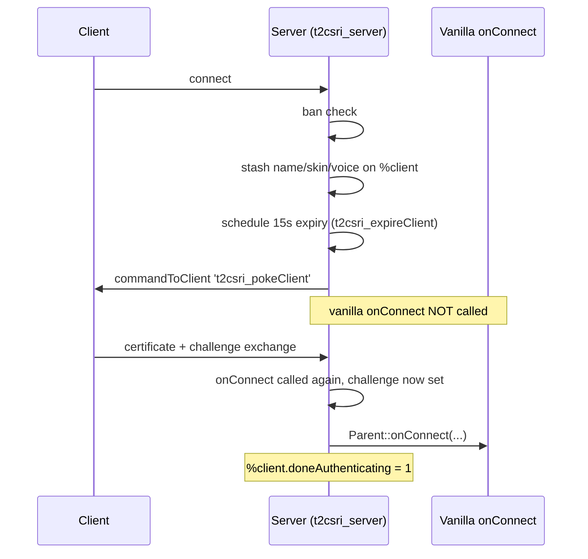

# Modding against a patched install

Practical guidance. Assume your users are on the QoL patch, test on it, and design so RC2a does not break
you.

## The short version

| | |
|---|---|
| **Does my weapon/armor/vehicle mod need changes?** | No. Content is untouched by both patches. |
| **Does my gametype need changes?** | Almost certainly not. `scripts/*Game.cs` discovery is untouched. |
| **Does my UI mod need changes?** | Probably. Fonts, scaling, and several dialogs are overridden. |
| **Do I need to detect the patch?** | Only if you touch the collision surface below. |
| **Will my mod break the patch?** | Only if you override without `Parent::`. |

## The collision surface

Functions overridden by the patches. If your mod packages any of these, order and `Parent::` discipline
matter.

### High risk — you are likely to touch these

| Function | Patched by | Note |
|---|---|---|
| `CreateServer` | QoL `console_client_patches` | The natural place to load your datablock files |
| `GameConnection::onConnect` | Both, via `t2csri_server` | **Deferred by an auth phase** — see below |
| `GameConnection::onDrop` | Both, via `t2csri_server` | Suppressed during the auth phase |
| `GameConnection::getAuthInfo` | Both, via `t2csri_server` | Now reads from the certificate |
| `clientCmdChatMessage` | QoL | Bad-word filtering |
| `MessageVector::pushBackLine` | QoL | Tag filtering |

### Medium risk — UI mods

`Canvas::setContent`, `dashboardHud::onResize`, `MessageHud::open`, `ServerInfoDlg::onWake`,
`OptionsDlg::applyGraphicChanges`, `OptionsDlg::saveSettings`, `OP_FullScreenTgl::onAdd`,
`LaunchToolbarMenu::add`, `LaunchTabView::addLaunchTab`, `GuiMessageVectorCtrl::onAdd`,
`StartLoginProcess`, `GGIntroGui::onSleep`.

### Low risk — specialised

`allocClientTarget`, `ghostAlwaysObjectReceived`, `ClientReceivedDataBlock`, `sceneLightingComplete`,
`isTextureFlushRequired`, `onMissingTexture`, `onUpdateRenderTargets`, `IRCClient::connect`,
`JoystickConfigDlg::onWake`, `RemapInputCtrl::onInputEvent`, `EPainter::*`, `audioUpdateProvider`,
`audioIsEnvironmentProvider`, `getRandomTrack`, `MP3Audio::playTrack`, `clientCmdSetDefaultVehicleKeys`,
`clientCmdSetPilotVehicleKeys`.

Plus, on RC2a only: `GetIRCServerList`, `IRCClient::notify`, `IRCClient::away`, and the un-packaged
`NewsGui::onWake` / `NM_TabView::onAdd` family.

## Creating server content

The patch overrides `CreateServer` **[patch-script]**:

```php
function CreateServer(%mission, %missionType)
{
   Parent::CreateServer(%mission, %missionType);
   if (!isActivePackage(t2csri_server))
      exec("t2csri/serverGlue.cs");
}
```

If your mod does the same thing, both work — the package stack chains them:

```php
package MyMod
{
   function CreateServer(%mission, %missionType)
   {
      Parent::CreateServer(%mission, %missionType);   // ← runs the patch's version, which runs vanilla's
      exec("scripts/weapons/burstDisc.cs");
   }
};
activatePackage(MyMod);
```

Your package activates from `scripts/autoexec/`, after `console_client_patches` has activated at boot, so
yours is outermost and runs first. Your `Parent::` call reaches the patch's version, whose own `Parent::`
reaches vanilla's. The chain works in either order **provided every link calls `Parent::`**.

**Prefer `DefaultGame::missionLoadDone` where it will do.** It is outside the collision surface entirely
and runs after everything is in place.

## The pre-connection auth phase

The single most significant behavioural change for a server mod. `t2csri_server` packages
`GameConnection::onConnect` **[patch-script]**:

```php
function GameConnection::onConnect(%client, %name, %raceGender, %skin, %voice, %voicePitch)
{
   if (%client.getAddress() !$= "local" && %client.t2csri_serverChallenge $= "")
   {
      // check to see if the client is IP banned
      if (BanList::isBanned(0, %client.getAddress()))
      {
         %client.setDisconnectReason("You are not allowed to play on this server.");
         %client.schedule(0, delete);
         return;
      }

      // save these for later
      %client.tname = %name;
      %client.trgen = %raceGender;
      %client.tskin = %skin;
      %client.tvoic = %voice;
      %client.tvopi = %voicePitch;

      // start the 15 second count down
      %client.tterm = schedule(15000, 0, t2csri_expireClient, %client);

      commandToClient(%client, 't2csri_pokeClient', "T2CSRI 1.5 - 08/09/2012");
      return;                                   // ← vanilla onConnect NOT called yet
   }

   // continue connection process
   if (isEventPending(%client.tterm))
      cancel(%client.tterm);

   Parent::onConnect(%client, %name, %raceGender, %skin, %voice, %voicePitch);
   %client.doneAuthenticating = 1;
   %client.t2csri_cert = "";
}
```



What this means for your mod:

- **`onConnect` fires twice per client** — once to start authentication, once to complete it. Guard on
  `%client.doneAuthenticating` if you only want the real one.
- **There is a window where a `GameConnection` exists but is not a player.** Code that iterates
  `ClientGroup` may see clients mid-authentication. `onDrop` is suppressed for them **[patch-script]**:

  ```cs
  function GameConnection::onDrop(%client, %reason)
  {
     if (!isObject(%client) || !%client.doneAuthenticating)
        return;
     Parent::onDrop(%client, %reason);
  }
  ```

- **`local` connections skip the phase entirely.** Offline and listen-server hosts authenticate
  immediately, which is why a bug here only appears with a real remote client. Test with two machines.
- **Fifteen seconds is the timeout.** A client that does not complete is dropped by `t2csri_expireClient`.

If your mod hooks `onConnect`, the safe shape is:

```php
package MyMod
{
   function GameConnection::onConnect(%client, %name, %raceGender, %skin, %voice, %voicePitch)
   {
      Parent::onConnect(%client, %name, %raceGender, %skin, %voice, %voicePitch);

      // Only act once the client is actually in.
      if (%client.doneAuthenticating)
         myModOnClientReady(%client);
   }
};
```

On vanilla, `doneAuthenticating` is never set and the guard fails — so also handle the unpatched case if
you support it, or hook `DefaultGame::clientMissionDropReady` instead, which is patch-independent.

### `getAuthInfo` now comes from the certificate

```php
function GameConnection::getAuthInfo(%client)
{
   if (%client.t2csri_authInfo $= "" && %client.getAddress() $= "local")
      %client.t2csri_authInfo = WONGetAuthInfo();

   return %client.t2csri_authInfo;
}
```

The record format is preserved **[patch-script]**:

```
>Name  ActiveClanTag  Prepend(0)/Postpend(1)Tag  guid
>NumberOfClans
>ClanName  TagForClan  Prepend(0)/Postpend(1)Tag  clanid  rank  title
```

with the comment *"in this version, there is no clan support, so those fields are empty"*. **A mod that
parses clan fields out of `getAuthInfo` will get empty strings.**

## Master-server functions are stubbed

`t2csri_server` replaces four vanilla functions with no-op stubs **[patch-script]**:

```php
// deactivating old master list server protocol handlers in script
// sending a game type list to a dedicated server would result in a massive number
// of nuiscance calls to the following functions, and spam the console with pages of errors
// the errors were the main source of CPU utilization, so just setting stubs is adequate protection
function addGameType()             { return; }
function clearGameTypes()          { return; }
function clearMissionTypes()       { return; }
function sortGameAndMissionTypeLists() { return; }
```

**If your gametype calls `addGameType()` it silently does nothing on a patched server.** The gametype
still works — `scripts/*Game.cs` discovery and `// MissionTypes = ` are unaffected — but the old
master-server type registration is gone. See [Gametypes](../05-gameplay-systems/gametypes.md).

## UI mods

Three changes to plan around.

**Fonts are substituted.** `$Font::Substitute["Univers Condensed"] = "Saira SemiCondensed Medium"`
**[patch-script]**. Your `.gui` asking for `Univers Condensed` renders in Saira. Metrics differ, so a
layout tuned to the pixel against vanilla fonts will shift. Use `autoSizeWidth` / `autoSizeHeight` and
leave slack.

**Resolution is no longer effectively 640×480.** The virtual coordinate space is unchanged, but render
scale, UI scale, and UI aspect are now user-controlled. Anything positioned by absolute coordinate against
a canvas extent should read the extent rather than assume it.

**`dashboardHud::onResize` repositions the HUD** per `$pref::Video::uiAspect`, with hardcoded special
cases at 480 and 600 height **[patch-script]**. HUD elements you add should hook
`clientCmdResetHud` — see [HUD](../04-interface/hud.md#adding-your-own-hud-element) — rather than
positioning once at load.

## Asset downloads

`enableAssetDownloads(bool)`, driven by `$pref::Net::downloadAssets` **[patch-script]**, lets a server
ship missing files to joining clients.

This changes the distribution calculus described in
[Packaging](../06-shipping/packaging.md#what-to-ship): a mod with new art may be able to rely on the
server delivering it, instead of requiring every player to install a client package.

**Do not rely on it without testing.** It is a user-toggleable preference, so some clients will have it
off, and the exact delivery scope has not been verified here. Ship a client package as well, and treat
downloads as a convenience.

## Testing checklist for a patched install

In addition to the [vanilla checklist](../06-shipping/hosting-and-testing.md#testing-checklist):

| Test | Catches |
|---|---|
| `listPackages()` at boot | Your package activating, and where it sits relative to `console_client_patches` |
| Connect a **real remote client** | The auth phase — a `local` connection skips it entirely |
| Two clients connecting at once | State keyed on the wrong client during authentication |
| A client that times out mid-auth | Cleanup on the 15-second expiry path |
| The Video options panel | Your UI changes surviving the rebuilt panel |
| Windowed and fullscreen at a non-4:3 aspect | HUD and GUI positioning |
| With `$pref::Net::downloadAssets` off | Whether your assets are actually reaching clients |
| On RC2a if you support it | The `scripts/autoexec/` ordering collision |

## Distribution notes

**State which patch you tested against.** "Tested on TribesNEXT preview 20250922" in your readme saves
your users a great deal of confusion.

**Keep the version gate.** The patch itself refuses to load on anything but build 25034 **[patch-script]**;
copying that guard means your mod fails with a message rather than a crash:

```php
if (getT2VersionNumber() != 25034)
{
   error("MyMod requires Tribes 2 build 25034 (patch v1.05).");
   return;
}
```

**Do not ship patch files.** Never bundle `IFC22.dll`, `t2csri.vl2`, or `console_client_patches.cs` with
your mod. Users install the patch themselves, versions move, and the licences are not yours to
redistribute — RC2a's Ruby components are GPL-3-or-later, and the scripts carry a 2008 T2CSRI copyright.

**Do not shadow patch files.** Putting a `t2csri/` directory in your mod, or a loose
`base/loginScreens.cs`, will shadow the patch through the normal mount stack and break authentication.

## Related

- [TribesNEXT QoL patch](tribesnext-qol.md) — the full override inventory
- [RC2a](rc2a.md) — the autoexec collision
- [Packages](../02-engine-model/packages.md) — the chaining discipline this all depends on
- [Hosting and testing](../06-shipping/hosting-and-testing.md) — the vanilla test loop
