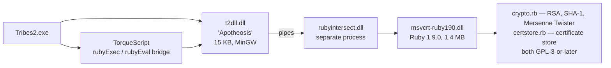

# TribesNEXT RC2a

The 2009 release, superseded by the [QoL preview](tribesnext-qol.md) but still found on older installs and
in archived mod packs. It matters to a mod author for one specific reason: **it puts files in
`scripts/autoexec/`**, which is the mod entry point.

## The architecture

RC2a predates the native rewrite. All crypto and account management runs in an **embedded Ruby 1.9.0
interpreter**.



| File | Size | Role |
|---|---:|---|
| `t2dll.dll` | 15,872 | Engine bridge; spawns the Ruby helper, injects `t2csri_verify_*` fragments |
| `rubyintersect.dll` | 9,728 | Host process loading the Ruby interpreter, piping back to `t2dll.dll` |
| `msvcrt-ruby190.dll` | 1,409,536 | Ruby 1.9.0 |
| `base/T2csri.vl2` | 496,285 | The patch archive |
| `SierraUp.exe` | 6,144 | No-op updater stub |

The script side of the bridge is plain TorqueScript **[patch-script]** — `t2csri/rubyUtils.cs`:

```php
// loads a ruby script
function rubyExec(%script)
{
   echo("Loading Ruby script " @ %script @ ".");
   new FileObject("RubyExecutor");
   RubyExecutor.openForRead(%script);

   while (!RubyExecutor.isEOF())
   {
      %line = RubyExecutor.readLine();
      %buffer = %buffer @ "\n" @ %line;
   }
   rubyEval(%buffer);
   RubyExecutor.close();
   RubyExecutor.delete();
}
```

A nice piece of engineering, and a good example of `FileObject` usage if you ever need to read a file from
TorqueScript.

## The collision that matters

`base/T2csri.vl2` contains:

```
scripts/autoexec/t2csri_IRCfix.cs      (+ .dso)
scripts/autoexec/t2csri_list.cs        (+ .dso)
scripts/autoexec/t2csri_serv.cs        (+ .dso)
t2csri/authconnect.cs                  (+ .dso)
t2csri/authinterface.cs                (+ .dso)
t2csri/autoupdate.cs
t2csri/bans.cs                         (+ .dso)
t2csri/base64.cs                       (+ .dso)
t2csri/certstore.rb                    ← Ruby, GPL-3
t2csri/clientSide.cs                   (+ .dso)
t2csri/clientSideClans.cs              (+ .dso)
t2csri/crypto.rb                       ← Ruby, GPL-3
t2csri/glue.cs                         (+ .dso)
t2csri/ipv4.cs                         (+ .dso)
t2csri/rubyUtils.cs                    (+ .dso)
t2csri/serverSide.cs
t2csri/serverSideClans.cs              (+ .dso)
t2csri/serverglue.cs                   (+ .dso)
loginScreens.cs                        (+ .dso)
textures/tn_logo.png, TN_logo.bm8, TN_entropy.png, TN_entropy.bm8
textures/texticons/TC_logo1.png, TC_logo1.bm8
```

**Three files land in `scripts/autoexec/`** — the directory `console_end.cs` globs to load user scripts
**[script]**:

```php
%path = "scripts/autoexec/*.cs";
for( %file = findFirstFile( %path ); %file !$= ""; %file = findNextFile( %path ) )
    exec( %file );
```

So on an RC2a install, `loadCustomScripts()` finds RC2a's three files **and** your mod's entry script, in
**whatever order the OS returns** — the comment in `console_end.cs` says so explicitly.

Practical consequences:

- **Do not name your autoexec script anything starting with `t2csri_`.** Collision is unlikely by
  accident, but it costs nothing to avoid.
- **Do not rely on being first or last.** If your entry script needs the patch to have loaded already,
  schedule your work rather than doing it at file scope. RC2a's own `t2csri_serv.cs` does exactly that
  **[patch-script]**:

  ```cs
  schedule(0, 0, exec, "t2csri/serverglue.cs");
  ```

  A zero-delay schedule defers to the next tick, by which time every autoexec file has been executed.
  Copy this idiom when order matters.

The QoL preview removed these files and moved to a loose root script executed by the DLL, so this
collision does not exist there. If you support both, code for RC2a's constraints.

## The RC2a packages

| Package | Where | Purpose |
|---|---|---|
| `t2csri_ircfix` | `scripts/autoexec/t2csri_IRCfix.cs` | Redirects the IRC server list, suppresses IRC error spam while connected |
| `t2csri_server` | `t2csri/serverSide.cs` | Server-side auth — same name as in the QoL patch |

`t2csri_list.cs` is **not** packaged — it defines `NewsGui::onWake`, `NM_TabView::onAdd` and friends as
plain functions at global scope **[patch-script]**. Those are hard overrides with no `Parent::` chain: a
mod that packages the same functions will win, but a mod that defines them as plain functions will fight
with RC2a depending on load order.

`t2csri_IRCfix.cs` also writes globals at file scope before its package block **[patch-script]**:

```php
$IRCClient::NickName = getField(wonGetAuthInfo(),0);
$IRCClient::NickName = strReplace($IRCClient::NickName," ","_");
$IRCClient::NickName = stripChars($IRCClient::NickName,"~@#$!+%/|^{&*()<>");
```

## The client loader

`t2csri/glue.cs` **[patch-script]**:

```php
// load the torque script components
exec("t2csri/authconnect.cs");
exec("t2csri/authinterface.cs");
exec("t2csri/base64.cs");
exec("t2csri/clientSide.cs");
exec("t2csri/ipv4.cs");
exec("t2csri/rubyUtils.cs");

// load the Ruby components
rubyExec("t2csri/crypto.rb");
rubyExec("t2csri/certstore.rb");

rubyEval("certstore_loadAccounts");
rubyEval("tsEval '$RubyEnabled=1;'");

// connect to the auth server via signed lookup
schedule(32, 0, authConnect_findAuthServer);

// get the global IP for sanity testing purposes
schedule(32, 0, ipv4_getInetAddress);
```

`$RubyEnabled` is a useful sentinel: **`if ($RubyEnabled)` distinguishes an RC2a install from a QoL one**
at runtime.

## RC2a versus the QoL preview

| | RC2a | QoL preview |
|---|---|---|
| Script entry | `scripts/autoexec/t2csri_*.cs` inside the archive | Loose `console_client_patches.cs`, DLL-executed |
| **Collides with the mod entry point** | **Yes** | No |
| Crypto | Ruby 1.9.0 subprocess | mbedTLS in `IFC22.dll` |
| Audio | Vanilla Miles | Miles or OpenAL Soft |
| Window/input | Vanilla DirectInput | SDL3 |
| Fonts | Vanilla `.gft` | `.sdft` with `$Font::Substitute` |
| UI scaling | None — 640×480 virtual space only | Render scale, UI scale, UI aspect |
| Force feedback | Vendor `IFC22.dll` retained → **works** | Stubbed → **dead** |
| Extra scripts | `autoupdate.cs`, `bans.cs`, `base64.cs`, `rubyUtils.cs`, IRC fixes | `serverList.cs`, `loginDialogs.gui`, `.sdft` fonts |
| Detection sentinel | `$RubyEnabled` | `isPackage(console_client_patches)` |
| Licence | Ruby components GPL-3-or-later | mbedTLS Apache-2.0; scripts carry 2008 T2CSRI copyright |

The **auth protocol shape is identical** in both — `<address>\t<signature>` looked up against
`tribesnext.com/auth`, SHA-1 of the address, RSA-verify of the signature, compare. Only the verifier moved
from Ruby to C++.

Both also share the same `t2csri_server` package and the same
[pre-connection auth phase](../02-engine-model/client-server-split.md#under-the-community-patches).

## Detecting which patch is present

```php
function myModDetectPatch()
{
   if (isPackage(console_client_patches))
      return "QoL";
   if ($RubyEnabled)
      return "RC2a";
   return "vanilla";
}
```

Useful if your mod touches anything in the collision surface. For most content mods it is unnecessary —
weapons, armors, and vehicles behave identically on all three.

## Related

- [TribesNEXT QoL patch](tribesnext-qol.md) — the current patch
- [Modding against a patched install](modding-against-a-patched-install.md) — practical guidance
- [Boot sequence](../02-engine-model/boot-sequence.md) — the autoexec glob RC2a lands in
- [Your first mod](../01-getting-started/your-first-mod.md) — the entry point RC2a shares
