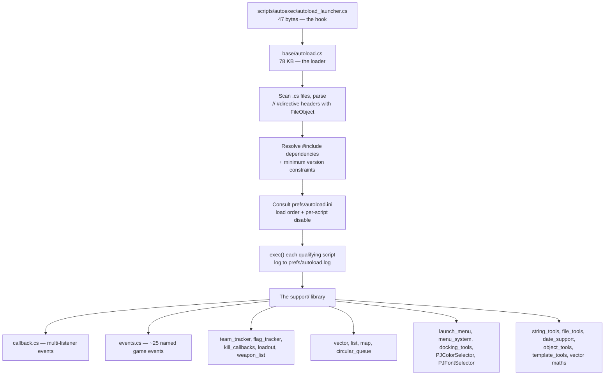

# 09 · The Support Pack (`support.vl2`)

A community-built **script library and module system** for Tribes 2, distributed as a single `.vl2`
dropped into `base/`. It is not a patch and not game content — it is infrastructure that other scripts
build on, and a large body of client-side community scripting depends on it.

It calls itself the *Tribes 2 Preprocessing and Autoloading System* **[support-script]**.

| Page | Read it for |
|---|---|
| [The autoload system](autoload-system.md) | `// #directive` headers, `autoload.ini`, dependency and version resolution, boot integration |
| [Callbacks and events](callbacks-and-events.md) | `callback.cs`, `events.cs`, and the state trackers — the reason the pack exists |
| [Library reference](library-reference.md) | All 36 modules, catalogued |

## The artifact

| | |
|---|---|
| Source | `https://files.playt2.com/Scripts/support.vl2` |
| Size | 392,216 bytes |
| SHA-256 | `4a6b1bef39301d58c3a59e2997574ee013593f8f2187511a34be09e0a90e6707` |
| Format | Standard PKZIP, like every `.vl2` |
| Contents | 39 entries — `autoload.cs`, 36 `support/*.cs` modules, one autoexec launcher, two text docs |
| Install | Drop into `GameData/base/` **[support-script]** |

Timestamps inside run from **2001-05-17** to **2003-12-19**, with `support/string_tools.cs` re-dated
**2020-09-19** — the pack is old but not entirely abandoned.

## What it actually provides



Three things, in order of importance to you:

1. **A module system with dependency resolution** — something TorqueScript has no native concept of.
2. **A multi-listener callback system** — the answer to a real limitation of packages.
3. **A standard library** — data structures, string utilities, state trackers.

## Why it exists

This is the interesting part, and it explains a genuine gap in the engine.

**Packages chain; they do not compose.** When five client scripts all want to know that the player fired a
weapon, each packages the same function and each must call `Parent::`. One author who forgets breaks
everyone downstream, silently. There is no registry, no way to enumerate listeners, no way to remove one.

`callback.cs` replaces the chain with a registry **[support-script]**:

```php
callback.add(foo, bar);
```

Now N scripts attach independent listeners to a named trigger, and none can break the others. See
[Callbacks and events](callbacks-and-events.md).

**And TorqueScript has no module system.** `exec()` is unconditional and unordered; nothing expresses
"I need `team_tracker.cs` version 0.0.4 or later, loaded before me". The autoload system adds exactly
that, parsed out of comments. See [The autoload system](autoload-system.md).

## The trick underneath — and its vanilla ancestry

Every directive is an ordinary TorqueScript comment:

```php
// #name = Flag Tracking Support
// #version = 0.0.3
// #author = Paul Tousignant
// #include = support/team_tracker.cs 0.0.4
// #include = support/events 1.0.3
```

The engine's compiler ignores them entirely. `autoload.cs` opens the file with a `FileObject`, reads the
lines, and parses the metadata itself **[support-script]**.

**This is the same technique vanilla uses** for `// MissionTypes = ` and `// DisplayName = ` in `.mis`
files, and `// DisplayName = ` in `scripts/*Game.cs` **[script]** — Sierra used it in two narrow places;
the community generalised it into a full module system with versioned dependencies. It is the standard
Tribes 2 answer to "I need metadata the engine will not choke on".

It is also, incidentally, a route to
[reading an object's fields without `eval()`](../02-engine-model/simobject-and-namespaces.md) — the
`script` class in `autoload.cs` is a line-editing wrapper around `FileObject` with `findInFile`,
`replaceInFile`, `insertLine`, and `replaceLinesInFile` **[support-script]**.

## Scope: client side

The pack is **predominantly client-side** — GUI wake events, key bindings, HUD docking, colour and font
selectors, demo recording, the launch-menu script browser. **[inferred]** from the module inventory and
the events it hooks; a few utility modules (`string_tools`, `map`, `vector`, `list`, `date_support`) are
side-agnostic and usable anywhere.

If you are writing a **server-side gameplay mod**, you almost certainly do not need it, and should not
take a dependency on it — your users would have to install it too.

If you are writing a **client-side utility** — a HUD, a bind manager, a stat tracker — it is the
established foundation, and much of the surviving community script corpus assumes it.

## Does it collide with my mod?

Yes, in one place, and it is the same place RC2a lands.

`scripts/autoexec/autoload_launcher.cs` **[support-script]**:

```php
if( !$AutoloadExecuted ) exec("autoload.cs");
```

That is a **third occupant** of the directory `console_end.cs` globs to load user scripts. On a machine
with RC2a and the support pack installed, `loadCustomScripts()` executes:

- RC2a's `t2csri_IRCfix.cs`, `t2csri_list.cs`, `t2csri_serv.cs`
- the support pack's `autoload_launcher.cs`
- **your** entry script

in **OS-determined order** **[script]**. The mitigations are the ones already documented in
[Your first mod](../01-getting-started/your-first-mod.md#under-the-community-patches): avoid the
`t2csri_` and `autoload_` prefixes, and defer order-sensitive work with `schedule(0, 0, …)`.

Note the `$AutoloadExecuted` guard — the pack protects itself against double execution, exactly as the
TribesNEXT patch does with `isPackage(console_client_patches)`. Copy the pattern.

## Disabling it

| Method | Effect |
|---|---|
| `-noautoload` on the command line | Sets `$AutoloadEnabled = false` **[support-script]** |
| `-skipnewautoload` | Skips the scan for other autoloading `.cs` files (added 2003-12-19) |
| Comment a line in `prefs/autoload.ini` with `;` | Disables one script |
| Remove `base/support.vl2` | Removes the pack entirely |

Useful when isolating whether a bug is yours or the library's.

## Credits

From the pack's own `readme_first.txt` **[support-script]**:

**Script authors** — Daniel "Wizard_TPG" Neilsen, Paul "UberGuy (FT)" Tousignant, Jason "VeKToR++" Gill,
Lars "Diogenes" Soldahl, Mark "PanamaJack" Dickenson, Jon "Ratorasniki" Naiman. `callback.cs` is by
Lorne "Writer" Laliberte.

**Credited by the authors** — "MrPoop", Robert "xgalaxy" Blanchet.

**Support manual** — Shane "^BuGs^" Froebel, Andrew "BigWig" Wignall.

Later maintenance entries in `changes.txt` are signed **ilys**.

The original scripter documentation lived at `planettribes.com/depot` as a PDF. That host is long gone;
this section and the module headers are what remains.

## A note on evidence

Claims sourced from the pack's own scripts are marked **[support-script]**. The pack is third-party
community code of varying vintage — where its own comments and its behaviour might disagree, this section
follows the code, the same policy applied to Sierra's comments throughout this handbook.
