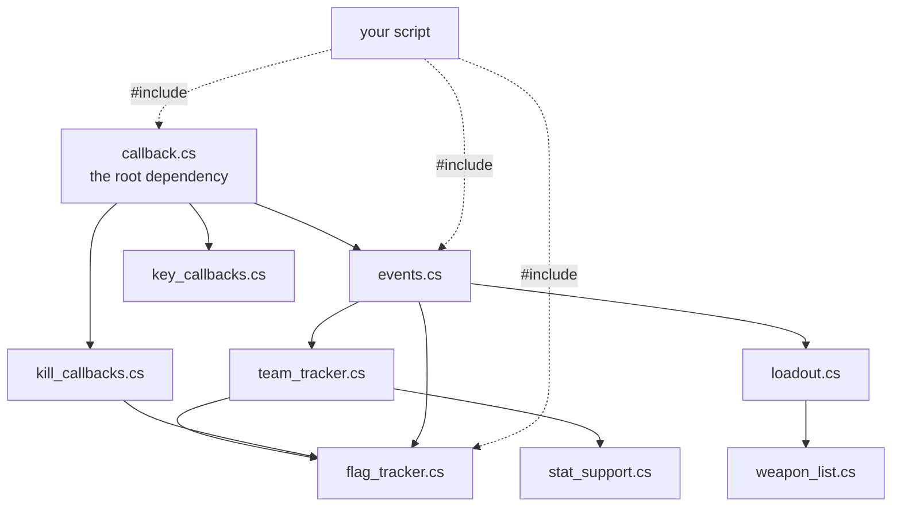

# Library reference

All 36 modules in `support.vl2`, with the version and description from each file's own directive header
**[support-script]**.

Versions are the ones in the pack as fetched; the pack has had multiple maintainers, so check the header
in your copy rather than trusting this table for a version pin.

## Core

| Module | Ver | Description |
|---|---|---|
| `callback.cs` | 1.2.0 | This callback class provides a sophisticated event handler for scripts |
| `events.cs` | 1.0.4 | Callbacks for commonly used, miscellaneous events |

`callback.cs` is the dependency almost everything else declares. See
[Callbacks and events](callbacks-and-events.md).

## Data structures

| Module | Ver | Description |
|---|---|---|
| `vector.cs` | 1.0.3 | Structure for fast adds and indexed lookup |
| `list.cs` | 1.0.1 | Structure for fast adds and removes |
| `map.cs` | 1.0.9 | Structure for fast lookup by key |
| `circular_queue.cs` | 1.0.0 | Handy buffer data structure |

Worth knowing these exist. TorqueScript arrays are name-concatenation sugar with no length and no
iteration protocol (see [TorqueScript](../02-engine-model/torquescript.md#arrays)), so anything
non-trivial benefits.

`map.cs` gained `incrementValue(%key)` / `decrementValue(%key)` and a faster `ListMap::hasKey()` in 2003
**[support-script]**. `vector.cs` and `list.cs` were changed so `pop*()` returns the popped value — a
breaking change if you pinned an older version.

## Game state trackers

| Module | Ver | Description |
|---|---|---|
| `team_tracker.cs` | 0.0.6 | Provides information about teams and the players on them |
| `flag_tracker.cs` | 0.0.3 | Provides information about flag status, events and carrier kills |
| `kill_callbacks.cs` | 1.0.1 | Simplified kill tracking Callback |
| `loadout.cs` | 0.1.1 | Determines players current loadout status from HUD information |
| `player_support.cs` | 0.0.7 | Provides a convenient api for getting info about players |
| `weapon_list.cs` | 1.4.0 | This class maintains a mapping of numbers ("slots") to weapon names |
| `stat_support.cs` | 0.0.8 | Adds player and team stat logging support |
| `mission_callbacks.cs` | 1.0.1 | Adds some basic mission callbacks |
| `vehicle_callbacks.cs` | 0.0.5 | Callbacks for mounting and dismounting vehicles |
| `tourney_mode.cs` | 1.0.0 | Callbacks and functions to test for tourney mode |

Note what `loadout.cs` does: it reconstructs the player's inventory **from HUD updates**, because the
client is not told inventory directly — it receives `clientCmdSetInventoryHud*` calls. That is a neat
illustration of the client/server split described in
[Client/server split](../02-engine-model/client-server-split.md), and of `weapon_list.cs`'s purpose —
the wire protocol carries HUD **slot numbers**, not weapon names, so something must map them back. Slots
come from `$WeaponsHudData`; see [HUD](../04-interface/hud.md).

## Input

| Module | Ver | Description |
|---|---|---|
| `key_callbacks.cs` | 0.0.2 | Allows multiple uses of one button and button "muting" |
| `bind_manager.cs` | 1.1.1 | Management script for adding new keybinds for Tribes 2 scripts |
| `tap.cs` | 1.0.0 | Adds functions that scripts can use to check for tapped keys or buttons |

`key_callbacks.cs` is the input equivalent of `callback.cs` — several scripts binding the same key without
clobbering each other. `bind_manager.cs` carries a keybind-remap fix and was corrected in 2003 to autoload
so the fix actually loads **[support-script]**.

## Interface

| Module | Ver | Description |
|---|---|---|
| `launch_menu.cs` | 1.0.0 | Adds new commands to the LaunchToolbarMenu class so scripters can customize the launch menu |
| `menu_system.cs` | 1.02 | CenterPrint Menus just like T1 Stripped. This script is a T2 port of MrPoop's original MenuSystem.cs |
| `docking_tools.cs` | 0.0.2 | Additional events and features for docking HUDs to one another |
| `PJColorSelector.cs` | 1.0.1 | RGB Dialog |
| `PJFontSelector.cs` | 1.0.1 | Font Selector |

`launch_menu.cs` is what puts the **Script Browser** into the launch menu — the in-game UI for viewing
installed scripts and editing `autoload.ini`, referenced by the pack's readme **[support-script]**.

`docking_tools.cs` matters if you ship a HUD element: it is the community answer to HUD layout, and it
predates the TribesNEXT patch's aspect-aware repositioning by twenty years. Expect the two to interact —
see [HUD](../04-interface/hud.md#under-the-community-patches).

`PJFontSelector` will not see the TribesNEXT `.sdft` replacements as vanilla `.gft` fonts; the
`$Font::Substitute` table redirects by name at a lower level. **[inferred]**

## Utilities

| Module | Ver | Description |
|---|---|---|
| `string_tools.cs` | 1.5.1 | Adds functions to manipulate and work with strings |
| `file_tools.cs` | 1.2.0 | Adds new member functions to the FileObject class |
| `date_support.cs` | 0.7.0 | A date API that requires no outside support |
| `object_tools.cs` | 0.0.1 | Adds new functions to work with objects |
| `template_tools.cs` | 0.0.1 | Provides tools for script Authors to define and use code templates |
| `mute_tools.cs` | 0.4.1 | Adds functions to help mute messages |
| `flood_protect.cs` | 1.0 | Utility to help scripters prevent spam and other over-repetitive events in their scripts |

`file_tools.cs` extends `FileObject` itself — relevant to the
[`save()` field-enumeration technique](../02-engine-model/simobject-and-namespaces.md), since it is more
`FileObject` capability already written.

`date_support.cs` is notable because vanilla gives you `getSimTime()` and `getRealTime()` and nothing else
— no calendar functions at all. See [Scheduling and events](../02-engine-model/scheduling-and-events.md).

`string_tools.cs` carries a **2020-09-19** timestamp, the only file in the pack touched in the last two
decades.

## Recording

| Module | Ver | Description |
|---|---|---|
| `PJEnhancedRecording.cs` | 1.0.1 | Support for adding more information to demo recordings |

Extends vanilla's demo system (`startRecord` / `playDemo` — see
[Console functions](../reference/console-functions.md)). `flag_tracker.cs` and `team_tracker.cs` were
both modified in 2003 to work with demos recorded through it **[support-script]**, so if you consume
either during playback, that dependency is real.

## Which autoload by default

Exactly **two** of the 36 modules carry `#autoload` as their first directive — which is what
`autoload::get_autoload()` actually tests **[support-script]**:

```
support/PJEnhancedRecording.cs
support/bind_manager.cs
```

plus whatever `autoload.ini` lists. **The rest are libraries** — they load because a script that
`#include`s them is loading, not on their own. That is the intended design: declaring
`#include = support/callback.cs` is what pulls `callback.cs` in.

## Dependency shape



Reconstructed from the `#include` lines in each module's header **[support-script]**. `callback.cs` sits
under nearly everything; the trackers layer on `events.cs`.

## Reading a module

Every module documents itself in its header comment block, usually including its callback list and data
fields — `flag_tracker.cs` documents its five triggers and the `%flagRef` field set in the first 30 lines.
**Read the file.** The original PDF documentation is gone, so those headers are the reference that
survives.

## Related

- [The autoload system](autoload-system.md) — how `#include` is resolved
- [Callbacks and events](callbacks-and-events.md) — the core API
- [Section overview](README.md) — install, scope, credits
