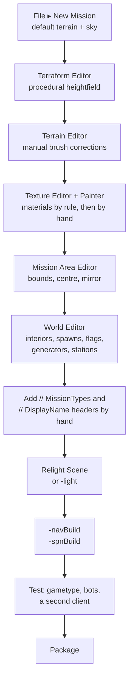

# 10 · Mapping

Tribes 2 ships a complete map-making toolchain **inside the game**. Press `F11` and you are in it. No
external editor, no export step, no SDK — terrain generation, texturing, object placement, lighting and
bot navigation are all built in.

This section documents that toolchain from the game's own manual and scripts. Sections
[17](../17-bones-getting-started/README.md)–[20](../20-bones-environment-finishing/README.md) then follow
NecroBones' community tutorial, which covers the workflow and judgement the manual does not.

| § | Section | Covers |
|---|---|---|
| **10** | Mapping *(this page)* | The file set, the toolchain, the end-to-end workflow |
| [11](../11-mission-editor/README.md) | The Mission Editor | `F11`, the eight tools, File/Edit/Camera menus, movement |
| [12](../12-world-editor/README.md) | World Editor | Placing and manipulating objects; Tree, Inspector, Creator |
| [13](../13-terrain/README.md) | Terrain | Manual brush editing, the procedural Terraform stack, mission area |
| [14](../14-terrain-texturing/README.md) | Terrain texturing | Rule-based placement, manual painting, the four-texture rule |
| [15](../15-lighting-nav-spawn/README.md) | Lighting, navigation & spawn data | Relighting, `.ml`, `.nav`, `.spn` |
| [16](../16-shipping-a-map/README.md) | Shipping a map | Gametype wiring, headers, packaging, what clients need |

## Sierra shipped a manual and almost nobody read it

`base/scripts.vl2` contains a `help/` directory with **eight `.hfl` documents** — the Torque Mission
Editor manual, integrated into the game **[script]**:

```
1. About.hfl                        450 bytes
2. Mission Editor Overview.hfl    4,234
3. World Editor.hfl               5,626
4. Mission Area Editor.hfl        1,033
5. Terrain Editor.hfl             2,044
6. Terrain Terraform Editor.hfl   2,242
7. Terrain Texture Editor.hfl     1,377
8. Terrain Texture Painter.hfl      634
```

`.hfl` is a markup format read by the in-game help viewer, using the same `<font:>`, `<a:>`, `<lmargin%:>`
tags as `GuiMLTextCtrl` ([GUI system](../04-interface/gui-system.md#guimltextctrl-markup)). Its own
opening page is candid about the provenance **[script]**:

> *"The GarageGames Torque Engine Mission Editor is included as part of the Torque Game Engine, and now as
> an integrated tool in Sierra's Tribes 2."*

Sections 11–14 are essentially this manual, restated with the surrounding evidence and cross-linked into
the rest of the handbook.

## What a map actually is

A map is **not one file**. It is a `.mis` plus a set of companions that must travel with it:

| File | Location | Authored or generated | Purpose |
|---|---|---|---|
| `<Name>.mis` | `missions/` | **Authored** (editor writes it) | The object tree — terrain reference, interiors, spawns, flags, lighting |
| `<Name>.ter` | `terrains/` | **Authored** (Terrain/Terraform editors) | Heightfield, square flags, texture assignment |
| `<Name>.nav` | `terrains/` | **Generated** — `-navBuild` | AI navigation graph. No file, no bots. |
| `<Name>.spn` | `terrains/` | **Generated** — `-spnBuild` | Terrain prop/vegetation placement |
| `<Name>_<crc>.ml` | `lighting/` | **Generated** — `-light` or Relight Scene | Precomputed static lighting |
| `.dif` interiors | `interiors/` | External tool | Buildings placed by the `.mis` |
| `.dml` / textures | `textures/terrains/` | External | Terrain material sets |



Two steps in that chain are easy to miss and both fail silently:

- **The header comments are not written by the editor.** A `.mis` without `// MissionTypes = ` never
  appears in any host menu ([Missions](../05-gameplay-systems/missions.md#the-header-comments)).
- **`-navBuild` is a separate run.** `buildMissionList` decides bot support purely by whether
  `terrains/<Name>.nav` exists **[script]**.

## Getting in

```bash
Tribes2.exe -nologin -mod Construction -mission Slapdash CTF
```

then **`F11`** in game **[script]**. The editor operates on the **currently loaded mission**, so you start
a mission and edit it live — there is no separate editor executable.

The editor GUIs are loaded unconditionally at boot by `console_end.cs` **[script]**:

```php
loadGui("GuiEditorGui");
loadGui("consoleDlg");
loadGui("InspectDlg");
```

with the editor logic in `scripts/editor.cs`, `editorGui.cs`, `editorRender.cs`, `editorProfiles.cs` and
`pathEdit.cs`, and the C++ side registered as `EditManager`, `WorldEditor`, `TerrainEditor`,
`MissionAreaEditor`, `CreatorTree`, `EditTSCtrl`, `GuiTerrPreviewCtrl` and `Terraformer` **[binary]**.

## Command-line map operations

Three launch modes exist purely for map processing **[script]**. Each sets `$Host::Dedicated`, enables the
Windows console, and calls `CreateServer()` directly:

```bash
Tribes2.exe -light <MissionName>
```

```bash
Tribes2.exe -navBuild <MissionName> <MissionType>
```

```bash
Tribes2.exe -spnBuild <MissionName> <MissionType>
```

There is also `Tribes2.exe <file>.dif`, which sets `$LaunchMode = "InteriorView"` for inspecting a
building on its own **[script]**, and `-show` for the shape viewer
([Console functions](../reference/console-functions.md#shape-viewer)).

## Where mapping sits relative to the rest of this handbook

| You want | Go to |
|---|---|
| The `.mis` file format and its header comments | [Missions](../05-gameplay-systems/missions.md) |
| What a gametype expects a map to contain | [Gametypes](../05-gameplay-systems/gametypes.md) |
| How bots use `.nav` | [AI and bots](../05-gameplay-systems/ai-bots.md) |
| The formats themselves | [File formats](../reference/file-formats.md) |
| Placing *deployables* at runtime rather than authoring | [Turrets and deployables](../03-content-recipes/turrets-and-deployables.md) |

[Missions](../05-gameplay-systems/missions.md) covers the `.mis` as a **data file a mod reads**. This
section covers making one.

## A caution on scope

The editor is Torque's, not Sierra's, and its manual describes the general tool. Where Tribes 2 differs —
the mission-type headers, the team/base object naming conventions, the power system — the manual is silent
and this handbook fills the gap from the shipped missions and scripts.

Anything about **`.dif` interior authoring** is out of scope: interiors are built in external tools of the
Torque Constructor lineage, which are not part of the game and not documented here. Maps place interiors;
they do not create them.
