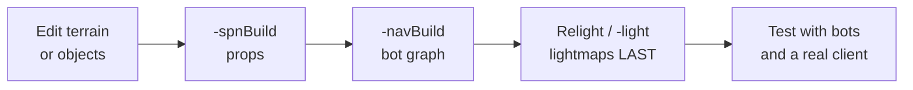

# 15 · Lighting, navigation & spawn data

Three generated companion files. None are authored by hand, all are required, and **all three go stale
when you change the map**.

| File | Generated by | Without it |
|---|---|---|
| `lighting/<Name>_<crc>.ml` | **Relight Scene**, or `-light` | Lighting is wrong or recomputed at load |
| `terrains/<Name>.nav` | `-navBuild` | **No bots on the map, at all** |
| `terrains/<Name>.spn` | `-spnBuild` | No terrain prop/vegetation placement |

## Lighting

Static lighting is precomputed and cached per mission.

**In the editor:** Edit ▸ **Relight Scene** — *"Recomputes mission static lighting"* **[script]**.

**From the command line** **[script]**:

```bash
Tribes2.exe -light <MissionName>
```

which sets `$LaunchMode = "SceneLight"`, enables the Windows console, sets `$Host::Dedicated`, and runs
the lighting pass.

Script-side, `sceneLightingComplete` fires when the pass finishes — the QoL patch packages it to cancel
the loading GUI's poll schedule **[patch-script]**.

### The CRC is why your lighting goes stale

Lightmaps are written as `lighting/<mission>_<crc>.ml` **[binary]**, and the CRC is the **mission file's**.
`loadMissionStage2` computes it and sends it to every client **[script]**:

```php
%file = "missions/" @ $missionName @ ".mis";
…
$missionCRC = getFileCRC(%file);
%count = ClientGroup.getCount();
for(%i = 0; %i < %count; %i++)
{
   %client = ClientGroup.getObject(%i);
   if(!%client.isAIControlled())
      %client.setMissionCRC($missionCRC);
}
```

So **any edit to the `.mis` — even one that cannot affect lighting — invalidates the cached lightmap**,
because the filename no longer matches. Two consequences:

- Relight **last**, after object placement is final. Relighting then moving one crate wastes the pass.
- Old `_<crc>.ml` files accumulate in `lighting/` as you iterate. They are dead weight; clear them before
  packaging.

The client is told the CRC so it can find the matching lightmap, which is why lighting is a *client-side*
asset concern as well as a server one.

### `Sun` and the lighting inputs

The `.mis` carries the light source **[script]**:

```php
new Sun(Sun) {
   direction = "0.622506 0.622506 -0.474313";
   color = "0.800000 0.800000 0.800000 1.000000";
   ambient = "0.400000 0.400000 0.400000 1.000000";
      scale = "1 1 1";
      locked = "true";
   lensFlareScale = 0.7;
   lensFlareIntensity = 1.0;
   frontFlareSize = 300.0;
   backFlareSize = 450.0;
   flareColor = "1.0 1.0 1.0 1.0";
   texture[0] = "special/sunFlare";
   …
};
```

`direction`, `color` and `ambient` are the three that drive the lighting pass. `ambient` is the floor —
set it too low and shadowed geometry becomes unreadable; too high and the terrain flattens out. Shipped
maps sit around `0.4` ambient against `0.8` direct.

Everything from `lensFlareScale` down is render-time only and does not require a relight.

Note `Sun` derives from `NetObject`, not `SceneObject` — which is why its `position`, `rotation` and
`scale` appear as *dynamic* fields at the deeper indent in the `.mis`
([SimObjects and namespaces](../02-engine-model/simobject-and-namespaces.md)).

## Navigation graphs

Bots need a `.nav`. There is no fallback and no partial mode.

```bash
Tribes2.exe -navBuild <MissionName> <MissionType>
```

`buildMissionList` decides bot support purely on the file's existence **[script]**:

```php
// Test to see if the mission is bot-enabled:
%navFile = "terrains/" @ %name @ ".nav";
$BotEnabled[%idx] = isFile( %navFile );
```

**That is the whole test.** No `.nav`, no bots — the map still loads and plays, it simply cannot host AI.

### Generation parameters

The `.mis` carries a `NavigationGraph` object whose fields tune the build **[script]**:

```php
new NavigationGraph(NavGraph) {
   conjoinAngleDev = "70";
   cullDensity = "0.3";
   customArea = "0 0 0 0";
      scale = "1 1 1";
      locked = "true";
      coverage = "0";
      GraphFile = "Slapdash.nav";
};
```

| Field | Effect |
|---|---|
| `GraphFile` | The `.nav` this graph references |
| `conjoinAngleDev` | Angular deviation permitted when joining nodes |
| `cullDensity` | How aggressively redundant nodes are removed |
| `customArea` | Restrict generation to a sub-area rather than the whole mission |
| `coverage` | Coverage metric |

`customArea` is the practical one on large maps — generating the full area is slow, and restricting it to
the playable region keeps the graph small.

Build support is in `scripts/navGraph.cs` and `scripts/graphBuild.cs`, with `NavigationGraph`, `FloorPlan`
and `GroundPlan` registered engine-side **[binary]**. Two console functions are exposed **[binary]**:

```
navGraphExists();
AIGetPathDistance(fromPoint, toPoint);
NavDetectForceFields();
```

`AIGetPathDistance` is worth knowing for gametype work — it gives the *navigable* distance between two
points rather than the straight line, which is what you want for scoring proximity or picking objectives.

### Regenerate after terrain changes

The graph is computed against the terrain and the placed geometry. Change either substantially and the
graph is wrong — bots will path into walls or refuse routes. **Rebuild the `.nav` after any significant
terrain or interior change**, not just once at the end.

## Spawn data

```bash
Tribes2.exe -spnBuild <MissionName> <MissionType>
```

Produces `terrains/<Name>.spn` — 81 ship in the vanilla archives
([File formats](../reference/file-formats.md)).

**This is the spawn graph for spawn spheres**, and it is a required build step that placing the spheres
does not perform. NecroBones is explicit **[bones]**:

> *"Once you've placed the spheres, you need to **build the spawn graph**. This can be done in the editor,
> but I don't trust the graphical version as much, and you need to exit out of the game and restart anyway
> before you can test the changes."*

So the sequence is: place spawn spheres in the World Editor → save → exit → `-spnBuild` → restart to test.
Spheres with no graph do not work, and the failure is silent.

Spawn sphere behaviour is tuned per sphere by `weight` and by indoor/outdoor weights — see
[19 · Building a base](../19-bones-building-a-base/README.md#spawnspheres).

> **Correction.** An earlier draft of this page described `.spn` as terrain prop and vegetation placement,
> inferred from the `RandomOrganics` group's proximity in shipped missions. That was wrong.
> `RandomOrganics` is an ordinary `SimGroup` of placed static shapes in the `.mis`, and the per-environment
> prop maps — `lushPropMap.cs`, `desertPropMap.cs`, `icePropMap.cs`, `lavaPropMap.cs`,
> `badlandsPropMap.cs` **[script]** — are script-side tables, unrelated to `.spn`.

## The regeneration order

After any substantial edit:



Lighting goes **last** because it is keyed to the mission CRC, and both `-navBuild` and `-spnBuild` load
and may re-save the mission. Relight first and you invalidate your own lightmap.

## Related

- [13 · Terrain](../13-terrain/README.md) — what these are generated against
- [16 · Shipping a map](../16-shipping-a-map/README.md) — which of these must ship to clients
- [AI and bots](../05-gameplay-systems/ai-bots.md) — how the graph is used at runtime
- [Launch options](../01-getting-started/launch-options.md) — the three build modes
