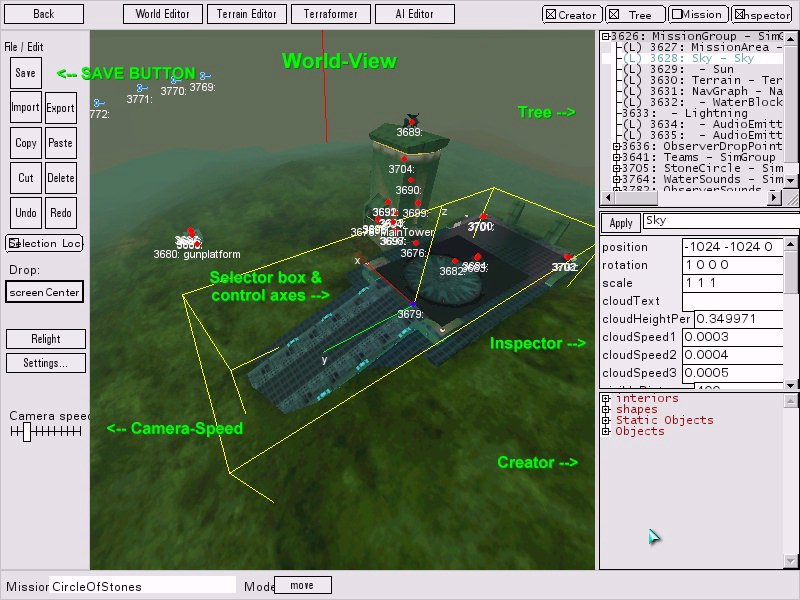
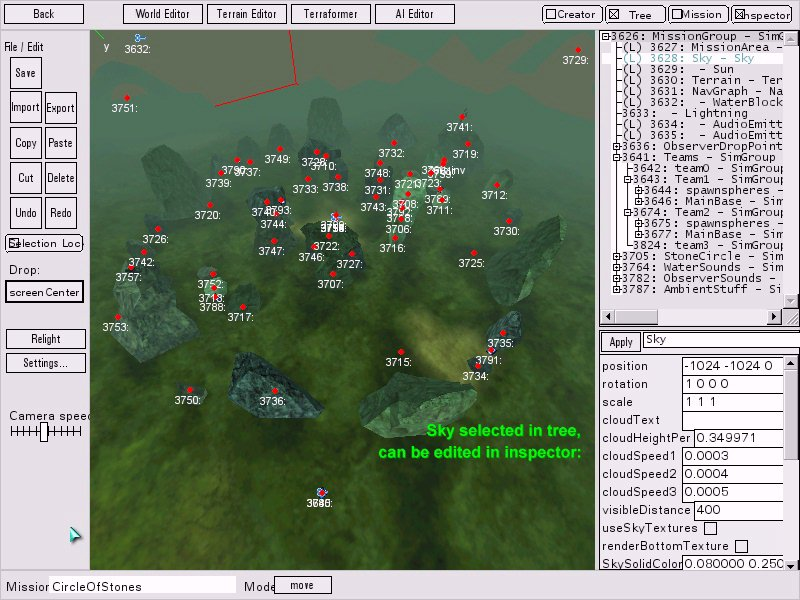
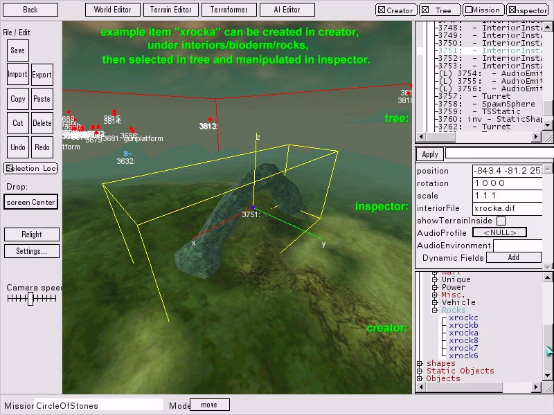

# 18 · Bones' Mapping Tutorial — The editor windows

Tree, Inspector, Creator — and how they work together. Continuing from
[17 · Getting started](../17-bones-getting-started/README.md).

Material marked **[bones]** is from NecroBones' tutorial at
`http://tribes.necrobones.com/tribes2/tutorial.html`; screenshots are mirrored from it with attribution.



*Editor screenshot — NecroBones.*

## The Tree

> *"everything contained in the mission is stored in **SimGroups**, which are basically
> folders/directories within the mission file. Some have specific purposes and **MUST** be present."*
> **[bones]**

### The groups that must exist

| Group | Required | Notes |
|---|---|---|
| `Teams` → `Team0` | **Yes** | *"has to be present, but chances are you won't put anything in it"* |
| `Teams` → `Team1` | **Yes** | **Storm** |
| `Teams` → `Team2` | **Yes** | **Inferno** |
| A group for **observer drop points**, holding cameras | **Yes** | See [19](../19-bones-building-a-base/README.md#observer-drops) |

`Team1 = Storm, Team2 = Inferno` **[bones]** is the mapping between group number and in-game tribe. Team 0
is the neutral/unassigned team — the same one `DefaultGame::missionLoadDone` makes visible and friendly to
everyone **[script]**:

```php
// make team0 visible/friendly to all
setSensorGroupAlwaysVisMask(0, 0xffffffff);
setSensorGroupFriendlyMask(0, 0xffffffff);
```

which is why it must exist even when empty.

### Stripping a mission to start fresh

Because the workflow starts from a copied `.mis`
([17](../17-bones-getting-started/README.md#starting-a-map)), the first job is emptying it **[bones]**:

> *"You can click on a simgroup's name to select all objects within it, and then press **Ctrl-X** to cut
> them out… To destroy everything in the existing mission and start from scratch, select each simgroup
> one-by-one, and press Ctrl-X. **Don't delete things like "terrain" and "sky" and "sun"** and so forth,
> since these are necessary objects, and thus don't fall under a simgroup."*
>
> *"POOF, all gone!"*

The distinction is structural: **objects inside SimGroups are content; objects at `MissionGroup` level are
infrastructure.** `MissionArea`, `Sun`, `TerrainBlock`, `NavigationGraph` and `Sky` sit at the top level
and are exactly the ones the shipped missions mark `locked = "true"` **[script]**
([12 · World Editor](../12-world-editor/README.md#world-menu)).

One residue to watch for **[bones]**:

> *"you may still see tags floating around in space for AI objectives for the bots. I usually delete these
> manually out of the MIS file"*

Inherited AI objective markers survive the group purge. Since the tutorial does not cover bots, hand-editing
them out of the `.mis` is the given fix.

### Alt-click sets the drop target

> *"To select a drop-point in the Tree, you need to use the **Alt** key. So open up "Teams", and Alt-Click
> on Team1."* **[bones]**

This is the **instant group** — the same `$instantGroup` documented in
[12 · World Editor](../12-world-editor/README.md#the-tree-and-the-instant-group) and
[Scheduling and events](../02-engine-model/scheduling-and-events.md#instantgroup). Alt-click the team
group *before* creating an object and it lands in the right place; create it with the wrong group active
and you get a mission that stock gametype code cannot navigate.

## The Inspector



*Editor screenshot — NecroBones.*

The worked example is the Sky **[bones]**:

> *"Click on the sky object. You'll notice that the inspector now displays a bunch of variables and values
> for the Sky… If you want to change a variable in the object, you have to enter the new value and then
> press **apply**."*

His demonstration doubles as the clearest explanation of fog anywhere in the material:

| Setting | Result |
|---|---|
| Visible distance **200**, haze distance **50** | *"you can no longer see very far, and it looks like you're in a thick fog"* |
| Visible distance **1000**, haze distance **900** | *"you can see very far with clarity"* |

Beyond that, the Inspector *"can set objects to specific locations by changing its coordinates… scale
objects, and change some of the behaviours and details"* **[bones]**.

**Apply is not optional.** Selecting away without pressing it loses the edit — consistent with Sierra's
manual **[script]**.

## The Creator

> *"This is how you add objects to the world. You'll find that this is sufficient for most things, but
> some things will be easier to do **manually in the .MIS file** (like adding water or fireballs… since
> water is a pain to create in the editor, and fireballs aren't even on the menu)."* **[bones]**

### The four folders

| Folder | Contains |
|---|---|
| **Interiors** | Buildings, bridges, other man-made structures — **and rocks** |
| **Shapes** | Dynamic objects: turrets, stations, generators, packs, ammo, vehicles |
| **Statics** | Non-movable: trees, plants, and **"plugs"** |
| **Objects** | Force fields, SimGroups, observer cameras |

Two of those need expanding.

**Rocks are Interiors, not Statics.** They are `.dif` geometry, not shapes — which is unintuitive and
worth remembering when hunting for them.

**Plugs** are the sleeper **[bones]**:

> *"'plugs' (useful rectangular gratings that you can use to block off doorways and the like to control
> where players can and can't go)"*

That is level design in one object. A plug closes a route without a visible wall, which is how you shape
flow through a base you did not build.

### Interiors are organised by tribe

> *"the sub-folders are divided up by **tribe name**… each tribe is associated with a **type of terrain and
> architecture**. Let's look in the Blood Eagle (**lush**) folder."* **[bones]**

So architecture and environment are paired in the shipped asset set — Blood Eagle is lush, and the other
tribes map to desert, ice, lava and badlands. Mixing tribes' architecture on one terrain is possible but
will read as inconsistent.

### Two placement quirks

**Objects appear partially submerged.** *"by default it'll appear partially submerged in the ground"*
**[bones]** — you almost always need to raise altitude after placing.

**Some buildings are designed to be partly buried.** *"Some buildings have sections that are meant to be
underground, and thus may not have exterior textures… you'll know it when you see one, since you'll see
disconnected wall pieces that don't look right from the outside."* **[bones]**

**And a Tribes 1 difference that bites** **[bones]**:

> *"Unlike in Tribes 1, if you're inside a building and want to create something on the floor, the object
> will appear **outside**. T1 would create it on the floor, but T2 doesn't work that way, which is annoying
> since you have to take the time to carefully move the object into place."*

Combined with the drop rules in [12](../12-world-editor/README.md#drop-rules), the practical consequence
is that **furnishing interiors is manual work** — place outside, then move in.

## The gizmo



*Editor screenshot — NecroBones.*

> *"Notice that the object has a cube around it, and has lines representing the X, Y, and Z axes. Look down
> at the bottom of the screen, and press **spacebar** a few times. See how the little box down there flips
> between "**move**", "**rotate**", and "**scale**"?"* **[bones]**

**Spacebar cycles the gizmo mode**, with the current mode shown in a box at the bottom of the screen. Then
grab an axis and drag — the Z axis to raise a tower out of the ground, and so on.

This is the friendlier route to the same operations as the modifier scheme in Sierra's manual
(plain = translate, Alt = rotate, Alt-Ctrl = scale —
[12 · World Editor](../12-world-editor/README.md#mouse-and-keyboard)). Gizmos must be enabled in World
Editor Settings.

## Related

- [19 · Building a base](../19-bones-building-a-base/README.md) — power, objectives, pads, spawns
- [12 · World Editor](../12-world-editor/README.md) — Sierra's account of the same three windows
- [17 · Getting started](../17-bones-getting-started/README.md) — setup and the server-side technique
