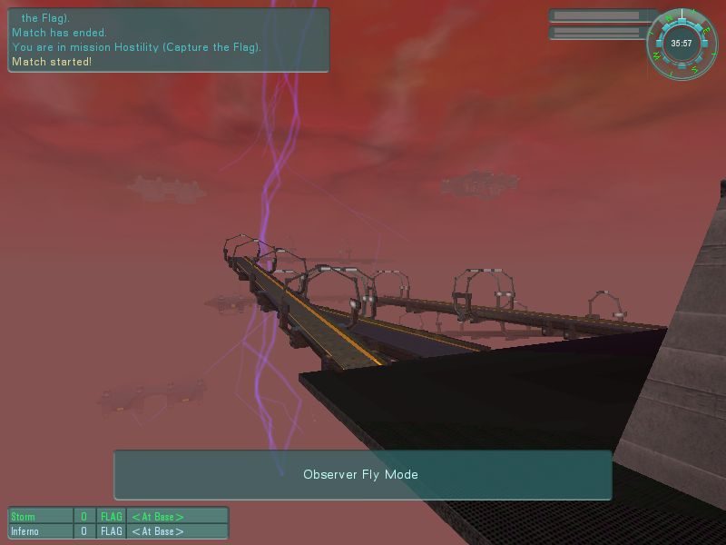
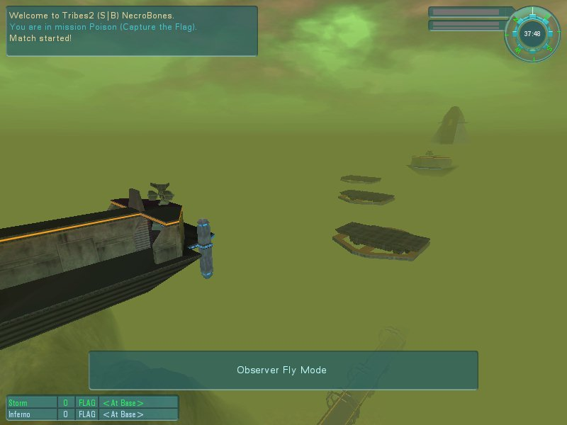
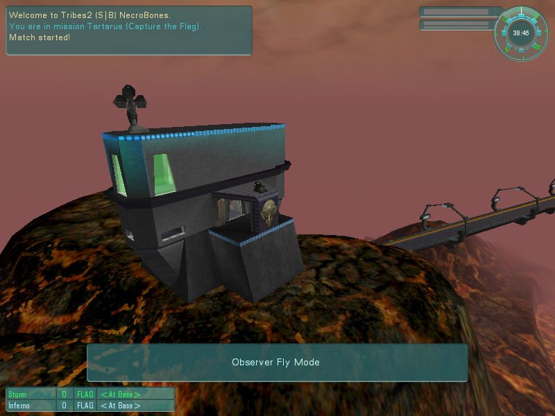

# 20 · Bones' Mapping Tutorial — Environment and finishing

Sky, fog, atmosphere, and the last pass before a map ships. Concluding
[17](../17-bones-getting-started/README.md)–[19](../19-bones-building-a-base/README.md).

Material marked **[bones]** is from NecroBones' tutorial at
`http://tribes.necrobones.com/tribes2/tutorial.html`; map images are mirrored from it with attribution.

> *"This is the fun stuff. :) You can adjust the sky, fog, water, and sun to your heart's desire, and the
> system is remarkably flexible, even compared to T1."* **[bones]**

## Sky

### Start by copying one

> *"look through the existing maps and find a sky that is close to what you want (perhaps it has clouds you
> like). You can manually **copy the sky block out of the MIS file** and replace the one in your mission.
> Or, you can write down the name of the dml object and copy it into the appropriate field, but **the
> editor tends to not be fond of making such changes while running**."* **[bones]**

Sky editing is a text-editor job more than an Inspector job. The same is true of water and fireballs
([18 · The Creator](../18-bones-editor-windows/README.md#the-creator)).

### The client can switch your sky off

The single most important constraint in this section **[bones]**:

> *"the **background texture can be turned off by the client** (as well as the clouds), as a performance
> option, so **always remember to pick a background color that looks good on your map**."*

Players on weak hardware disable sky textures. If your atmosphere depends on the texture, those players
get a flat default and your map looks broken.

The author turned that constraint into a technique:

> *"You might even choose to leave it that way, since just a background color with clouds can make for a
> very customizable sky. **That's how I did the red and green skies in Hostility and Poison**,
> respectively."* **[bones]**



*Hostility — NecroBones.*



*Poison — NecroBones.*

**Colour plus clouds, no background texture** — cheap, robust, and it looks the same for everyone.

## Fog

### Visible and haze distance

> *"**Haze distance** is the distance at which the haze begins. Between that distance and the **vis
> distance**, objects and terrain will fade towards the fog color, which should closely match the
> predominant colors in the sky (with or without the textures). If they don't match, that can be OK too,
> but things will look out of place if you don't put in a thick fog layer."* **[bones]**

These are the same fields on `TerrainBlock` in the `.mis` — shipped maps use `visibleDistance = "1200"`,
`hazeDistance = "250"` **[script]** ([13 · Terrain](../13-terrain/README.md#the-terrainblock-fields-you-will-set)).

**Fog colour must match the sky**, or the horizon reads as a seam.

### The three fog layers

Precise, and documented nowhere else **[bones]**:

> *"The sky also controls fog layers. You can have **3 layers**. "**0 0 0**" means the layer is turned off.
> The first number is the **fog distance**, the second is **bottom of the layer** (altitude), and the third
> is the **top of the layer**. **Layers should never overlap**, but they can be used together to make a
> gradual dropoff in the fog."*

| Field position | Meaning |
|---|---|
| 1 | Fog distance |
| 2 | Bottom altitude of the layer |
| 3 | Top altitude of the layer |

His worked example:

```
"100 0 100"      fog distance 100, altitude   0 → 100
"200 100 110"    fog distance 200, altitude 100 → 110
"300 110 120"    fog distance 300, altitude 110 → 120
```

> *"the fog will be at altitude 120 and down, but there will be **multiple steps** in how visually obscuring
> it is."* **[bones]**

Stacked non-overlapping bands give a gradient rather than a hard ceiling — thick at ground level, thinning
with altitude. That is how you make a valley feel deep without fogging out the whole map.

### An engine limitation to design around

> *"Unfortunately sometimes the **terrain textures are still visible in the fog** as a slightly different
> color because of limitations of the engine, and so certain colors will work well and others won't."*
> **[bones]**

Test your fog colour against your terrain, not just against the sky.

### Colour choice

> *"be sure to pick colors that look **realistic and appropriate**. For instance, the fog and sky in both
> Hostility and Poison (red and green, respectively) are technically primary colors, but **they're not pure
> primaries**."* **[bones]**

Pure `255 0 0` reads as a rendering error. Desaturate and shift toward a plausible hue and the same idea
reads as atmosphere.



*Tartarus — NecroBones.*

## Finishing touches

### Visible distance is a framerate decision

> *"Did you choose a good visible distance? If this is too high, the framerate is going to suck for a lot
> of people… Tribes 2 wasn't really designed with complex catwalks and so forth in mind, so if you have a
> lot of prefabs on the screen at once, framerate is going to go down. **To compensate, you can shorten the
> visible distance and haze things down** so it looks more foggy and the framerate stays higher."*
> **[bones]**

Fog is a performance tool as much as an aesthetic one. A dense, detailed map wants a shorter draw distance,
and the fog that hides the cut-off is the same fog that gives it mood.

### Eye candy

> *"You can put up **banners** on the walls, **corpses** in the field, **packs and ammo** to be found behind
> rocks… You can add **trees**, **crashed vehicles**, **smoking debris**, even **additional capturable
> buildings**."* **[bones]**

Packs and ammo hidden behind rocks is the one with gameplay consequences — it rewards exploration and
gives the map's dead space a reason to exist.

### A custom load screen

Exact and easy to get wrong **[bones]**:

> *"take a decent screenshot of something unique to your map, and in a graphics program **crop it down to
> 212x430 pixels**, and save it in **base/textures/gui** as the mission-filename with a "**load_**" in front
> of it, in **PNG** format. For instance, if it's called "mymission.mis", then this image would be
> "**load_mymission.png**"."*

| | |
|---|---|
| Size | **212 × 430** |
| Format | PNG |
| Location | `base/textures/gui/` |
| Name | `load_<missionfilename>.png` |

Note this is a **client-side asset** — it lives in the texture path and is not transmitted, so a
server-side map ([17](../17-bones-getting-started/README.md#the-server-side-map)) cannot ship one to
players who do not have it.

### Mission facts, quote, and signing your work

> *"You'll want some interesting mission facts and a cool quote for the mission on the mission-load screen
> too. To edit these, open up the MIS file and edit them at the top… **Don't forget to sign your work**…
> put your name on it and be proud of what you've made!"* **[bones]**

These are the `MISSION QUOTE` and `MISSION STRING` blocks
([16 · Shipping a map](../16-shipping-a-map/README.md#the-headers-the-editor-does-not-write)) — hand-edited,
above the `//--- OBJECT WRITE BEGIN ---` marker so the editor does not overwrite them.

### Mission area and vehicle ceiling

> *"adjust the mission-area so that it comfortably includes the entire battlefield and all buildings… It's
> usually good to make it **extend at least 100m behind the bases**. Remember, **the flags MUST stay within
> the mission area**, so make it large enough that a flag-runner has some breathing room."* **[bones]**

And the ceiling:

> *"The mission-area block also contains the **vehicle ceiling**… I would recommend **not making this any
> lower than 300**… **500** is probably more comfortable, and **2000** effectively removes the restriction
> since it's rare that anyone would try to fly so high."* **[bones]**

| Value | Effect |
|---|---|
| < 300 | Too restrictive |
| 500 | Comfortable |
| 2000 | Effectively unrestricted |

Worth comparing against Slapdash's shipped `flightCeiling = "240"` **[script]** — Sierra went lower than
his recommendation, which tells you the setting is a genuine design lever rather than a default to copy.

### The terrain-inside-buildings check

The deferred task from [19 · Placing a base](../19-bones-building-a-base/README.md#terrain-inside-buildings)
**[bones]**:

> *"Remember when I had you click on the "show terrain inside building" checkbox… assuming you've exited
> and re-entered the mission, you should now be able to **walk around to each building** and see if there's
> any terrain showing inside. If so, you need to fix it. You can mass-select the building and move it, or
> you can leave it as-is, or you can **punch holes in the terrain**."*

Punching holes is **Set Empty** in the Terrain Editor
([13 · Terrain](../13-terrain/README.md#the-eleven-action-modes)) — and note that doing so writes
`emptySquares` into the `.ter`, which makes the map **client-side**
([17](../17-bones-getting-started/README.md#the-server-side-map)). On a server-side map, moving the
building is the only available fix.

## The final pass

Combining his list with [16 · Shipping a map](../16-shipping-a-map/README.md#testing-checklist):

| Check | Why |
|---|---|
| Visible distance vs framerate | Playability on average hardware |
| Sky reads well **with textures off** | Many clients disable them |
| Fog colour matches sky **and** terrain | Horizon seams, engine colour limitation |
| Walk every building interior | Invisible terrain collision |
| Flags well inside the mission area | Flags must not leave it |
| Flight ceiling ≥ 300 | Aircraft usability |
| Load screen at 212×430 | Or you get the default |
| Quote, facts, and **your name** in the header | Attribution and polish |
| Spawn graph built | Spheres alone do nothing |
| Observer cameras placed and aimed | 3–6, green axis toward the action |

## Related

- [17 · Getting started](../17-bones-getting-started/README.md) — the server-side technique and setup
- [19 · Building a base](../19-bones-building-a-base/README.md) — power, objectives, pads, spawns
- [16 · Shipping a map](../16-shipping-a-map/README.md) — headers, packaging, what clients need
- [13 · Terrain](../13-terrain/README.md) — Set Empty, visible and haze distance
