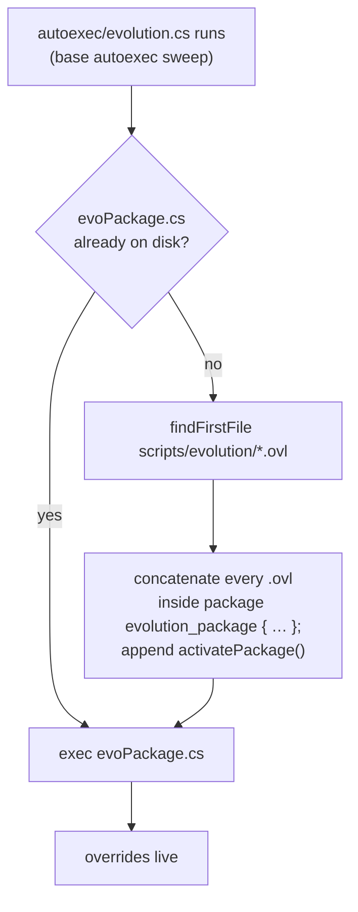

# 25 · Evolution Admin Mod 1.2.3c

An administration layer for Classic, from **triben.de**, released **13 May 2004** — the same week as
Classic 1.5.1. It is the most architecturally interesting mod in this handbook, because it solves a
problem Classic created and does it with a technique nothing else here uses: **it writes its own
TorqueScript package at runtime.**

| | |
|---|---|
| Version | 1.2.3c **[mod-script]** |
| Lineage | "Based on Pizza Admin Mod by Altair" **[mod-script]** |
| Targets | "specific to the Classic mod v1.4.1 - 1.5.1" **[mod-script]** |
| Ships as | `evoClassic.vl2` + a `prefs/` tree |
| Contents | 26 files — 10 `.cs`, 16 `.ovl` |
| Installs into | `GameData/classic/` — *inside* the Classic mod, not beside it |

Note the target range: **1.4.1 to 1.5.1**. Classic 1.5.2 shipped two days after Evolution 1.2.3c and is
not named. In practice servers ran it on 1.5.2 anyway, but the mod was never revised for it.

## The problem it solves

Classic shadows files. It replaces `scripts/server.cs`, `scripts/defaultGame.cs` and sixty others
outright (section 21). An admin mod that also wants to change `defaultGame.cs` therefore cannot simply
ship its own copy — it would either lose all of Classic's changes or have to fork Classic wholesale and
re-merge on every release.

The correct tool is a **package** — TorqueScript's override mechanism, which lets you wrap a function,
call `Parent::` and keep the original. See [Packages](../02-engine-model/packages.md).

But packages have a hard constraint: **a package is a single lexical block.** You write

```php
package foo {
   function A::b() { … }
   function C::d() { … }
};
```

and everything the package overrides has to be inside those braces, in one file. You cannot split a
package across files, and you cannot reopen one.

So an admin mod overriding functions from eight different Classic files has two bad options: one
enormous unnavigable file, or eight files that cannot be packages.

## The solution: generate the package

Evolution takes a third option. Each overridden area lives in its own `.ovl` file — plain TorqueScript
function bodies, no package wrapper — and at first run the mod **concatenates them into a generated
package file** and executes that.

`scripts/autoexec/evolution.cs`, in full **[mod-script]**:

```php
function createEvolutionPackage()
{
   // Load default prefs if they haven't been. Editing is done to ServerPrefs.cs
   if($Host::EvoDefaultsLoaded $= "" || !$Host::EvoDefaultsLoaded)
   {
      exec("evo_prefs.cs");
      $Host::EvoDefaultsLoaded = 1;
   }

   $PackageWrite = 1;
   %newfile = "scripts/evolution/evoPackage.cs";
   if(isFile(%newfile))
      return;

   %package = new fileObject();
   %package.openForWrite(%newFile);
   %package.writeLine("package evolution_package {");
   %fobject = new fileObject();
   %path = "scripts/evolution/*.ovl";
   for(%file = findFirstFile(%path); %file !$= ""; %file = findNextFile(%path))
   {
      %name = fileBase(%file);
      %fobject.openForRead(%file);
      while (!%fobject.isEOF())
      {
         %line = %fobject.readLine();
         if(getSubStr(%line, 0, 2) !$= "//")
            %package.writeLine(%line);
      }
      %fobject.close();
   }
   %fobject.delete();
   %package.writeLine("};");
   %package.writeLine("activatePackage(evolution_package);");
   %package.close();
   %package.delete();
}

if(!$PackageWrite)
   createEvolutionPackage();

exec("scripts/evolution/evoPackage.cs");
```

Read that again — it is a script that writes a script and then runs it.

The sequence:



## Why this is clever

**It buys per-file organisation inside a single-file construct.** Sixteen `.ovl` files map onto sixteen
Classic areas — `defaultGame.ovl`, `admin.ovl`, `CTFGame.ovl`, `SiegeGame.ovl`, `player.ovl`,
`projectiles.ovl`, `hud.ovl`, `message.ovl`, `server.ovl`, `staticShape.ovl`, `camera.ovl`,
`loadingGui.ovl`, `scoreList.ovl`, `TR2Game.ovl`, `DnDGame.ovl`, `HuntesGame.ovl` — while the engine
still sees one package.

**It survives Classic upgrades.** Because it overrides rather than shadows, a Classic point release can
change `defaultGame.cs` freely and Evolution's `Parent::` calls still reach the new code. This is the
whole reason it works at all across 1.4.1–1.5.1.

**The `.ovl` extension is load-order protection.** Files named `.cs` under `scripts/` risk being executed
directly by something else, and — more importantly — would be compiled to `.dso`. A bare function
definition executed outside its package wrapper would override *permanently*, with no way to deactivate
it. Naming them `.ovl` makes them inert to every mechanism except this one. See
[File formats](../90-reference/file-formats.md).

The non-packaged helpers are loaded conventionally, before the package is built:

```php
exec("scripts/evolution/evoSupport.cs");
exec( $Host::EvoBanListFile );
exec("scripts/evolution/logs.cs");
exec("scripts/evolution/ParseCommands.cs");
exec("scripts/evolution/mapRotation.cs");
exec("scripts/evolution/voteOptions.cs");
exec("scripts/evolution/eTourney.cs");
exec("scripts/evolution/stats.cs");
exec("scripts/evolution/lease.cs");
```

New functions do not need a package. **Only overrides do.** That split — helpers as `.cs`, overrides as
`.ovl` — is the mod's core organising idea and it is a good one.

## Why this is dangerous

### The cache never invalidates

```php
%newfile = "scripts/evolution/evoPackage.cs";
if(isFile(%newfile))
   return;
```

The generated file is written **once**. There is no timestamp comparison, no hash, no version stamp. Edit
an `.ovl` and nothing happens — not on the next map, not on the next restart, not ever, until the
generated file is deleted by hand.

The mod's own readme documents this as an install step rather than fixing it **[mod-script]**:

> "If `classic/scripts/evolution/evoPackage.cs` exists, delete it."

And it compounds: `evoPackage.cs` is a `.cs`, so the engine compiles it to `evoPackage.cs.dso`. Deleting
only the `.cs` leaves the `.dso` shadowing it — the stale-`.dso` trap from
[Packaging](../06-shipping/packaging.md#dso-compilation), reached by a second route. **Delete both.**

If you build something like this, **regenerate unconditionally at boot** — drop the `isFile` guard
entirely. The cost is a few file reads once per process start, which is nothing against an entire mission
load, and it removes the whole class of "my edit did nothing" bugs.

Note that V12 gives you no timestamp function to be cleverer with: neither `getFileModifiedTime` nor any
`fileModifiedTime` variant exists in `Tribes2.exe` **[binary]**. If you want change detection rather than
unconditional regeneration, the only shipped primitive is `getFileCRC()` **[binary]** — stamp the CRCs of
the sources into the generated file as a leading comment and compare on the next boot. That is more
machinery than the problem deserves; regenerate every time.

### Line-oriented comment stripping

```php
if(getSubStr(%line, 0, 2) !$= "//")
   %package.writeLine(%line);
```

Only lines *starting* at column 0 with `//` are dropped; indented comments pass through, which is fine.
But the test is positional and knows nothing about strings, so a line beginning with a `//` sequence
inside a multi-line string construction would be silently eaten. TorqueScript has no block comments
([TorqueScript](../02-engine-model/torquescript.md)), which limits the damage, but the rule is fragile.

The stripping exists to keep the generated file small. Given that the file is written once and read once
per boot, that is optimising the wrong thing — **concatenate verbatim** and keep line numbers meaningful,
because the alternative is console errors whose reported line number points into a generated file that
does not correspond to any source you can edit.

### Debugging happens in the generated file

Any runtime error is reported against `evoPackage.cs` at a line number produced by concatenation order —
which is `findFirstFile` order, which is filesystem order. Mapping that back to an `.ovl` is manual.
Writing a comment banner between files would cost nothing and solve it; the comment-stripping pass makes
it impossible.

## The single-package footprint

Everything ends up in one package named `evolution_package`, activated once. That is tidy, and it has a
consequence worth knowing: **you cannot deactivate part of Evolution.** `deactivatePackage(evolution_package)`
removes all sixteen files' worth of overrides at once. A more granular design would emit one package per
`.ovl` and activate them in order — more packages, but individually switchable, and that is what a
modern equivalent should do.

## Should you copy this?

**The `.ovl` split: yes.** Separating "new functions" from "overrides", and giving overrides a
non-executable extension, is sound and worth stealing.

**The generation step: only if you must.** It exists because V12 packages cannot span files. If your mod
overrides a handful of functions, one honest package file is better. If it overrides fifty across many
subsystems, generation starts to pay — and then fix the cache invalidation, keep the comments, and emit
per-file packages.

**The runtime `FileObject` write: understand what it costs.** The mod writes into its own script
directory at boot, which requires the game directory to be writable and means the deployed tree differs
from the shipped tree. On a modern locked-down host that is a real constraint. See
[Hosting and testing](../06-shipping/hosting-and-testing.md).

## Related

- [26 · Evolution in operation](../26-evolution-operation/README.md) — prefs, chat console, leasing
- [27 · teratos' evoClassic](../27-teratos-evoclassic/README.md) — the one-line fix
- [Packages](../02-engine-model/packages.md) — the mechanism and its single-file constraint
- [Packaging](../06-shipping/packaging.md) — `.dso` staleness, reached here by a second route
- [09 · The Support Pack](../09-support-pack/README.md) — the other mod that generates behaviour from files on disk
