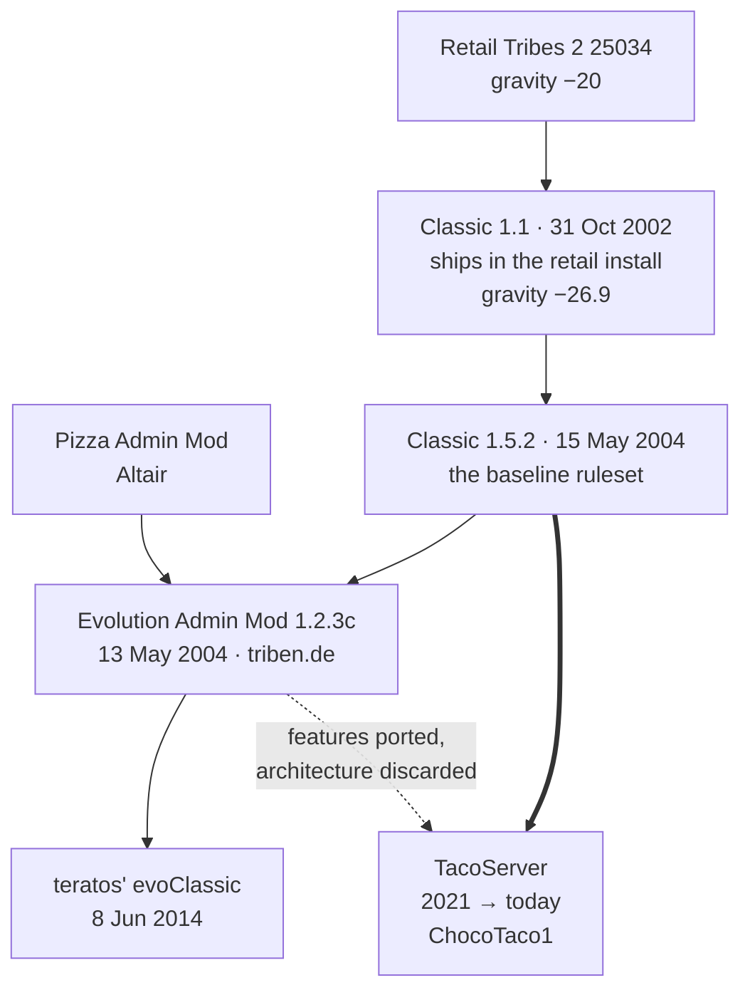

# 37 · Classic

The mod that became the game.

Sierra shipped Tribes 2 with a ruleset its own players thought was too slow. Classic is the community's
answer — a server-side mod that raised gravity, tightened the weapons and gave admins the controls the
retail build never had. It won so completely that Sierra put it in the box: **Classic ships inside the
retail 25034 install**, and by 2004 "Classic" was what people meant when they said Tribes 2.

Every public Tribes 2 server running today is running a descendant of it.

| Page | Read it for |
|---|---|
| [38 · Classic 1.1](../38-classic-1-1/README.md) | The version in your 25034 install — what it changed and why |
| [39 · Classic 1.5.2](../39-classic-152/README.md) | The 2004-onward baseline ruleset every modern server starts from |
| [40 · The ruleset toggles](../40-classic-ruleset-toggles/README.md) | `$Host::ClassicLoad*` — optional rules as a shipped mechanism, and how to steal it |
| [45 · Evolution Admin Mod](../45-evolution-admin-mod/README.md) | Architecture — the `.ovl` files and the generated package |
| [46 · Evolution in operation](../46-evolution-operation/README.md) | 89 prefs, the chat console, and time-leased SuperAdmin |
| [47 · teratos' evoClassic](../47-teratos-evoclassic/README.md) | A one-line fix, ten years later, and what it teaches |
| [48 · TacoServer](../48-tacoserver/README.md) | The modern codebase — lineage, `NoEvo`, and the overlay model |
| [49 · TacoServer in operation](../49-tacoserver-operation/README.md) | The 21 autoexec features, prefs, and running it |
| [50 · Running Classic today](../50-running-classic-today/README.md) | Choosing a codebase in 2026, and what to build on |

## Why Classic exists

Retail Tribes 2 set gravity at `-20` **[script]** (`base/scripts.vl2`'s `server.cs`, `$DefaultGravity`).
Classic sets it to `-26.9` **[mod-script]**:

```php
$Classic::gravSetting = -26.9; // z0dd - ZOD, 9/13/02. Classic Gravity setting
```

That single number — 34.5% more gravity — is the mod's thesis. Heavier gravity means faster descents,
faster skiing, shorter hang time and a lower, quicker game. It is not the whole story, though — gravity is
one line, and it sits alongside a much larger, undocumented retuning of skiing, friction and momentum
covered in full in [38 · Classic 1.1](../38-classic-1-1/README.md#the-physics-change-skiing-friction-and-momentum).
Classic's own readme puts the intent plainly **[mod-script]**:

> "The Classic modification brings speed and intensity back to the Tribes game. The majority of the
> changes revolve around creating a faster and more exciting game play experience."

Everything else follows from it. Raise gravity and every ballistic weapon in the game now falls short, so
mortar, grenade launcher and tank projectiles all needed re-tuning. The bomber's compensation is written
as arithmetic against the constant rather than a magic number **[mod-script]**:

```php
gravityMod = 20.0 / mabs($Classic::gravSetting); // z0dd - ZOD, 8/28/02. Compensate for our grav change. Math: base grav / our grav
```

`20.0` is the retail constant, and the expression reads as "restore the base-gravity behaviour". This is
worth copying: **when you change a global physical constant, express the compensations as ratios against
it**, not as re-tuned literals. The next person to change gravity gets the fix for free.

## The lineage



The solid double arrow is the load-bearing one. **TacoServer's base is Classic 1.5.2, not Evolution** —
it carries 589 of z0dd's authorship comments and all ten `$Host::ClassicLoad*` toggles forward
**[mod-script]**, while Evolution's `.ovl` machinery is gone entirely. Evolution contributed features
and ideas; 1.5.2 contributed the code. Section 48 evidences this.

## What "Classic" is, mechanically

| | |
|---|---|
| Type | Server-side mod plus a small client pack |
| Launched as | `-mod Classic` |
| Installed as | `GameData/Classic/` |
| Client pack | `GameData/base/zz_Classic_client_v1.vl2` |
| Maps | `GameData/base/Classic_maps_v1.vl2` — 24 missions |
| Strategy | **File shadowing** — replaces vanilla scripts wholesale, no packages |
| Author | z0dd (ZOD) — 684 occurrences of his signature in 1.1 alone **[mod-script]** |

Classic does *not* use TorqueScript packages. It replaces `scripts/server.cs`, `scripts/player.cs` and
sixty-odd others outright, relying on the mod path stack to shadow the base copies — the same technique
Construction uses, documented in
[Mod paths and overrides](../02-engine-model/mod-paths-and-overrides.md).

The consequence is the one every Classic derivative lives with: **you cannot cleanly layer two mods that
both shadow the same file.** Evolution's own readme warns about exactly this **[mod-script]**:

> "If you have been using other admin mods, make a backup of their files and remove them from your tribes
> installation. There might be severe problems combining different admin mods on a server, as they tend
> to alter the same game resources in an incompatible way."

The rest of these sections are, in large part, the story of successive authors working around that
constraint — Evolution with generated packages (section 45), TacoServer with per-feature autoexec scripts
(section 48).

## A note on evidence

Classic 1.1 ships inside the retail 25034 install, which makes it unusually verifiable — you can read
every line quoted here in your own `GameData/Classic/` directory without downloading anything. It is
still community-authored mod content, so it is marked **[mod-script]** throughout rather than
**[script]**, which this handbook reserves for Sierra's own `base/scripts.vl2`.

## Related

- [31 · The base ruleset](../31-base-ruleset/README.md) — the 25034 baseline every number here is a delta against
- [Mod paths and overrides](../02-engine-model/mod-paths-and-overrides.md) — how shadowing resolves
- [Packages](../02-engine-model/packages.md) — the mechanism Classic declines to use
- [58 · The Construction Mod](../58-construction-mod/README.md) — the other great shadowing mod
- [Hosting and testing](../06-shipping/hosting-and-testing.md) — running a dedicated server
