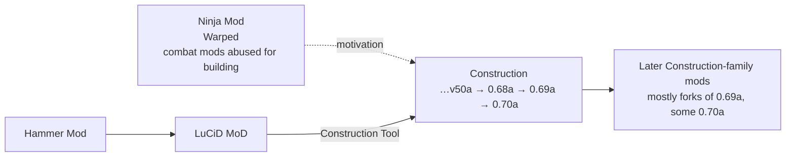

# 58 · The Construction Mod

The largest and most consequential server-side Tribes 2 mod. It took a team shooter and turned it into a
sandbox building game, and almost every later Construction-family mod is a fork of one of the three
versions documented here.

| Page | Read it for |
|---|---|
| [What it changed](what-it-changed.md) | Architecture — the shadowing strategy, the 27 replaced files, how it extends the vanilla frameworks |
| [Building systems](building-systems.md) | The mechanics: deployable pieces, the Construction Tool, save/load, server modes |
| [Playing Construction](playing.md) | **How it works at the controls** — the beacon-key mode switch, auto/pad sizing, power frequencies, server modes, and what each fork changes for a player |
| [Reusable mechanisms](reusable-mechanisms.md) | **Twelve techniques to steal** — surface-aligned placement, fit-to-gap geometry, chat-command dispatch, GUID ownership, frequency linking, and the anti-patterns |

## The motivation

Unusually for a twenty-year-old mod, it states it plainly in its own `readme.txt` **[mod-script]**:

> ```
> The BASIC IDEA:
>
> -------------------------------------------------------------------------------------------
> We just like to build stuff.
> -------------------------------------------------------------------------------------------
> Up to now mods like ninja mod and warped where used to create the wierdest of structures.
> However these mods being combat orientated where limited in their building flexiblity.
> Therefor the man with the vision started "the construction mod" (or is it the mod named
> "construction"?)
> ```

That is the whole thesis, and it is worth unpacking because it explains the mod's every design decision.

**Players were already building.** Ninja Mod and Warped were *combat* mods whose deployable systems were
loose enough to be abused for construction. People were stacking deployables into structures the mods
never anticipated, fighting the tooling the entire way.

**Construction stopped fighting it.** Rather than adding building to a combat mod, it inverted the
priority — building is the game, and combat is a setting you can switch off. The readme is explicit that
this is a deliberate narrowing:

> *"until that day this mod remains for the one intrested in building and only building. But hey, there's
> a builder in everyone."* **[mod-script]**

So the motivation is a **genre pivot executed entirely in script**, on an engine with no building support
whatsoever. No engine changes were possible — `Tribes2.exe` cannot be rebuilt — so every part of it is
TorqueScript and datablocks layered over a shooter.

That constraint is what makes Construction worth studying. It is the outer limit of what the modding
surface documented in sections 02–05 can be pushed to.

## What it actually is

| | |
|---|---|
| Type | Server-side mod, `-mod Construction` |
| Installed as | `GameData/Construction/` |
| Versions here | 0.68a, 0.69a, 0.70a |
| Size | 2.2 MB / 2.6 MB / 2.7 MB — 107 / 122 / 128 files |
| Gametype | `ConstructionGame`, via `scripts/ConstructionGame.cs` |
| Strategy | **File shadowing** — 27 vanilla scripts replaced, 22 new ones added |
| Packages | Exactly one (`DefaultGame`) |

Launchers ship as batch files **[mod-script]**:

```bat
cd ..\
start Tribes2.exe -nologin -mod Construction
```

```bat
cd ..\
start ispawn.exe 28000 Tribes2.exe -dedicated -mod Construction
```

— the same `-nologin -mod` and `ispawn.exe` patterns Sierra used for Classic **[script]**. See
[Launch options](../01-getting-started/launch-options.md).

## The versions

0.69a is the most widely forked, 0.70a next **[per the user]**. The three are incremental, not rewrites.

| | 0.68a | 0.69a | 0.70a |
|---|---|---|---|
| Files | 107 | 122 | 128 |
| Deployable packs | 30 | 33 | 35 |
| Launchers | `.lnk` shortcuts | `.lnk` shortcuts | `.bat` files |
| Server config | in-script | in-script | `ConstructionPreferences.cs` |
| DSO cleaners shipped | **3** | **3** | 1 |
| Notable additions | GUID owner tracking, Invincible Deployables mode, orphaned-deployable cleanup, Cascade/Vehicles split from Purebuild | Transport Missile Gun, 4 effect packs, deployable vehicle pad, MPB multi-purpose missiles | Doors, anti-nuke turret, chat commands, `message.cs` |

New packs 0.68a → 0.70a: `AntiNuketurret.cs`, `Effectpacks.cs`, `door.cs`, `doorbu.cs`, `vehiclepad.cs`.

### Three DSO deleters

0.68a and 0.69a ship **three separate batch files** for the same job **[mod-script]**:

```
Constructs-DSO-Remover-2.1.bat
Constructs-DSO-deleter-1.2.bat
JTLdelDSO.bat
```

consolidated to one `DSO Remover.bat` by 0.70a. That is the stale-`.dso` problem — documented in this
handbook as the single most common cause of "my change did nothing"
([Debugging](../06-shipping/debugging.md)) — visible as an artifact of a real mod's support burden. Three
different people wrote a fix, independently, and all three shipped.

## Lineage

Construction did not appear from nothing. Its signature weapon carries its own provenance
**[mod-script]**:

```php
//--------------------------------------------------------------------------
// Deconstruct Gun / Construction Tool
// Originally from Hammer Mod. Changed and redone for LuCiD MoD.
// Also Changed again and redone for Construction Mod.
// All changes made by LuCiD from LuCiD MoD & Mostlikely or JackTL from Construction Mod.
```

Hammer Mod → LuCiD Mod → Construction. And the `Credits.txt` names a maintenance chain — *"JackTL: For
maintaining mod from v50a"* **[mod-script]** — so the versions here sit late in a long line.



### The credits connect to the rest of this handbook

`Credits.txt` **[mod-script]** names two people whose work appears elsewhere in these pages:

- **BadShot** — *"Taking the time to help me with some nasty bugs. Knowing alot for tribes2 stuff.. and
  being willing to share it. Helping all those other modders."* He is the author of 26 of the tutorials in
  the [community corpus](../reference/source-tutorial-index.md).
- **DynaBlade** — *"His Awesome function librarys."* Also a tutorial author, and `saveBuilding.cs` is
  credited as *"a joint effort of DynaBlade and JackTL"* **[mod-script]**.

Also credited: **Construct** (the original idea, testing, the installer), **Lucid** (code help, the
deconstruct gun, the load screen), **Child_Killer**, **T2CC** (*"Their great forum and putting all that
coding power at your very fingertips"*), and **Mostlikely**, who signs most of the version history.

The tutorial corpus, the forum, and the flagship mod were the same small community. The techniques
documented in [03 · Content Recipes](../03-content-recipes/README.md) are the ones these people were
writing down for each other while building this.

### The licence stance

From `Credits.txt` **[mod-script]**:

> *"I don't need any credit for this mod, it was created for the people who want to play it (which
> includes me). Feel free to use any stuff from this mod or ask me about it if you can't extract it
> somehow."*

Which is why the fork tree is so wide.

## The fork family

Sections 59–68 document the derivatives. **Nine of the ten fingerprint closest to 0.69a**; Atomic
Construction is the one exception, closer to 0.68a — established by comparing MD5 hashes of each fork's
`.cs` files against all three baselines and taking the closest match. For consistency the table below
scores every fork against the same fixed baseline, 0.69a, regardless of which is individually closest.

| § | Fork | `.cs` | Identical to 0.69a | New | Removed | Character |
|---|---|---:|---:|---:|---:|---|
| [59](../59-power-edition/README.md) | Power Edition | 155 | **82 %** | 45 | 0 | Purely additive weapons pack |
| [60](../60-c2k-construction/README.md) | c2kconstruction | 219 | 67 % | 109 | 0 | Construction + the Tricon 2 admin suite |
| [61](../61-moocon/README.md) | MooCon 1.7.0 | 125 | 62 % | 18 | 3 | Light fork, tooling focus |
| [62](../62-spirit-construction/README.md) | Spirit Construction | 140 | 41 % | 30 | 0 | Novelty toys only — no scoring file touched |
| [63](../63-metallic-construction/README.md) | Metallic Construction 1.4 | 153 | 38 % | 59 | 16 | Building features + RPG elements |
| [64](../64-ccm/README.md) | CCM | 166 | 34 % | 74 | 18 | Combat/construction hybrid |
| [65](../65-tccm/README.md) | TCCM | 169 | 32 % | 77 | 18 | CCM sibling, own install name |
| [66](../66-ultimate-build/README.md) | Ultimate Build 2.0 | 149 | 27 % | 50 | 11 | RP economy, bundles Tricon 2 |
| [67](../67-atomic-construction/README.md) | Atomic Construction | 95 | 25 % † | 2 | 17 | JackTL's branch — actually closest to 0.68a (36 %) |
| [61](../61-moocon/README.md) | MooCon 1.9.0 | 113 | 21 % | 58 | 55 | Full tree reorganisation |
| [61](../61-moocon/README.md) | MooCon Final | 115 | 19 % | 60 | 55 | Increment on 1.9.0 |
| [68](../68-quantiumx/README.md) | QuantiumX | 199 | **8 %** | 99 | 10 | Near-total rewrite |

† Scored against 0.69a for table consistency; Atomic Construction's true closest match is 0.68a, at 36%.

Read the "Identical to 0.69a" column as *how much of 0.69a survives untouched*. A high number is not a
criticism — Power Edition is additive by design and all the better for it. A low number means the fork
rewrote the base rather than extending it, which makes merging anything back essentially impossible.

> **Installation naming.** Almost every one of these installs as `GameData/Construction/` regardless of
> its name — they are alternatives, not companions, and only one can be present at a time. **TCCM is the
> exception**, installing under its own name. The directory names under `mod-doc-ref/` are review labels
> chosen for this documentation, not install paths.

> **Two things you may also see filed alongside these forks, that aren't documented as forks here.**
> A folder named "Classic Construction" is **100% byte-identical to 0.70a** — an unmodified re-release
> under a different label, not a fork with its own content (see
> [67 · Atomic Construction](../67-atomic-construction/README.md#classic-construction-a-footnote-not-a-fork)
> for the fingerprint). And "Structural Infinity" is not a mod at all — a server-side patch, "Version 0.7,
> written by Electricutioner, 5/24/2010," that lifts Torque's roughly 1024-object ghost/visibility limit
> so a Construction server can host larger builds. It requires a modified `Tribes2_server.exe` and ships
> matching patched binaries rather than `.cs` content, which puts it outside what this handbook's
> script-fingerprinting method can document.

## Why study it

| Reason | Where |
|---|---|
| It is the reference implementation of a **total conversion** on this engine | [What it changed](what-it-changed.md) |
| It shows the **file-shadowing** strategy at full scale, with its costs | [What it changed](what-it-changed.md#the-shadowing-strategy) |
| It extends the vanilla **deployable validation framework** exactly as designed | [Building systems](building-systems.md#extending-the-deployable-tests) |
| It solves **object persistence** — saving and reloading player-built structures — with no engine support | [Building systems](building-systems.md#saving-and-loading-buildings) |
| It is the base your fork is probably built on | Both |

## A note on evidence

Claims sourced from Construction's own scripts, readme, credits, or version history are marked
**[mod-script]**. This is community code by many hands across several years, with inconsistent style and
some abandoned experiments still in the tree. Where its comments and its code disagree, this section
follows the code — the policy applied to Sierra's comments throughout this handbook.

Version-specific claims name the version. Where all three behave alike, the text says "Construction".
