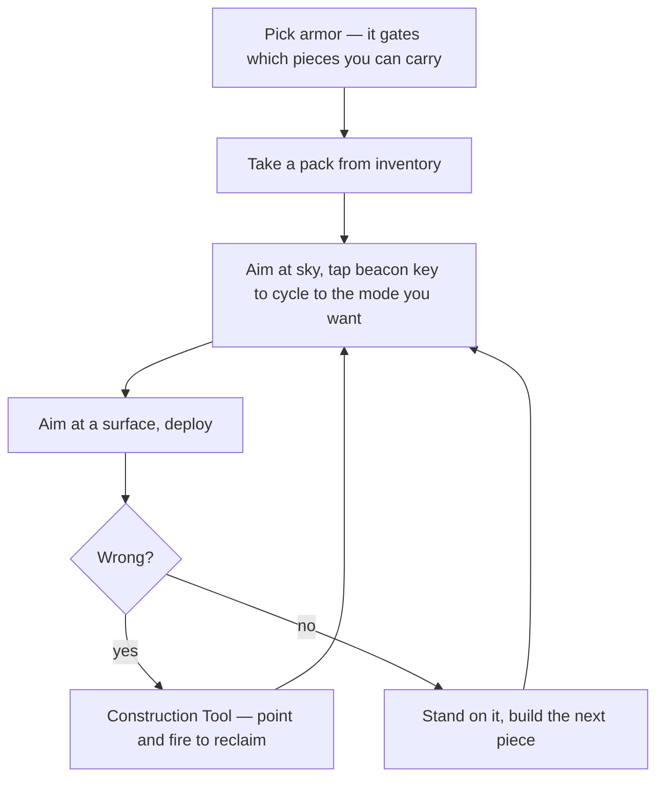

# Playing Construction

What the mod actually does at the controls, reconstructed from the code rather than from memory. This
page covers baseline 0.68a–0.70a and notes where forks (sections 59–68) differ.

If you are joining a Construction server and wondering why nothing behaves like Tribes 2, this is the
page.

## The one thing nobody tells you

**The beacon key is your mode switch.**

`Beacon::onUse` is overridden. It raycasts **3 metres** along your view **[mod-script]**:

```php
function Beacon::onUse(%data, %obj)
{
   %searchRange = 3.0;
   %mask = $TypeMasks::TerrainObjectType | $TypeMasks::InteriorObjectType
         | $TypeMasks::StaticShapeObjectType | $TypeMasks::ForceFieldObjectType;
   …
   %searchResult = containerRayCast(%eyePos, %eyeEnd, %mask, 0);
   if(!%searchResult) {
      // no terrain/interior collision within search range
      %changed = cyclePackSetting(%obj,1);
      …
   }
   else { … normal beacon placement … }
}
```

So the same key does two different things:

| You are aiming | Beacon key does |
|---|---|
| At a surface **within 3 m** | Places a beacon, as in vanilla |
| At sky, or anything **further than 3 m** | **Cycles the current pack's mode** |

Look up at the sky and tap it. The mode name prints along the bottom of your screen via `bottomPrint`
**[mod-script]**:

```
Beam set to 4 meters in height
```

This is the entire reason Construction can offer dozens of building options with no spare keys. See
[Reusable mechanisms](reusable-mechanisms.md#1-overloading-an-existing-key-for-mode-selection) for how it
works.

## The mode tables

Modes are data, in `$packSetting[<pack>, <index>]` **[mod-script]**:

```php
$packSettings["spine"] = 18;
$packSetting["spine",0]  = "0.5 0.5 0.1 10 cm in height";
$packSetting["spine",1]  = "0.5 0.5 0.25 25 cm in height";
$packSetting["spine",2]  = "0.5 0.5 0.5 50 cm in height";
$packSetting["spine",3]  = "0.5 0.5 1 1 meter in height";
$packSetting["spine",4]  = "0.5 0.5 1.5 1.5 meters in height";
$packSetting["spine",5]  = "0.5 6 160 auto adjusting";
$packSetting["spine",6]  = "0.5 8 160 pad";
$packSetting["spine",7]  = "0.5 8 160 wooden pad";
$packSetting["spine",8]  = "0.5 0.5 4 4 meters in height";
$packSetting["spine",9]  = "0.5 0.5 8 8 meters in height";
$packSetting["spine",10] = "0.5 0.5 20 20 meters in height";
$packSetting["spine",11] = "0.5 0.5 40 40 meters in height";
```

Words 0–2 are `min`, `default`, `max`; everything after is the label you see on screen.

Mode counts in 0.70a **[mod-script]**:

| Pack | Modes |
|---|---|
| Light support beam (`spine`) | 18 |
| Medium support beam (`mspine`) | 18 |
| Floor (`floor`) | 11 |
| **Walkway (`walk`)** | **74** |
| Jump pad (`jumpad`) | 6 |

Seventy-four walkway modes. Cycling one at a time from the sky is how you reach them, which tells you
something about how these servers were actually played — people learned the index they wanted and counted.

### The three special modes

Most entries are fixed sizes. Three behave differently, and they are the ones worth learning
**[mod-script]**:

| Mode | What it does |
|---|---|
| **auto adjusting** (`packSet == 5`) | Casts a ray along the surface normal and **scales the beam to exactly fill the gap**. Unconfined, it defaults to the `default` word (6 m for spines). Clamped to `min` and `max`. |
| **pad** (`packSet == 6`) | Measures in **two** axes — along the normal and side to side — and stretches into a **platform** that fits the space, re-centred and re-rotated to match. |
| **wooden pad** (`packSet == 7`) | Same as pad, with a different datablock (`DeployedWoodSpine`), a scale multiplier and a 180° flip. |

Auto and pad are what make Construction feel like a building tool rather than a prop placer. Point at a
gap between two existing pieces, deploy, and the beam is exactly the right length.

## Placement is surface-relative

A piece does not spawn upright — it aligns to whatever you are aiming at. The deploy code builds a
coordinate frame from the surface normal **[mod-script]**:

```php
%playerVector = vectorNormalize(-1 * getWord(%plyr.getEyeVector(),1) SPC getWord(%plyr.getEyeVector(),0) SPC "0");

if (%item.surfaceinher == 0) {
   if (vAbs(floorVec(%item.surfaceNrm,100)) $= "0 0 1")
      %item.surfaceNrm2 = %playerVector;          // flat ground: use player facing
   else
      %item.surfaceNrm2 = vectorNormalize(vectorCross(%item.surfaceNrm,"0 0 1"));
}
%item.surfaceNrm3 = vectorCross(%item.surfaceNrm,%item.surfaceNrm2);
%rot = fullRot(%item.surfaceNrm,%item.surfaceNrm2);
```

Two practical consequences:

- **On flat ground, your facing decides the piece's rotation.** Turn before you deploy.
- **On a sloped or vertical surface, the surface decides**, and your facing is ignored. That is why pieces
  snap flush to walls without you aiming carefully.

`surfaceinher` lets a piece inherit orientation from what it is placed on, which is how stacking stays
aligned.

## Building workflow

The shape the tools imply:



### Armor tiers gate materials

Pieces are restricted by armor through vanilla's `max[]` mechanism
([Ammo and inventory](../03-content-recipes/ammo-and-inventory.md#carry-limits)) **[mod-script]**:

| Armor | Gets |
|---|---|
| **Light** | Light support beam, light blast wall, walkways |
| **Medium** | Medium support beam + rings, floors, jump pads, disc turrets, trees |
| **Heavy** | Teleporters, energizers, base turrets |

So *changing armor is changing toolbox*. A light armor cannot place a teleporter no matter what.

### Vertical building

The medium spine ships with **rings** you deploy onto and stand on, specifically so you can reach the
place the next spine goes **[mod-script]**. That is the intended ladder: ring → stand → spine → ring.
There is no scaffolding system; this is it.

### Undo

The **Construction Tool / Deconstruct Gun** reclaims a piece — point, fire, it becomes the pack again. The
readme is blunt about the workflow **[mod-script]**:

> *"If you make an mistake you can correct it with this with out any dangerous side effects. Make sure you
> remove mistakes right after you made them."*

The warning is real: some pieces are composites, and reclaiming out of order can leave orphans.

## Power

Deployables that need power use a **frequency and radius** system, not wiring **[mod-script]**:

```php
function genLinkedObj(%powerObj,%obj) {
   if (%obj.powerFreq == %powerObj.powerFreq) {
      if (vectorDist(%obj.getPosition(),%powerObj.getPosition()) < %powerObj.getDataBlock().powerRadius
      …
}
```

A piece is powered when a generator **on the same frequency** is **within that generator's radius** and is
itself enabled and powered.

The frequency comes from you at deploy time — `%deplObj.powerFreq = %plyr.powerFreq` **[mod-script]** — so
your current frequency setting is stamped onto everything you place. **Set it before you build**, or you
will end up with a structure on mixed frequencies and lights that will not switch together.

Switches, doors, tripwires and lights all key off the same mechanism.

## Teleporters

Forty frequencies, **shared between both teams** **[mod-script]**. A pad only links to another on the same
frequency. The readme warns of *"dangerous side effects that become worse when the telleport is damaged"*
— so protect them, and expect trouble if an enemy sets a pad to your frequency.

## Server modes you will notice

These are toggled by admins and, in baseline Construction, by **player vote** **[mod-script]**:

| Mode | Effect on you |
|---|---|
| **Purebuild** | Combat off. Pure building server. |
| **Expert** | Unlocks a second settings axis on several packs — see below |
| **Cascade** | Structures collapse progressively when supports are destroyed |
| **Invincible Deployables** | Buildings cannot be damaged |
| **Invincible Armors** | Players cannot be damaged; would-be damage shows as a waypoint percentage |
| **Vehicles** | On/off |
| **AllowUnderground** | Whether you may build below terrain |
| **Jail / DeploySpam jailing** | Griefers get contained; spammers may be auto-jailed |

Vote strings exist for most of them **[mod-script]**:

```php
$VoteMessage["VotePurebuild", 0]        = "enable pure building";
$VoteMessage["VoteExpertMode", 0]       = "enable expert mode";
$VoteMessage["VotePrisonDeploySpam", 0] = "enable jailing deploy spammers";
```

### Expert mode is a second axis

With `$Host::ExpertMode == 1`, several packs gain a parallel setting cycled independently
**[mod-script]**:

```php
$expertSettings["forcefield"]        // count
$expertSetting["forcefield", <idx>]  // table
```

So a pack can have both a *pack setting* (size/shape) and an *expert setting* (behaviour), giving a matrix
rather than a list. Force fields, gravity fields, switches, blast walls and floors all use it. On a server
with expert mode off, those options simply do not exist.

## Anti-griefing you may run into

A build server is uniquely exploitable, and the mod is defensive. Eight tunables govern deploy-spam alone
**[mod-script]**:

```
$Host::DeploySpam                 $Host::DeploySpamCheckTimeMS
$Host::DeploySpamMaxTime          $Host::DeploySpamMultiply
$Host::DeploySpamRemoveRecentMS   $Host::DeploySpamResetWarnCountTime
$Host::DeploySpamTime             $Host::DeploySpamWarnings
```

Place too much too fast and you get warnings, then rollback of recent placements, then possibly jail.
Ownership is tracked by **account GUID**, not session, so your pieces are attributable after you
disconnect and reconnect — and admins can bulk-remove orphaned deployables whose owner has left.

## What the forks change for a player

| Fork | What you will notice |
|---|---|
| [63 Metallic](../63-metallic-construction/README.md) | Warp gates and transport pads alongside teleporters; manned/repair/projector turrets; decoration objects with power modes; ownership transfer |
| [61 MooCon](../61-moocon/README.md) | `/help`, `/door help`, `/delmypieces`, private chat with `!PlayerName msg`; **prefabs** and a **merge tool** for combining saved buildings; stairs; rotation for prefabs; deploy on force fields; buy-favourites key |
| [64 CCM](../64-ccm/README.md) / [65 TCCM](../65-tccm/README.md) | Actual combat — Arena and CTF gametypes, ranks, a large vehicle roster, purpose-built battle maps |
| [59 Power Edition](../59-power-edition/README.md) | The vanilla weapon set restored and extended on top of building |
| [68 QuantiumX](../68-quantiumx/README.md) | **Chat commands replace pack modes** — `/objectscale`, `/objectscale get`, `/swing`, object naming; environment pack placing weather; rotating pads that carry what is on them |
| [66 Ultimate Build](../66-ultimate-build/README.md) | RP money system; Tricon 2 remote administration |
| [60 c2kconstruction](../60-c2k-construction/README.md) | Largest content set; admin-only vehicles; Tricon 2 |

### QuantiumX is worth calling out

It moved manipulation from beacon-cycled modes to **typed commands** **[mod-script]**:

```
/objectscale 2 2 4          scale an object
/objectscale get            read its current scale
/objectscale x x 4          change only the Z axis, leave X and Y
/swing                      manually swing a door
```

If you find beacon-cycling through 74 walkway modes tedious, that is the fork that agreed with you.

## Reading a server's configuration

Most of the above is server-side and varies. To see what you are actually on:

```
/help                       MooCon and several forks
```

and in the console, if you have access:

```php
echo($Host::Purebuild SPC $Host::ExpertMode SPC $Host::Cascade);
echo($Host::InvincibleDeployables SPC $Host::AllowUnderground);
```

0.70a moves server settings into a documented `ConstructionPreferences.cs` at the mod root
**[mod-script]**, which is the best place to look on a server you run.

## Related

- [Reusable mechanisms](reusable-mechanisms.md) — how all of this is implemented, and what to steal
- [Building systems](building-systems.md) — the piece inventory and save/load
- [Section overview](README.md) — motivation and the fork family
