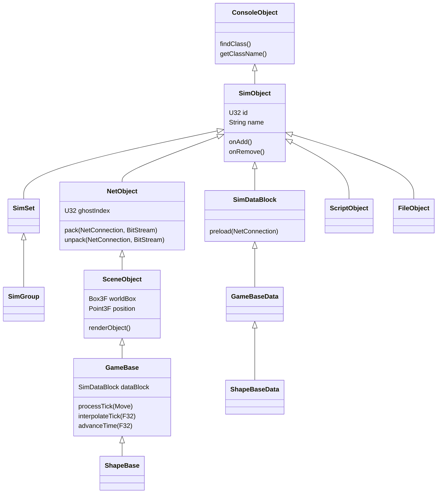

# Class hierarchy

The engine registers **287 classes** at startup **[binary]**. This page lists the ones a modder meets and
sketches the inheritance shape.

## How the class list was recovered

`Tribes2.exe` is compiled with MSVC RTTI disabled (`/GR-`), so class identity comes from Torque's own
registry pattern instead. Every `IMPLEMENT_CONOBJECT(ClassName)` emits a static
`ConcreteClassRep<ClassName>` holding the class-name string, a factory function, and the field tables.
Sweeping `.rdata` for those strings recovers the full registry: **287 `ConcreteClassRep<...>` instances,
288 unique class names, 204 non-GUI classes** **[binary]**.

That registry is what `getClassByName()` binds against and what `%obj.getClassName()` returns.

## The base chain



What each level gives you:

| Class | Adds |
|---|---|
| `ConsoleObject` | Class registration, `getClassName()` |
| `SimObject` | ID, name, `onAdd`/`onRemove`, dynamic fields |
| `SimSet` / `SimGroup` | Containment; `SimGroup` owns its contents |
| `SimDataBlock` | Network-transmitted static description |
| `NetObject` | Ghosting — `pack`/`unpack` |
| `SceneObject` | World transform, bounding box, rendering |
| `GameBase` | A datablock pointer and the tick/interpolate/advance loop |
| `ShapeBase` | `.dts` shape, mounted images, damage, energy, inventory |

**`ShapeBase` is the ancestor of almost everything you interact with.** Mount points, images, damage
state, energy, and inventory all live there, which is why `%obj.mountImage()`, `%obj.getEnergyLevel()`,
and `%obj.setInventory()` work on players, vehicles, turrets, and stations alike.

## The paired-class convention

Almost every gameplay class comes in a pair — an object and its datablock:

| Object | Datablock |
|---|---|
| `Player` | `PlayerData` |
| `Item` | `ItemData` |
| `StaticShape` | `StaticShapeData` |
| `FlyingVehicle` | `FlyingVehicleData` |
| `Explosion` | `ExplosionData` |
| `Trigger` | `TriggerData` |

The `Data` half is the shared description; the bare half is the live instance. `%obj.getDataBlock()`
crosses from one to the other.

## Classes you will meet

### Entities

```
ShapeBase, ShapeBaseData
Player, PlayerData
Item, ItemData
Camera, CameraData
StaticShape, StaticShapeData
```

### Vehicles

```
FlyingVehicle,  FlyingVehicleData
HoverVehicle,   HoverVehicleData
WheeledVehicle, WheeledVehicleData
RigidShape,     RigidShapeData
```

### Projectiles

Twelve registered projectile classes **[binary]**:

```
BombProjectile,          BombProjectileData
ELFProjectile,           ELFProjectileData
EnergyProjectile,        EnergyProjectileData
FlareProjectile,         FlareProjectileData
GrenadeProjectile,       GrenadeProjectileData
LinearFlareProjectile,   LinearFlareProjectileData
LinearProjectile,        LinearProjectileData
SeekerProjectile,        SeekerProjectileData
ShockLanceProjectile,    ShockLanceProjectileData
SniperProjectile,        SniperProjectileData
TargetProjectile,        TargetProjectileData
TracerProjectile,        TracerProjectileData
```

`BombProjectile` and `FlareProjectile` are registered but barely used by the shipped content — worth
knowing they exist.

The `projectileType` field on a `ShapeBaseImageData` names one of the **bare** class names (e.g.
`LinearProjectile`), while `projectile` names a **datablock** of the matching `…Data` type. See
[Projectiles](../03-content-recipes/projectiles.md).

### World and environment

```
TerrainBlock, WaterBlock, Sun, Sky, Marble
InteriorInstance, PathedInterior, PathedInteriorData
Trigger, TriggerData
PhysicalZone, PhysicalZoneData
ForceFieldBare, ForceFieldBareData
Lightning, LightningData
Precipitation, PrecipitationData
FireballAtmosphere, FireballAtmosphereData
Tsunami, TsunamiData
Volcano, VolcanoData
MissionMarker, MissionMarkerData
BeaconObject
```

### Effects

```
Explosion, ExplosionData
Debris, DebrisData
Splash, SplashData
ParticleEmitter, ParticleEmitterData
ParticleEmitterNode, ParticleEmitterNodeData
ParticleData
DecalManager, DecalData
EffectProfile
```

### Audio

```
AudioProfile, AudioDescription
AudioEmitter, AudioEnvironment, AudioSampleEnvironment
```

### Networking

```
NetConnection, GameConnection, GhostConnection, ConnectionProtocol
NetEvent, SimEvent
TCPObject, HTTPObject, RemoteCommandEvent
```

Registered `NetEvent` subclasses **[binary]**:

```
CRCChallengeEvent, CRCChallengeResponseEvent
FogChallengeEvent
GhostAlwaysObjectEvent, GhostingMessageEvent
GravityEvent, LightingEvent, WaterEvent
RemoteCommandEvent
SimVoiceStreamEvent, SinglePlayerLocateEvent
Tribes2GameEvent
```

`GameConnection` is the one you use constantly — it is what `ClientGroup` holds and what `%player.client`
returns. See [Client/server split](../02-engine-model/client-server-split.md).

### AI

```
AIConnection, AITask, AIObjective, AIObjectiveQ
NavigationGraph, FloorPlan, GroundPlan
BombSight, ClientTarget, CommanderIconData
```

`AIConnection` derives from `GameConnection`, which is why `%client.isAIControlled()` works uniformly and
why bots appear in `ClientGroup` alongside human players. See [AI and bots](../05-gameplay-systems/ai-bots.md).

### Script utility

```
ScriptObject       ← the Game object, and any pure-script object you create
FileObject         ← used by buildMissionList and the EULA reader
ActionMap          ← key bindings
BanList
MaterialPropertyMap
```

### GUI — around 84 `Gui*` classes

`GuiCanvas`, `GuiControl`, `GuiCursor`, `GuiControlProfile`, plus 80+ specific controls. See
[GUI system](../04-interface/gui-system.md).

### Tribes 2 shell UI — the `Shell*` family

Custom styled controls for the main menu: `ShellBitmapButton`, `ShellToggleButton`, `ShellRadioButton`,
`ShellLaunchMenu`, `ShellTextList`, `ShellTextEditCtrl`, `ShellScrollCtrl`, `ShellPopupMenu`,
`ShellPaneCtrl`, `ShellDlgFrame`, `ShellProgressBar`, `ShellFancyArrayScrollCtrl`, `ShellFancyArray`,
`ShellFancyTextList`, `ShellSliderCtrl`.

### HUD — around 30 `Hud*` classes

Tribes 2-specific, and not present in generic Torque:

`HudBarBaseCtrl`, `HudBitmapCtrl`, `HudBitmapFrameCtrl`, `HudBombSight`, `HudCapacitor`, `HudChat`,
`HudClock`, `HudCommandMsg`, `HudCompass`, `HudCrosshair`, `HudCtrl`, `HudDamage`, `HudEnergy`,
`HudFancyCtrl`, `HudHeat`, `HudHelpTag`, `HudWeaponInvBase`, `HudVote`, `HudCommanderMap`. See
[HUD](../04-interface/hud.md).

### Editor and tools

```
EditManager, TerrainEditor, WorldEditor, MissionAreaEditor
CreatorTree, EditTSCtrl, GuiTerrPreviewCtrl
DbgFileView, DebugView
Terraformer
```

## Enumerating classes at runtime

```php
%obj.getClassName();          // this object's class
%obj.dump();                  // every field and method
```

`dumpConsoleClasses()` enumerates the whole registry in stock Torque. **[inferred]** — the registry
structure that would back it is confirmed present in Tribes 2's binary, but the function itself was not
found among the extracted usage strings, so it may not be registered in this build. `%obj.dump()` is the
reliable route.

## A caveat on parentage

The **class list** is decisive — it comes from the binary's own registry strings **[binary]**. The
**inheritance edges** drawn in the diagram above are reconstructed from Torque's documented structure and
from how the shipped scripts behave; the vtable walk that would confirm each edge directly has not been
done. The major branch shape is not in doubt; a specific edge might be.

## Under the community patches

The class registry is **`Tribes2.exe`'s**, and neither patch modifies the executable. All 287 classes are
present and unchanged on a patched install.

What changes is the implementation behind one of them and the reachability of a few others:

| Class | Change |
|---|---|
| `HTTPObject` | Registered in vanilla **[binary]** but plain HTTP. TribesNEXT provides a libcurl-backed implementation with TLS, which is what the auth lookup uses. |
| `GameConnection` | Behaviour changed by the `t2csri_server` package, not the class — the pre-authentication phase. See [Client/server split](../02-engine-model/client-server-split.md#under-the-community-patches). |
| `AIConnection` | Unchanged; bots are `local` and skip authentication entirely. |
| The `Hud*` family | Several repositioned by `console_client_patches`; classes themselves untouched. |

**No classes are added.** A patch cannot register a new `ConcreteClassRep` without modifying the
executable, and neither patch does — the console-function surface (`Con::addCommand` at `DllMain`) is the
extension mechanism they use instead **[binary]**. See
[Console functions](console-functions.md#under-the-community-patches).

`%obj.getClassName()` and `%obj.dump()` behave identically on patched and vanilla installs.

## Related

- [SimObjects and namespaces](../02-engine-model/simobject-and-namespaces.md) — using these from script
- [Datablock classes](datablock-classes.md) — the declarable subset
- [Console functions](console-functions.md) — the global function surface
- [07 · Community Patches](../07-community-patches/README.md) — the DLL-level extension mechanism
