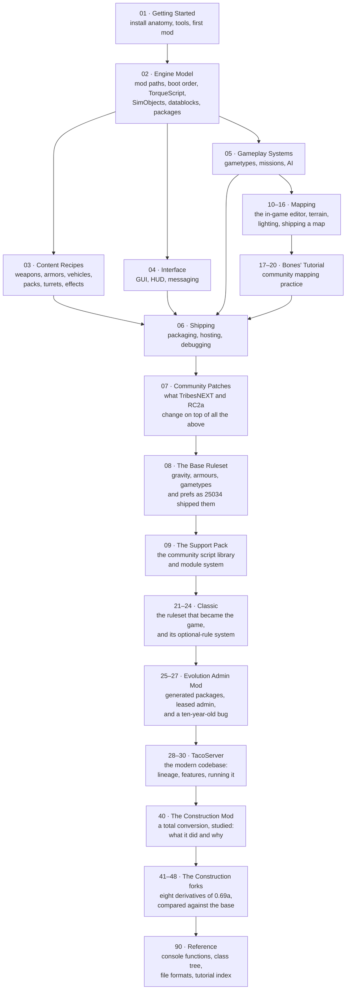

# Tribes 2 Mod Development Handbook — build 25034

> **A teaching handbook for writing mods against vanilla Tribes 2, patched build 25034 (retail v1.05).**
> It merges two bodies of knowledge: the surviving community modding tutorials (2002–2003 era) and
> this project's reverse engineering of `Tribes2.exe` and the shipped V12 game data.

---

## What this covers, and what it does not

| In scope | Out of scope |
|---|---|
| Vanilla Tribes 2, **build 25034** (`getT2VersionNumber()` returns `25034`) | Torque Game Engine / Torque 3D differences |
| The V12 ("Darkstar") engine as it actually shipped | Engine C++ modification (you cannot rebuild `Tribes2.exe`) |
| TorqueScript, datablocks, packages, the mod-path stack | Reimplementation projects |
| `base/` and `Classic/` game data as the reference material | The patches' auth protocol, crypto, and account systems |
| **What the TribesNEXT and RC2a patches change on top** — [section 07](07-community-patches/README.md), and an "Under the community patches" section on each affected page | |

**Sections 01–06 describe vanilla.** Nobody runs vanilla in 2026 — the WON servers died in 2008 — but it
is the substrate the patches sit on, and the great majority of modding is identical on both. Where a patch
changes something, the page says so at the end, and
[section 07](07-community-patches/README.md) covers the patches in full.

Everything here is written against the engine **as it exists on disk**. Where a statement comes from
reading the binary or the shipped scripts, it is marked. Where it is an inference, it says so.

### Evidence markers

Every non-obvious claim carries one of these:

| Marker | Meaning |
|---|---|
| **[binary]** | Confirmed by disassembly or string analysis of `Tribes2.exe`, or of a patch DLL |
| **[script]** | Confirmed by reading the shipped V12 `.cs` in `base/scripts.vl2` — file and line cited |
| **[patch-script]** | Confirmed by reading a community patch's own shipped `.cs` |
| **[support-script]** | Confirmed by reading the community support pack's own shipped `.cs` |
| **[mod-script]** | Confirmed by reading a documented community mod's own shipped files |
| **[bones]** | From NecroBones' Tribes 2 Mapping Tutorial — community practice, attributed |
| **[community]** | From the 2002–2003 tutorial corpus; widely relied on, not independently confirmed |
| **[inferred]** | Reasoned from the above; plausible but unverified |

If you find a claim without a marker, treat it as ordinary prose, not a load-bearing fact.

### Code blocks are tagged `php`, deliberately

TorqueScript has no highlighter of its own. Every TorqueScript block in this handbook is fenced as
` ```php ` because PHP's highlighter is the closest available fit:

| | `php` | `cs` (C#) |
|---|---|---|
| `$global` | **Highlighted as a variable** — PHP's native sigil | Unrecognised |
| `%local` | Not recognised | Reads as the modulo operator |
| `function`, `new`, `if`, `switch`, `return` | Keywords | Keywords |
| `//` comments | Correct | Correct |

Neither handles `%local`, but PHP gets `$global` right and loses nothing else, so it renders better on
GitHub, MkDocs, and Docusaurus alike. **Please do not "correct" these to `cs`.**

Non-TorqueScript blocks use their real language — `bash`, `bat`, `powershell`, `ini`, `mermaid` — and
untagged fences are plain output, file listings, or directory trees.

---

## Learning path

Read in order the first time. After that, use it as a reference.



Sections **07**–**09**, **21–30** and **40–48** are context rather than instruction — what your users are
running, what libraries exist, and how the mods that shaped the live game were built. Numbers between 30
and 40 are left free for further studies.

### The three things that trip up every new Tribes 2 modder

Read these before anything else — they explain most "why doesn't my change take effect?" questions.

1. **Stale `.dso` files shadow your edits.** The engine compiles `foo.cs` to `foo.cs.dso` and prefers the
   compiled form on later runs **[binary]** (`Compiling %s...` / `Loading compiled script %s.`). Sierra's own
   `Classic_LAN.bat` deletes every `.dso` under `base/scripts/` and `Classic/scripts/` before launching
   **[script]**. Do the same. See [Debugging](06-shipping/debugging.md).
2. **You override by *packaging*, not by editing.** Copying `base/scripts/` into your mod and hacking it
   works but makes your mod unmergeable with every other mod. The engine has a first-class override
   mechanism — `package` + `Parent::` — and it is the correct tool. See [Packages](02-engine-model/packages.md).
3. **Server and client are separate script worlds** even in single player. Putting a `datablock` in a
   client-only file, or calling a server function from a client script, fails silently or throws a console
   error. See [Client/server split](02-engine-model/client-server-split.md).

---

## Table of contents

### 01 · [Getting Started](01-getting-started/README.md)
| Page | What it answers |
|---|---|
| [Install anatomy](01-getting-started/install-anatomy.md) | What every file and folder in `GameData/` is for |
| [What you need](01-getting-started/what-you-need.md) | Tools: archive tools, editors, how to unpack `.vl2` |
| [Your first mod](01-getting-started/your-first-mod.md) | A working mod in ten minutes, start to finish |
| [Launch options](01-getting-started/launch-options.md) | Every command-line switch the engine parses |

### 02 · [Engine Model](02-engine-model/README.md)
| Page | What it answers |
|---|---|
| [Mod paths and overrides](02-engine-model/mod-paths-and-overrides.md) | How the engine finds a file, and how you shadow one |
| [Boot sequence](02-engine-model/boot-sequence.md) | What executes when, from `console_start.cs` to the main menu |
| [TorqueScript](02-engine-model/torquescript.md) | The language: syntax, types, variables, operators, gotchas |
| [SimObjects and namespaces](02-engine-model/simobject-and-namespaces.md) | Object model, method dispatch, `SimGroup`/`SimSet` |
| [Datablocks](02-engine-model/datablocks.md) | What a datablock is, how it ghosts, how inheritance works |
| [Packages](02-engine-model/packages.md) | The override mechanism — the single most important modding tool |
| [Client/server split](02-engine-model/client-server-split.md) | Which code runs where, and how the two sides talk |
| [Scheduling and events](02-engine-model/scheduling-and-events.md) | `schedule`, callbacks, `MissionCleanup`, object lifetime |

### 03 · [Content Recipes](03-content-recipes/README.md)
| Page | What it answers |
|---|---|
| [Weapons](03-content-recipes/weapons.md) | Full weapon anatomy and the image state machine |
| [Projectiles](03-content-recipes/projectiles.md) | Every projectile class and its fields |
| [Ammo and inventory](03-content-recipes/ammo-and-inventory.md) | Ammo datablocks, inventory limits, station sets |
| [Packs](03-content-recipes/packs.md) | Backpack items, mount/unmount, activation |
| [Grenades and hand inventory](03-content-recipes/grenades-and-hand-inventory.md) | Thrown items, mines, beacons |
| [Armors](03-content-recipes/armors.md) | `PlayerData`, movement tuning, animation binding |
| [Vehicles](03-content-recipes/vehicles.md) | Flying, wheeled, and hover vehicles; mount nodes |
| [Turrets and deployables](03-content-recipes/turrets-and-deployables.md) | Turret barrels, deployed objects, placement rules |
| [Particles, explosions, and effects](03-content-recipes/particles-explosions-effects.md) | The effect datablock chain |
| [Damage and type masks](03-content-recipes/damage-and-typemasks.md) | Damage types, radius damage, collision masks |
| [Audio](03-content-recipes/audio.md) | `AudioProfile`, `AudioDescription`, 3D sound |

### 04 · [Interface](04-interface/README.md)
| Page | What it answers |
|---|---|
| [GUI system](04-interface/gui-system.md) | `.gui` files, control profiles, Canvas, dialogs |
| [HUD](04-interface/hud.md) | In-game HUD controls, reticles, weapon HUD data |
| [Text and messaging](04-interface/text-and-messaging.md) | Chat, `bottomPrint`, tagged strings, colour codes |

### 05 · [Gameplay Systems](05-gameplay-systems/README.md)
| Page | What it answers |
|---|---|
| [Gametypes](05-gameplay-systems/gametypes.md) | How a gametype is structured and how to add one |
| [Missions](05-gameplay-systems/missions.md) | `.mis` files, mission objects, the in-game editor |
| [AI and bots](05-gameplay-systems/ai-bots.md) | The AI task system, nav graphs, bot behaviour |

### 06 · [Shipping](06-shipping/README.md)
| Page | What it answers |
|---|---|
| [Packaging](06-shipping/packaging.md) | Mod folder layout, `.vl2` building, `.dso` distribution |
| [Hosting and testing](06-shipping/hosting-and-testing.md) | LAN, dedicated, PURE servers, testing loops |
| [Debugging](06-shipping/debugging.md) | Console, `trace`, `dump`, telnet debugger, common errors |

### 10–16 · [Mapping](10-mapping/README.md)
Making maps, from Sierra's own mission-editor manual shipped inside `scripts.vl2`.

| Page | What it answers |
|---|---|
| [10 · Mapping](10-mapping/README.md) | The file set, the toolchain, the end-to-end workflow |
| [11 · The Mission Editor](11-mission-editor/README.md) | `F11`, the eight tools, File/Edit/Camera menus |
| [12 · World Editor](12-world-editor/README.md) | Placing objects; Tree, Inspector, Creator, drop rules |
| [13 · Terrain](13-terrain/README.md) | Brush editing, the 14-operation Terraform stack, mission area |
| [14 · Terrain texturing](14-terrain-texturing/README.md) | Placement by rule, manual painting, the four-texture rule |
| [15 · Lighting, nav & spawn data](15-lighting-nav-spawn/README.md) | Relighting, `.ml`, `.nav`, `.spn` |
| [16 · Shipping a map](16-shipping-a-map/README.md) | Gametype wiring, headers, what clients need |

### 17–20 · [Bones' Mapping Tutorial](17-bones-getting-started/README.md)
NecroBones' community tutorial — the workflow, crashes and design judgement the manual omits.

| Page | What it answers |
|---|---|
| [17 · Getting started](17-bones-getting-started/README.md) | Server-side maps, setup, the interior-placement crash |
| [18 · The editor windows](18-bones-editor-windows/README.md) | Tree, Inspector, Creator, the gizmo |
| [19 · Building a base](19-bones-building-a-base/README.md) | Power systems, objectives, vehicle pads, spawns |
| [20 · Environment & finishing](20-bones-environment-finishing/README.md) | Sky, fog layers, load screens, the final pass |

### 07 · [Community Patches](07-community-patches/README.md)
| Page | What it answers |
|---|---|
| [TribesNEXT QoL patch](07-community-patches/tribesnext-qol.md) | The current patch: what it replaces, overrides, and adds |
| [RC2a](07-community-patches/rc2a.md) | The 2009 Ruby-based predecessor, and its autoexec collision |
| [Modding against a patched install](07-community-patches/modding-against-a-patched-install.md) | Collisions, the auth phase, testing, distribution |

### 08 · [The Base Ruleset](08-base-ruleset/README.md)
What build 25034 actually ships as its rules — the baseline every mod in sections 21–48 is a delta against.

| Page | What it answers |
|---|---|
| [08 · The base ruleset](08-base-ruleset/README.md) | Gravity, the nine armour datablocks, the eleven gametypes, the 36 `$Host::` defaults, tournament mode |

### 09 · [The Support Pack](09-support-pack/README.md)
| Page | What it answers |
|---|---|
| [Section overview](09-support-pack/README.md) | What `support.vl2` is, why it exists, whether you need it |
| [The autoload system](09-support-pack/autoload-system.md) | `// #directive` headers, `autoload.ini`, dependency and version resolution |
| [Callbacks and events](09-support-pack/callbacks-and-events.md) | `callback.cs` and `events.cs` — multi-listener events |
| [Library reference](09-support-pack/library-reference.md) | All 36 modules |

### 21–24 · [Classic](21-classic/README.md)
The ruleset that became the game — shipped in your install, and still the base every live server runs.

| Page | What it answers |
|---|---|
| [21 · Classic](21-classic/README.md) | What Classic is, why it exists, and the twenty-year lineage map |
| [22 · Classic 1.1](22-classic-1-1/README.md) | The version in your 25034 install — gravity, launchers, the client pack |
| [23 · Classic 1.5.2](23-classic-152/README.md) | The 2004-onward baseline: four releases, and what a modern server inherits |
| [24 · The ruleset toggles](24-classic-ruleset-toggles/README.md) | `$Host::ClassicLoad*` — optional rules as a mechanism, and how to steal it |

### 25–27 · [Evolution Admin Mod](25-evolution-admin-mod/README.md)
An admin layer that generates its own TorqueScript package at runtime — and what that costs.

| Page | What it answers |
|---|---|
| [25 · Architecture](25-evolution-admin-mod/README.md) | The `.ovl` split, the generated package, and its cache trap |
| [26 · In operation](26-evolution-operation/README.md) | 89 prefs, the chat console, HTTP-loaded time-leased SuperAdmin |
| [27 · teratos' evoClassic](27-teratos-evoclassic/README.md) | One line, ten years later — and the gotcha behind it |

### 28–30 · [TacoServer](28-tacoserver/README.md)
The modern codebase most public servers run today.

| Page | What it answers |
|---|---|
| [28 · Lineage & architecture](28-tacoserver/README.md) | Overlay on 1.5.2, the `NoEvo` severance, one package per feature |
| [29 · In operation](29-tacoserver-operation/README.md) | Population-scaled rules, ~180 prefs, installing and running it |
| [30 · Running Classic today](30-running-classic-today/README.md) | **Which codebase to use in 2026**, and what the lineage teaches |

### 40 · [The Construction Mod](40-construction-mod/README.md)
| Page | What it answers |
|---|---|
| [Section overview](40-construction-mod/README.md) | What Construction is, the motivation behind it, its lineage and versions |
| [What it changed](40-construction-mod/what-it-changed.md) | Architecture — file shadowing at full scale, and the vanilla conventions it kept |
| [Building systems](40-construction-mod/building-systems.md) | Deployable pieces, the Construction Tool, building persistence, server modes |
| [Playing Construction](40-construction-mod/playing.md) | How it works at the controls, across all forks |
| [Reusable mechanisms](40-construction-mod/reusable-mechanisms.md) | Twelve techniques to lift into your own mod, plus the anti-patterns |

### 41–48 · The Construction forks
Each derives from **Construction 0.69a**. The percentage is how much of that base survives byte-identical.

| § | Fork | Base intact | Character |
|---|---|---:|---|
| [41](41-metallic-construction/README.md) | Metallic Construction 1.4 Beta | 38 % | Warp gates, transpads, turret variety, RPG beginnings |
| [42](42-moocon/README.md) | MooCon 1.7.0 / 1.9.0 / Final | 62→19 % | Dev team, add-on system, cash economy, full tree reorganisation |
| [43](43-ccm/README.md) | CCM | 34 % | Combat/construction hybrid — gametypes, ranks, own maps |
| [44](44-power-edition/README.md) | Power Edition | **82 %** | Purely additive weapons pack; the disciplined one |
| [45](45-quantiumx/README.md) | QuantiumX | **8 %** | Near-total rewrite; chat-command interface |
| [46](46-tccm/README.md) | TCCM | 32 % | CCM sibling; the only fork with its own install name |
| [47](47-ultimate-build/README.md) | Ultimate Build 2.0 | 27 % | `serverScripts/` subtree, RP money, bundles Tricon 2 |
| [48](48-c2k-construction/README.md) | c2kconstruction | 67 % | Largest package; Tricon 2 admin suite; ships mostly `.dso` |

### 90 · [Reference](90-reference/README.md)
| Page | What it answers |
|---|---|
| [Console functions](90-reference/console-functions.md) | The engine-registered function surface |
| [Datablock classes](90-reference/datablock-classes.md) | Every datablock type you can declare |
| [Class hierarchy](90-reference/class-hierarchy.md) | The engine object tree |
| [File formats](90-reference/file-formats.md) | `.vl2`, `.dts`, `.dsq`, `.dif`, `.ter`, `.dso`, and the rest |
| [Global variables](90-reference/global-variables.md) | `$pref::`, `$Host::`, and other well-known globals |
| [Source tutorial index](90-reference/source-tutorial-index.md) | Map of the original community tutorial corpus |

---

## Where the material comes from

| Source | Location | Nature |
|---|---|---|
| Shipped V12 scripts | `base/scripts.vl2` (334 files) | Primary — the engine's own code |
| Shipped V12 GUI | `base/scripts.vl2` `gui/` (136 files) | Primary |
| Classic mod scripts | `GameData/Classic/scripts/` | Primary — a real, complete mod to read |
| `Tribes2.exe` | `GameData/Tribes2.exe` | Primary — string and disassembly evidence |
| Community tutorials | `T2ModTutorialDatabase/` † | Secondary — see [tutorial index](90-reference/source-tutorial-index.md) |
| Project RE notes | `docs/` † | Secondary — deeper binary analysis |

† Not included in this repository. These sit alongside it in the authoring workspace; the paths are
recorded so claims can be traced back to their source, not so they can be clicked.

The community tutorial corpus is the origin of a great deal of practical Tribes 2 modding knowledge, and
this handbook preserves its recipes. It also contains guesses and errors that circulated for twenty years;
where the shipped scripts contradict a tutorial, this handbook follows the scripts and says so.
