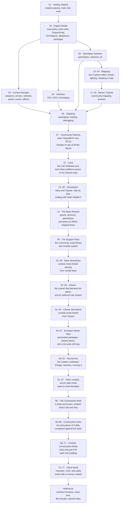

# Tribes 2 Mod Development Handbook — build 25034

> **A teaching handbook for writing mods against vanilla Tribes 2, patched build 25034 (retail v1.05).**
> It merges two bodies of knowledge: the surviving community modding tutorials (2002–2003 era) and
> this project's reverse engineering of `Tribes2.exe` and the shipped V12 game data.

---

## What this covers, and what it does not

| In scope | Out of scope |
|---|---|
| Vanilla Tribes 2, **build 25034** (`getT2VersionNumber()` returns `25034`) | Torque Game Engine / Torque 3D differences |
| The V12 ("Darkstar") engine as it actually shipped | Engine C++ modification (you cannot rebuild `Tribes2.exe`) |
| TorqueScript, datablocks, packages, the mod-path stack | Reimplementation projects |
| `base/` and `Classic/` game data as the reference material | The patches' auth protocol, crypto, and account systems |
| **What the TribesNEXT and RC2a patches change on top** — [section 07](07-community-patches/README.md), and an "Under the community patches" section on each affected page | |

**Sections 01–06 describe vanilla.** Nobody runs vanilla in 2026 — the WON servers died in 2008 — but it
is the substrate the patches sit on, and the great majority of modding is identical on both. Where a patch
changes something, the page says so at the end, and
[section 07](07-community-patches/README.md) covers the patches in full.

Everything here is written against the engine **as it exists on disk**. Where a statement comes from
reading the binary or the shipped scripts, it is marked. Where it is an inference, it says so.

### Evidence markers

Every non-obvious claim carries one of these:

| Marker | Meaning |
|---|---|
| **[binary]** | Confirmed by disassembly or string analysis of `Tribes2.exe`, or of a patch DLL |
| **[script]** | Confirmed by reading the shipped V12 `.cs` in `base/scripts.vl2` — file and line cited |
| **[patch-script]** | Confirmed by reading a community patch's own shipped `.cs` |
| **[support-script]** | Confirmed by reading the community support pack's own shipped `.cs` |
| **[mod-script]** | Confirmed by reading a documented community mod's own shipped files |
| **[bones]** | From NecroBones' Tribes 2 Mapping Tutorial — community practice, attributed |
| **[community]** | From the 2002–2003 tutorial corpus, or a mod's own readme; widely relied on, not independently confirmed against code |
| **[inferred]** | Reasoned from the above; plausible but unverified |

If you find a claim without a marker, treat it as ordinary prose, not a load-bearing fact.

### Code blocks are tagged `php`, deliberately

TorqueScript has no highlighter of its own. Every TorqueScript block in this handbook is fenced as
` ```php ` because PHP's highlighter is the closest available fit:

| | `php` | `cs` (C#) |
|---|---|---|
| `$global` | **Highlighted as a variable** — PHP's native sigil | Unrecognised |
| `%local` | Not recognised | Reads as the modulo operator |
| `function`, `new`, `if`, `switch`, `return` | Keywords | Keywords |
| `//` comments | Correct | Correct |

Neither handles `%local`, but PHP gets `$global` right and loses nothing else, so it renders better on
GitHub, MkDocs, and Docusaurus alike. **Please do not "correct" these to `cs`.**

Non-TorqueScript blocks use their real language — `bash`, `bat`, `powershell`, `ini`, `mermaid` — and
untagged fences are plain output, file listings, or directory trees.

---

## Learning path

Read in order the first time. After that, use it as a reference.



Sections **07**–**09**, **21–71** and **72–77** are context rather than instruction — what your users are
running, what libraries exist, and how the mods that shaped the live game were built. **Reference carries
no number at all** — see below.

### The three things that trip up every new Tribes 2 modder

Read these before anything else — they explain most "why doesn't my change take effect?" questions.

1. **Stale `.dso` files shadow your edits.** The engine compiles `foo.cs` to `foo.cs.dso` and prefers the
   compiled form on later runs **[binary]** (`Compiling %s...` / `Loading compiled script %s.`). Sierra's own
   `Classic_LAN.bat` deletes every `.dso` under `base/scripts/` and `Classic/scripts/` before launching
   **[script]**. Do the same. See [Debugging](06-shipping/debugging.md).
2. **You override by *packaging*, not by editing.** Copying `base/scripts/` into your mod and hacking it
   works but makes your mod unmergeable with every other mod. The engine has a first-class override
   mechanism — `package` + `Parent::` — and it is the correct tool. See [Packages](02-engine-model/packages.md).
3. **Server and client are separate script worlds** even in single player. Putting a `datablock` in a
   client-only file, or calling a server function from a client script, fails silently or throws a console
   error. See [Client/server split](02-engine-model/client-server-split.md).

---

## Table of contents

### 01 · [Getting Started](01-getting-started/README.md)
| Page | What it answers |
|---|---|
| [Install anatomy](01-getting-started/install-anatomy.md) | What every file and folder in `GameData/` is for |
| [What you need](01-getting-started/what-you-need.md) | Tools: archive tools, editors, how to unpack `.vl2` |
| [Your first mod](01-getting-started/your-first-mod.md) | A working mod in ten minutes, start to finish |
| [Launch options](01-getting-started/launch-options.md) | Every command-line switch the engine parses |

### 02 · [Engine Model](02-engine-model/README.md)
| Page | What it answers |
|---|---|
| [Mod paths and overrides](02-engine-model/mod-paths-and-overrides.md) | How the engine finds a file, and how you shadow one |
| [Boot sequence](02-engine-model/boot-sequence.md) | What executes when, from `console_start.cs` to the main menu |
| [TorqueScript](02-engine-model/torquescript.md) | The language: syntax, types, variables, operators, gotchas |
| [SimObjects and namespaces](02-engine-model/simobject-and-namespaces.md) | Object model, method dispatch, `SimGroup`/`SimSet` |
| [Datablocks](02-engine-model/datablocks.md) | What a datablock is, how it ghosts, how inheritance works |
| [Packages](02-engine-model/packages.md) | The override mechanism — the single most important modding tool |
| [Client/server split](02-engine-model/client-server-split.md) | Which code runs where, and how the two sides talk |
| [Scheduling and events](02-engine-model/scheduling-and-events.md) | `schedule`, callbacks, `MissionCleanup`, object lifetime |

### 03 · [Content Recipes](03-content-recipes/README.md)
| Page | What it answers |
|---|---|
| [Weapons](03-content-recipes/weapons.md) | Full weapon anatomy and the image state machine |
| [Projectiles](03-content-recipes/projectiles.md) | Every projectile class and its fields |
| [Ammo and inventory](03-content-recipes/ammo-and-inventory.md) | Ammo datablocks, inventory limits, station sets |
| [Packs](03-content-recipes/packs.md) | Backpack items, mount/unmount, activation |
| [Grenades and hand inventory](03-content-recipes/grenades-and-hand-inventory.md) | Thrown items, mines, beacons |
| [Armors](03-content-recipes/armors.md) | `PlayerData`, movement tuning, animation binding |
| [Vehicles](03-content-recipes/vehicles.md) | Flying, wheeled, and hover vehicles; mount nodes |
| [Turrets and deployables](03-content-recipes/turrets-and-deployables.md) | Turret barrels, deployed objects, placement rules |
| [Particles, explosions, and effects](03-content-recipes/particles-explosions-effects.md) | The effect datablock chain |
| [Damage and type masks](03-content-recipes/damage-and-typemasks.md) | Damage types, radius damage, collision masks |
| [Audio](03-content-recipes/audio.md) | `AudioProfile`, `AudioDescription`, 3D sound |

### 04 · [Interface](04-interface/README.md)
| Page | What it answers |
|---|---|
| [GUI system](04-interface/gui-system.md) | `.gui` files, control profiles, Canvas, dialogs |
| [HUD](04-interface/hud.md) | In-game HUD controls, reticles, weapon HUD data |
| [Text and messaging](04-interface/text-and-messaging.md) | Chat, `bottomPrint`, tagged strings, colour codes |

### 05 · [Gameplay Systems](05-gameplay-systems/README.md)
| Page | What it answers |
|---|---|
| [Gametypes](05-gameplay-systems/gametypes.md) | How a gametype is structured and how to add one |
| [Missions](05-gameplay-systems/missions.md) | `.mis` files, mission objects, the in-game editor |
| [AI and bots](05-gameplay-systems/ai-bots.md) | The AI task system, nav graphs, bot behaviour |

### 06 · [Shipping](06-shipping/README.md)
| Page | What it answers |
|---|---|
| [Packaging](06-shipping/packaging.md) | Mod folder layout, `.vl2` building, `.dso` distribution |
| [Hosting and testing](06-shipping/hosting-and-testing.md) | LAN, dedicated, PURE servers, testing loops |
| [Debugging](06-shipping/debugging.md) | Console, `trace`, `dump`, telnet debugger, common errors |

### 10–16 · [Mapping](10-mapping/README.md)
Making maps, from Sierra's own mission-editor manual shipped inside `scripts.vl2`.

| Page | What it answers |
|---|---|
| [10 · Mapping](10-mapping/README.md) | The file set, the toolchain, the end-to-end workflow |
| [11 · The Mission Editor](11-mission-editor/README.md) | `F11`, the eight tools, File/Edit/Camera menus |
| [12 · World Editor](12-world-editor/README.md) | Placing objects; Tree, Inspector, Creator, drop rules |
| [13 · Terrain](13-terrain/README.md) | Brush editing, the 14-operation Terraform stack, mission area |
| [14 · Terrain texturing](14-terrain-texturing/README.md) | Placement by rule, manual painting, the four-texture rule |
| [15 · Lighting, nav & spawn data](15-lighting-nav-spawn/README.md) | Relighting, `.ml`, `.nav`, `.spn` |
| [16 · Shipping a map](16-shipping-a-map/README.md) | Gametype wiring, headers, what clients need |

### 17–20 · [Bones' Mapping Tutorial](17-bones-getting-started/README.md)
NecroBones' community tutorial — the workflow, crashes and design judgement the manual omits.

| Page | What it answers |
|---|---|
| [17 · Getting started](17-bones-getting-started/README.md) | Server-side maps, setup, the interior-placement crash |
| [18 · The editor windows](18-bones-editor-windows/README.md) | Tree, Inspector, Creator, the gizmo |
| [19 · Building a base](19-bones-building-a-base/README.md) | Power systems, objectives, vehicle pads, spawns |
| [20 · Environment & finishing](20-bones-environment-finishing/README.md) | Sky, fog layers, load screens, the final pass |

### 07 · [Community Patches](07-community-patches/README.md)
| Page | What it answers |
|---|---|
| [TribesNEXT QoL patch](07-community-patches/tribesnext-qol.md) | The current patch: what it replaces, overrides, and adds |
| [RC2a](07-community-patches/rc2a.md) | The 2009 Ruby-based predecessor, and its autoexec collision |
| [Modding against a patched install](07-community-patches/modding-against-a-patched-install.md) | Collisions, the auth phase, testing, distribution |

### 21 · [Linux, and the Loki Software port](21-linux/README.md)
| Page | What it answers |
|---|---|
| [21 · Linux](21-linux/README.md) | The Loki dedicated server, `$platform`-aware code shared with Windows, and Sam Lantinga's fingerprints in `console_start.cs` |

### 22–30 · Gametypes
Base and Classic, gametype by gametype — what Classic shadowed, what it left alone, and what it patched
around without shadowing. Ends with Team Rabbit 2, a total-conversion sport mod shipped in its own
archives.

| Page | What it answers |
|---|---|
| [22 · Capture the Flag](22-capture-the-flag/README.md) | Base vs Classic's own `CTFGame.cs`, and Spawn CTF's no-economy loadout |
| [23 · Defend and Destroy](23-defend-and-destroy/README.md) | The 39-constant scoring table, and the suicide-penalty line that became a Classic-wide rule |
| [24 · Siege](24-siege/README.md) | The two-round time trial, and Classic's defensive-scoring additions |
| [25 · Bounty](25-bounty/README.md) | Per-player target/pursuer/bystander state, and the no-static-defence ban list |
| [26 · Capture and Hold](26-capture-and-hold/README.md) | Twelve-second capture windows, and turrets that convert rather than just fall |
| [27 · Deathmatch](27-deathmatch/README.md) | The minimal gametype, and TacoServer's own 970-line descendant |
| [28 · Hunters & Team Hunters](28-hunters/README.md) | GREED/HOARD as vote-toggled rules, and the game outing hoarders automatically |
| [29 · Rabbit](29-rabbit/README.md) | Solo flag-carrier keep-away, and the pseudo-team trick that makes it work |
| [30 · Team Rabbit 2](30-team-rabbit-2/README.md) | **A total-conversion sport mod** — its own archives, a ten-dimensional bonus matrix, and Classic's six-file integration |

### 31 · [The Base Ruleset](31-base-ruleset/README.md)
What build 25034 actually ships as its rules — the baseline every mod from section 32 onward is a delta
against.

| Page | What it answers |
|---|---|
| [31 · The base ruleset](31-base-ruleset/README.md) | Gravity, skiing/friction/momentum, the nine armour datablocks, the eleven gametypes, the 36 `$Host::` defaults, tournament mode |

### 09 · [The Support Pack](09-support-pack/README.md)
| Page | What it answers |
|---|---|
| [Section overview](09-support-pack/README.md) | What `support.vl2` is, why it exists, whether you need it |
| [The autoload system](09-support-pack/autoload-system.md) | `// #directive` headers, `autoload.ini`, dependency and version resolution |
| [Callbacks and events](09-support-pack/callbacks-and-events.md) | `callback.cs` and `events.cs` — multi-listener events |
| [Library reference](09-support-pack/library-reference.md) | All 36 modules |

### 32–36 · Base derivatives
Combat mods fingerprinted directly to vanilla base — no Classic lineage — ordered from lightest touch to
heaviest.

| Page | What it answers |
|---|---|
| [32 · BONES](32-bones/README.md) | NecroBones' own balance mod — a disclosed referee back door, two original vehicle gametypes |
| [33 · AirKill](33-airkill/README.md) | A disc air-kill training mod, and a rewritten Mobile Base Teleporter |
| [34 · Triumph](34-triumph/README.md) | A ~30-weapon overhaul on Bounty, maintained 2003–2009 |
| [35 · NinjaMod](35-ninja-mod/README.md) | "Ninja-X" — stealth/gadget beacons, one of the oldest T2 mods on record |
| [36 · tac2](36-tac2/README.md) | "Team Aerial Combat 2" — five vehicle-only aerial gametypes, its own Linux builds |

### 37–40 · [Classic](37-classic/README.md)
The ruleset that became the game — shipped in your install, and still the base every live server runs.

| Page | What it answers |
|---|---|
| [37 · Classic](37-classic/README.md) | What Classic is, why it exists, and the twenty-year lineage map |
| [38 · Classic 1.1](38-classic-1-1/README.md) | The version in your 25034 install — gravity, launchers, the client pack |
| [39 · Classic 1.5.2](39-classic-152/README.md) | The 2004-onward baseline: four releases, and what a modern server inherits |
| [40 · The ruleset toggles](40-classic-ruleset-toggles/README.md) | `$Host::ClassicLoad*` — optional rules as a mechanism, and how to steal it |

### 41–44 · Classic derivatives
Combat mods fingerprinted to Classic, ordered from lightest touch to heaviest.

| Page | What it answers |
|---|---|
| [41 · Overdrive](41-overdrive/README.md) | One energy-costed ability bolted onto stock Classic 1.5.2 |
| [42 · T2 Instagib](42-t2instagib/README.md) | An extreme weapon/armour strip-down — documented from its own readme, source not preserved here |
| [43 · Revmod2](43-revmod2/README.md) | Classic's MPB/Tesla scoring, plus eight ground-up custom classes |
| [44 · Meltdown 2](44-meltdown/README.md) | A mech-combat total conversion built directly on Classic 1.1's `defaultGame.cs` |

### 45–47 · [Evolution Admin Mod](45-evolution-admin-mod/README.md)
An admin layer that generates its own TorqueScript package at runtime — and what that costs.

| Page | What it answers |
|---|---|
| [45 · Architecture](45-evolution-admin-mod/README.md) | The `.ovl` split, the generated package, and its cache trap |
| [46 · In operation](46-evolution-operation/README.md) | 89 prefs, the chat console, HTTP-loaded time-leased SuperAdmin |
| [47 · teratos' evoClassic](47-teratos-evoclassic/README.md) | One line, ten years later — and the gotcha behind it |

### 48–50 · [TacoServer](48-tacoserver/README.md)
The modern codebase most public servers run today.

| Page | What it answers |
|---|---|
| [48 · Lineage & architecture](48-tacoserver/README.md) | Overlay on 1.5.2, the `NoEvo` severance, one package per feature |
| [49 · In operation](49-tacoserver-operation/README.md) | Population-scaled rules, ~180 prefs, installing and running it |
| [50 · Running Classic today](50-running-classic-today/README.md) | **Which codebase to use in 2026**, and what the lineage teaches |

### 51–57 · Other combat server-side mods
Mods that don't cleanly derive from base or Classic, or that deviate from both too heavily to call a
fork — ordered from least to most transformed.

| Page | What it answers |
|---|---|
| [51 · Small utilities](51-small-utilities/README.md) | Randomizer! and the "Lagg's Default" per-map bot AI packs |
| [52 · botpilot & Werewolf](52-botpilot/README.md) | Piloting AI, and a heavier community fork of it |
| [53 · Pirates of the Caribbean](53-potc/README.md) | A small, self-contained aerial-combat custom gametype |
| [54 · Masters mod](54-mastersmod/README.md) | Custom classes and a Team Rabbit 2-derived bonus system, mostly compiled `.dso` |
| [55 · GibMatch](55-gibmatch/README.md) | A standalone `-mod gibmatch` with its own gametype family |
| [56 · Powers Mod](56-powers-mod/README.md) | An affinity-class RPG layer on stock CTF/Bounty/DnD/Hunters |
| [57 · IronSphere RPG](57-ironsphere-rpg/README.md) | "DarkRealmsRPG" — a 1240-file total-conversion RPG |

### 58 · [The Construction Mod](58-construction-mod/README.md)
| Page | What it answers |
|---|---|
| [Section overview](58-construction-mod/README.md) | What Construction is, the motivation behind it, its lineage and versions |
| [What it changed](58-construction-mod/what-it-changed.md) | Architecture — file shadowing at full scale, and the vanilla conventions it kept |
| [Building systems](58-construction-mod/building-systems.md) | Deployable pieces, the Construction Tool, building persistence, server modes |
| [Playing Construction](58-construction-mod/playing.md) | How it works at the controls, across all forks |
| [Reusable mechanisms](58-construction-mod/reusable-mechanisms.md) | Twelve techniques to lift into your own mod, plus the anti-patterns |

### 59–68 · The Construction forks
Each derives from **Construction 0.69a**. The percentage is how much of that base survives byte-identical.

| § | Fork | Base intact | Character |
|---|---|---:|---|
| [59](59-power-edition/README.md) | Power Edition | **82 %** | Purely additive weapons pack; the disciplined one |
| [60](60-c2k-construction/README.md) | c2kconstruction | 67 % | Largest package; Tricon 2 admin suite; ships mostly `.dso` |
| [61](61-moocon/README.md) | MooCon 1.7.0 / 1.9.0 / Final | 62→19 % | Dev team, add-on system, cash economy, full tree reorganisation |
| [62](62-spirit-construction/README.md) | Spirit Construction | 41 % | Novelty toys — grappling hook, black hole gun — no scoring touched |
| [63](63-metallic-construction/README.md) | Metallic Construction 1.4 Beta | 38 % | Warp gates, transpads, turret variety, RPG beginnings |
| [64](64-ccm/README.md) | CCM | 34 % | Combat/construction hybrid — gametypes, ranks, own maps |
| [65](65-tccm/README.md) | TCCM | 32 % | CCM sibling; the only fork with its own install name |
| [66](66-ultimate-build/README.md) | Ultimate Build 2.0 | 27 % | `serverScripts/` subtree, RP money, bundles Tricon 2 |
| [67](67-atomic-construction/README.md) | Atomic Construction | 25 % | JackTL's branch — own version line, "v50a" lineage |
| [68](68-quantiumx/README.md) | QuantiumX | **8 %** | Near-total rewrite; chat-command interface |

### 69–71 · Combat Construction Mods
Construction-family forks that put PvP back into a genre built to switch it off — ordered from least to
most transformed.

| Page | What it answers |
|---|---|
| [69 · Dark Ages RPG Con Mod](69-dark-ages-rpg-con/README.md) | A CCM-lineage monster-pack shooter with an RPG world map |
| [70 · ACCM](70-accm/README.md) | "Advanced Combat Construction Mod" — self-described, zombie PvE and PvP |
| [71 · Total Warefare Mod](71-total-warefare-mod/README.md) | Boss fights, horde spawning, an EXP system — built on 0.69a and CCM |

### 72–77 · Client Mods
Cosmetic, HUD, and utility content with no server-side ruleset of its own.

| Page | What it answers |
|---|---|
| [72 · droc mod](72-droc-mod/README.md) | Pure cosmetic — vehicle skins, jet/flare effects |
| [73 · mousemod](73-mousemod/README.md) | Mouse-config client, bundling a Tricon2 admin console |
| [74 · T2Bol client content](74-t2bol/README.md) | A skins/textures/music asset pack |
| [75 · renclient4](75-renclient/README.md) | A Renegades-server HUD/audio autoexec, by Classic's own z0dd |
| [76 · Team Gauntlet client](76-teamgauntlet-client/README.md) | The client-side half of a gametype whose server code isn't in this workspace |
| [77 · EzRotation & EzVoteOptions](77-ez-utilities/README.md) | Two small autoexec utilities |

### [Reference](reference/README.md)
| Page | What it answers |
|---|---|
| [Console functions](reference/console-functions.md) | The engine-registered function surface |
| [Datablock classes](reference/datablock-classes.md) | Every datablock type you can declare |
| [Class hierarchy](reference/class-hierarchy.md) | The engine object tree |
| [File formats](reference/file-formats.md) | `.vl2`, `.dts`, `.dsq`, `.dif`, `.ter`, `.dso`, and the rest |
| [Global variables](reference/global-variables.md) | `$pref::`, `$Host::`, and other well-known globals |
| [Source tutorial index](reference/source-tutorial-index.md) | Map of the original community tutorial corpus |

---

## Where the material comes from

| Source | Location | Nature |
|---|---|---|
| Shipped V12 scripts | `base/scripts.vl2` (334 files) | Primary — the engine's own code |
| Shipped V12 GUI | `base/scripts.vl2` `gui/` (136 files) | Primary |
| Classic mod scripts | `GameData/Classic/scripts/` | Primary — a real, complete mod to read |
| `Tribes2.exe` | `GameData/Tribes2.exe` | Primary — string and disassembly evidence |
| Community tutorials | `T2ModTutorialDatabase/` † | Secondary — see [tutorial index](reference/source-tutorial-index.md) |
| Project RE notes | `docs/` † | Secondary — deeper binary analysis |
| Community mods | `mod-doc-ref/` † | Secondary — dozens of combat, Construction, and client mods, credited and fingerprinted on their own pages |

† Not included in this repository. These sit alongside it in the authoring workspace; the paths are
recorded so claims can be traced back to their source, not so they can be clicked.

The community tutorial corpus is the origin of a great deal of practical Tribes 2 modding knowledge, and
this handbook preserves its recipes. It also contains guesses and errors that circulated for twenty years;
where the shipped scripts contradict a tutorial, this handbook follows the scripts and says so.
